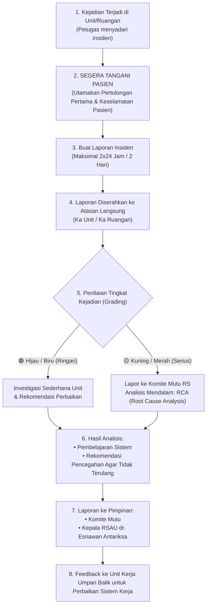
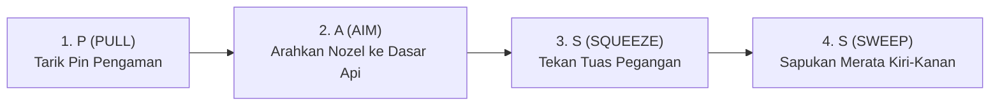
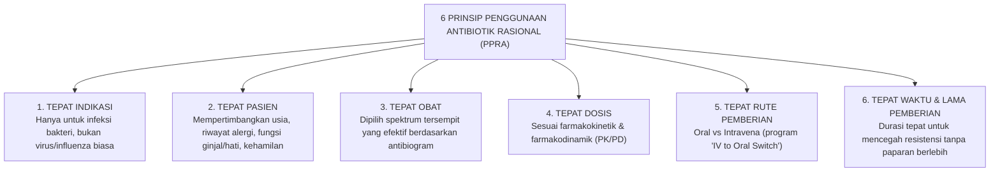
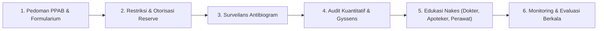
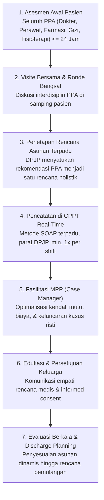
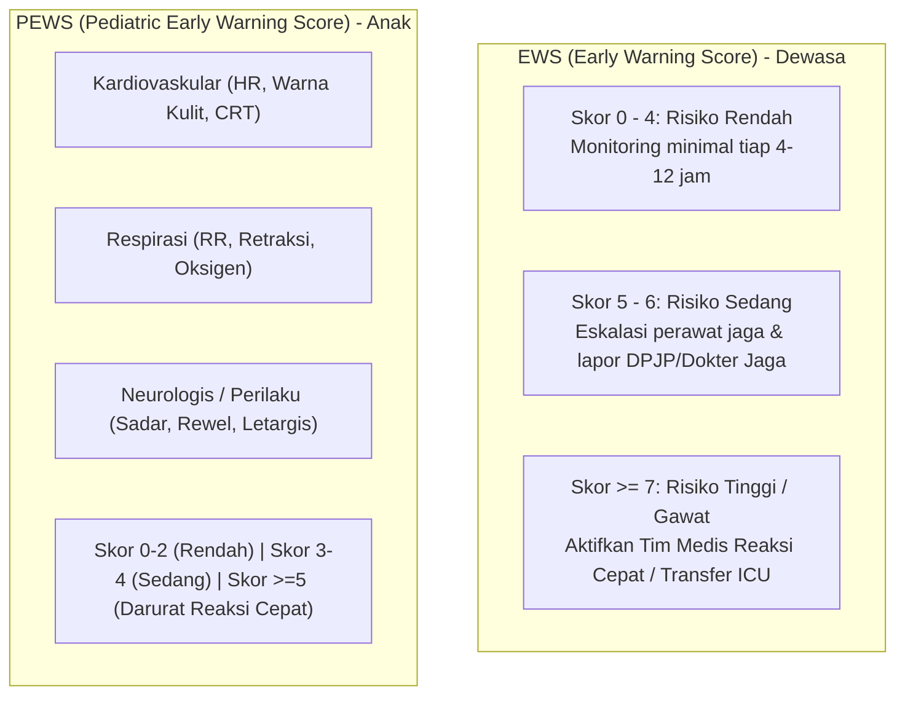
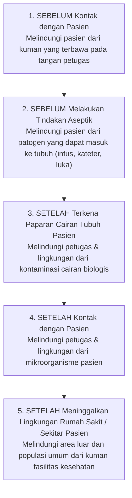
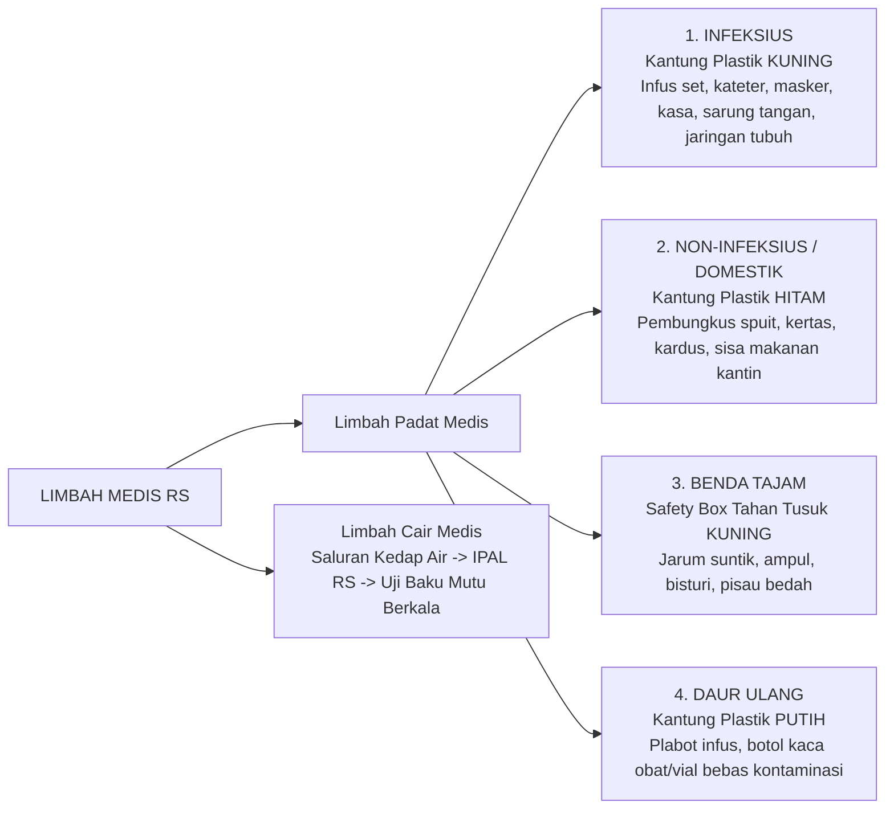
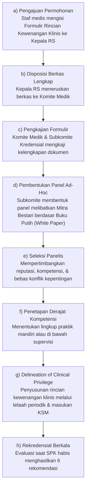

# 📖 Dokumentasi Lengkap Proyek: Mini Game Web 2D Physics Platformer (Rusa Adventure)
### *Panduan Arsitektur Teknis, Sistem Fisika & Animasi, serta Roadmap Pengembangan Menjadi Game Edukasi Akreditasi Rumah Sakit*

---

## 📋 Daftar Isi
1. [Ringkasan Proyek & Filosofi Desain](#1-ringkasan-proyek--filosofi-desain)
2. [Arsitektur Teknis & Struktur Kode (`index.html`)](#2-arsitektur-teknis--struktur-kode-indexhtml)
3. [Spesifikasi Karakter & Animasi Langkah Kaki Silih Berganti](#3-spesifikasi-karakter--animasi-langkah-kaki-silih-berganti)
4. [Platformer Physics Engine & Logika Collision](#4-platformer-physics-engine--logika-collision)
5. [Sistem Grafis, Kamera Dinamis & Parallax 5 Layer](#5-sistem-grafis-kamera-dinamis--parallax-5-layer)
6. [Sistem Audio Sintesis (Web Audio API)](#6-sistem-audio-sintesis-web-audio-api)
7. [Struktur Data Level, Entitas, & Progresi Game](#7-struktur-data-level-entitas--progresi-game)
8. [Blueprint Konversi ke Game Akreditasi Rumah Sakit (STARKES / KARS)](#8-blueprint-konversi-ke-game-akreditasi-rumah-sakit-starkes--kars)
9. [Panduan Langkah-demi-Langkah Menambah Fitur & Konten Baru](#9-panduan-langkah-demi-langkah-menambah-fitur--konten-baru)
10. [Daftar Berkas & Panduan Menjalankan](#10-daftar-berkas--panduan-menjalankan)
11. [Gamifikasi Akreditasi Map 1 (Pokja TKRS)](#-bagian-11-implementasi-khusus-gamifikasi-akreditasi-map-1-pokja-tkrs)
12. [Gamifikasi Akreditasi Map 2 (Pokja PMKP)](#-bagian-12-implementasi-khusus-gamifikasi-akreditasi-map-2-pokja-pmkp)
13. [Gamifikasi Akreditasi Map 3 (Pokja SKP)](#-bagian-13-implementasi-khusus-gamifikasi-akreditasi-map-3-pokja-skp)
14. [Gamifikasi Akreditasi Map 4 (Pokja MFK & Simulasi Proteksi Bencana)](#-bagian-14-implementasi-khusus-gamifikasi-akreditasi-map-4-pokja-mfk)
15. [Gamifikasi Akreditasi Map 5 (Pokja PROGNAS - PPRA)](#-bagian-15-implementasi-khusus-gamifikasi-akreditasi-map-5-pokja-prognas---ppra)
16. [Gamifikasi Akreditasi Map 6 (Pokja PAP - Asuhan Pasien Terpadu)](#-bagian-16-implementasi-khusus-gamifikasi-akreditasi-map-6-pokja-pap---pelayanan-dan-asuhan-pasien-terpadu)
17. [Gamifikasi Akreditasi Map 7 (Pokja PPI - Simulasi Cuci Tangan, Etika Batuk, APD & Limbah)](#-bagian-17-implementasi-khusus-gamifikasi-akreditasi-map-7-pokja-ppi---pencegahan-dan-pengendalian-infeksi)
18. [Gamifikasi Akreditasi Map 8 (Pokja KPS - Uraian Jabatan, Kredensial, Rekredensial, SPK & RKK)](#-bagian-18-implementasi-khusus-gamifikasi-akreditasi-map-8-pokja-kps---kualifikasi-dan-pendidikan-staf)
19. [Arsitektur Halaman Utama: Mukadimah, Misi Kapten Erik, Kreator Herlani & Sistem Pilih Map](#-bagian-19-arsitektur-halaman-utama-mukadimah-misi-kapten-erik-kreator-herlani--sistem-pilih-map)
20. [Sistem Multi-Genre Mini Games per Map: Flappy Glider (TKRS) & Moto Patrol Runner (PMKP)](#31-sistem-multi-genre-mini-games-per-map-flappy-glider-tkrs--moto-patrol-runner-pmkp)

---

## 1. Ringkasan Proyek & Filosofi Desain

Proyek ini adalah sebuah **Mini Game 2D Physics Platformer** retro modern yang terinspirasi dari mekanik platformer legendaris era 8-bit/16-bit, dikembangkan secara **100% Client-Side** dalam format **Single-File Web Application**.

### Karakteristik Arsitektur Utama:
* **Zero Dependency / Zero Build Process**: Tidak memerlukan `npm`, bundler (Webpack/Vite), backend server, maupun database. File [`index.html`](file:///Users/elan/Documents/rusa/index.html) dapat langsung dibuka di peramban web modern manapun (*double-click & play*).
* **HTML5 Canvas Engine**: Seluruh pergerakan game, entitas, platform, latar belakang parallax, dan efek partikel digambar melalui Canvas 2D Rendering Context berkinerja tinggi.
* **Modern UI Overlay (Tailwind CSS CDN)**: Layar menu, HUD, indikator nyawa, popup jeda (pause), modal game over, dan tombol sentuh mobile dibangun menggunakan HTML + Tailwind CSS yang melayang rapi di atas kanvas game.
* **Audio Bebas Aset Eksternal**: Menggunakan Web Audio API berbasis osilator frekuensi sintetis, sehingga suara lompat, koin, tabrakan, dan kemenangan tercipta seketika tanpa perlu mengunduh file `.mp3` atau `.wav`.
* **Cross-Platform & Responsive**: Mendukung penuh input Keyboard (PC/Laptop) dan Virtual Touch Controls via Pointer Events (Smartphone & Tablet).

---

## 2. Arsitektur Teknis & Struktur Kode (`index.html`)

Seluruh logika permainan tertata rapi dalam satu file [`index.html`](file:///Users/elan/Documents/rusa/index.html) sepanjang ~2.500 baris dengan pembagian seksi modular sebagai berikut:

```text
index.html
├── <head> : Meta tags, Google Fonts (Outfit & Press Start 2P), Tailwind CSS CDN, Canvas styling
├── <body>
│   ├── #canvasContainer : Pembungkus kanvas responsif
│   │   └── <canvas id="gameCanvas"> : Kanvas utama (resolusi dasar 960x540)
│   ├── #hud : Overlay HUD (Lives, Nama World, Skor, Koin, Timer, Mute, Pause)
│   ├── #mobileControls : Virtual D-Pad (Kiri/Kanan) & Tombol Lompat Sentuh
│   ├── Modal Overlays : Menu Utama, Panduan Main, Pilih Level, Pause, Game Over, Win
│   └── <script> : Engine JavaScript Murni
│       ├── 1. CONFIG & CONSTANTS       (Konfigurasi player, fisika, state game)
│       ├── 2. ASSET LOADER             (Prapemuatan sprite multi-pose & fallback)
│       ├── 3. AUDIO SYSTEM             (Web Audio API synthesizer kelas SoundSynth)
│       ├── 4. INPUT HANDLER            (Keyboard listeners & touch pointer bindings)
│       ├── 5. CAMERA & PARALLAX        (Kamera lookahead & latar belakang berlapis)
│       ├── 6. PARTICLES & FX           (Partikel debu langkah, koin sparkle, confetti)
│       ├── 7. LEVEL DATA DEFINITION    (Definisi platform, musuh, checkpoint, goal)
│       ├── 8. ENTITIES IMPLEMENTATION  (Class Player, Enemy, Platform, Collectible)
│       ├── 9. PHYSICS ENGINE           (AABB 2-Axis Collision, Variable Jump, Coyote)
│       ├── 10. GAME STATE & UI LOGIC   (Pemberian skor, waktu, transisi level)
│       ├── 11. GAME LOOP (FIXED 60Hz)  (Akumulator waktu tetap & render loop)
│       └── 12. INITIALIZATION          (Entry point saat DOMContentLoaded)
```

---

## 3. Spesifikasi Karakter & Animasi Langkah Kaki Silih Berganti

Karakter utama dirancang sebagai **Rusa Antropomorfik** berbusana medis (baju scrub biru berlencana *"RUSA KEREN"*, celana loreng medis, dan sepatu boot safety).

### Folder Aset Karakter (`/Users/elan/Documents/rusa/assets/`)
| Nama File | Dimensi | Fungsi / State | Deskripsi Visual |
|---|---|---|---|
| [`player_idle.png`](file:///Users/elan/Documents/rusa/assets/player_idle.png) | 360 × 540 | Pose Diam (*Idle*) | Rusa berdiri tegap menyamping menghadap ke kanan. |
| [`player_run1.png`](file:///Users/elan/Documents/rusa/assets/player_run1.png) | 360 × 540 | Pose Lari Frame 1 | **Kaki kanan melangkah maju** menapak lantai, kaki kiri mengayun ke belakang. |
| [`player_run2.png`](file:///Users/elan/Documents/rusa/assets/player_run2.png) | 360 × 540 | Pose Lari Frame 2 | **Passing Pose 1**: Kaki merapat/menekuk atletis (juga dipakai saat melompat). |
| [`player_run3.png`](file:///Users/elan/Documents/rusa/assets/player_run3.png) | 360 × 540 | Pose Lari Frame 3 | **Kaki kiri melangkah maju** menapak lantai, kaki kanan berganti ke belakang. |
| [`player_run4.png`](file:///Users/elan/Documents/rusa/assets/player_run4.png) | 360 × 540 | Pose Lari Frame 4 | **Passing Pose 2**: Kaki bertransisi kembali menuju langkah kanan. |
| [`player_front.png`](file:///Users/elan/Documents/rusa/assets/player_front.png) | 360 × 540 | Pose Menu Depan | Pose menyapa menghadap depan untuk kartu profil di layar awal. |

### Mekanisme Siklus Animasi Berlari (`Player.update` & `Player.draw`)
1. **Peningkatan Fase Berdasarkan Kecepatan**:
   ```javascript
   if (this.isGrounded && Math.abs(this.vx) > 0.5) {
       // Kecepatan ayunan kaki bertambah secara dinamis seiring kecepatan lari
       this.runCycle += Math.max(0.12, Math.abs(this.vx) * 0.035);
   } else {
       this.runCycle = 0; // Kembali ke pose idle saat berhenti
   }
   ```
2. **Pemilihan Frame Aktif**:
   ```javascript
   const frameIdx = Math.floor(this.runCycle) % playerImages.runFrames.length;
   spriteImg = playerImages.runFrames[frameIdx]; // Berotasi antara Frame 0, 1, 2, dan 3
   ```
3. **Efek Getaran Vertikal Langkah (*Organic Bobbing*)**:
   Saat berlari, tubuh rusa mengalami osilasi lembut setinggi ±2 pixel (`bob = Math.sin(this.runCycle * Math.PI) * 2`) yang sinkron dengan tiap ketukan kaki menjejak tanah.
4. **Kalibrasi Kanvas & Anti-Jitter**:
   Semua frame diproses dengan pusat massa torso di `X = 190` dan telapak kaki di `Y = 515`, sehingga tidak terjadi pergeseran sumbu tubuh saat animasi berganti frame.

---

## 4. Platformer Physics Engine & Logika Collision

Fisika platformer dirancang responsif, presisi (*snappy*), dan tidak licin (*tight controls*).

### Parameter Fisika (`PHYSICS`)
* **Gravitasi (`gravity = 0.60`)**: Menarik player ke bawah secara konsisten, dibatasi dengan kecepatan jatuh maksimum (*terminal velocity*) 14 px/frame.
* **Akselerasi (`acceleration = 0.85`)**: Memberikan respons instan saat tombol arah ditekan.
* **Friksi Tanah (`friction = 0.84`)**: Menghentikan pergerakan segera setelah tombol arah dilepas tanpa selip berlebih.
* **Kecepatan Maksimum (`maxSpeed = 7.2`)**: Batas kecepatan lari horizontal yang optimal untuk navigasi rintangan.
* **Kekuatan Lompat (`jumpForce = -12.5`)**: Mendorong player ke atas dengan elevasi setinggi ~130 pixel.

### Fitur Penunjang Kenyamanan Bermain (*Game-Feel Enhancements*)
1. **Variable Jump Height (`jumpCutMultiplier = 0.5`)**:
   Jika pemain melepas tombol lompat lebih awal sebelum mencapai puncak lompatan, kecepatan vertikal dipotong separuh (`this.vy *= 0.5`). Hasilnya: ketukan singkat menghasilkan lompatan pendek, sedangkan menahan tombol menghasilkan lompatan maksimal.
2. **Coyote Time (`coyoteTimeFrames = 8`)**:
   Pemain tetap diperbolehkan melompat hingga 8 frame (~130 milidetik) setelah melangkah keluar dari bibir tebing platform. Fitur ini menghilangkan frustrasi pemain akibat melompat sedikit terlambat.
3. **Jump Buffering (`jumpBufferFrames = 7`)**:
   Jika tombol lompat ditekan 7 frame sebelum player menyentuh tanah, input disimpan dan dieksekusi seketika saat telapak kaki mendarat.
4. **Deteksi Tabrakan Dua Sumbu AABB (*Axis-Aligned Bounding Box*)**:
   Pergerakan sumbu X dan sumbu Y dipisahkan secara independen. Posisi X diperbarui dan dicek terhadap dinding platform, disusul oleh pembaruan posisi Y dan pengecekan terhadap lantai/atap. Logika ini mencegah bug player menembus platform (*corner snagging*).
5. **One-Way Platform (Platform Tembus Bawah)**:
   Platform bertipe `"one-way"` dapat ditembus saat melompat dari bawah ke atas, tetapi menjadi pijakan solid saat jatuh dari atas ke bawah.
6. **Moving Platform Synchronization**:
   Player yang berdiri di atas platform bergerak secara otomatis mewarisi vektor kecepatan platform (`this.x += mp.vx; this.y += mp.vy`), memungkinkan player ikut terbawa tanpa terjatuh.

---

## 5. Sistem Grafis, Kamera Dinamis & Parallax 5 Layer

### Kamera Dinamis (Smooth Lerp & Lookahead)
* Kamera memposisikan karakter rusa sedikit di sebelah kiri layar saat berlari ke kanan, memberikan sudut pandang ke depan yang lapang (*lookahead*).
* Transisi lookahead diinterpolasi secara halus menggunakan fungsi lerp:
  ```javascript
  this.currentLookahead += (targetLookahead - this.currentLookahead) * 0.08;
  ```
* Saat merender, posisi kamera dibulatkan ke bilangan bulat terdekat (`Math.round(-camera.x)`), mengeliminasi getaran pixel (*pixel shimmer*) dan retak visual (*tile tearing*).

### 5 Lapisan Parallax (Rendered Procedurally via Canvas)
1. **Langit Dinamis (`parallax = 0.0x`)**: Gradasi warna atmosfer sesuai waktu (Pagi/Siang di World 1, Senja di World 2, Malam berbintang di World 3).
2. **Awan Melayang (`parallax = 0.1x`)**: Awan prosedural berlayar perlahan di latar belakang terjauh.
3. **Pegunungan Jauh (`parallax = 0.25x`)**: Siluet pegunungan besar yang bergerak sangat lambat.
4. **Perbukitan Hijau Midground (`parallax = 0.50x`)**: Bukit bergelombang lapis kedua.
5. **Lantai Permainan / Foreground (`parallax = 1.0x`)**: Platform aktif, koin, rintangan, musuh, dan pos checkpoint.

---

## 6. Sistem Audio Sintesis (Web Audio API)

Semua suara disintesis secara matematis menggunakan osilator audio bawaan browser tanpa perlu file audio eksternal (`SoundSynth`):

* **Lompat (`playJump`)**: Gelombang segitiga (*triangle wave*) yang frekuensinya meluncur naik dari 140 Hz ke 420 Hz dalam 0.12 detik.
* **Koin/Bintang (`playCoin`)**: Dua nada sinusoidal murni pada frekuensi 987.77 Hz (B5) dan 1318.51 Hz (E6) dengan envelope cepat, menghasilkan denting ceria.
* **Injak Musuh (`playStomp`)**: Kombinasi nada rendah 180 Hz meluncur ke 70 Hz disertai sentuhan noise perkusif.
* **Terkena Luka (`playHurt`)**: Gelombang gergaji (*sawtooth wave*) frekuensi rendah (120 Hz turun ke 50 Hz) dengan efek distorsi.
* **Checkpoint (`playCheckpoint`)**: Arpeggio 3 nada naik (C5 - E5 - G5 - C6) bertempo cepat.
* **Kemenangan Level (`playLevelComplete`)**: Fanfare melodi 4 nada megah (C5, E5, G5, C6 panjang).

---

## 7. Struktur Data Level, Entitas, & Progresi Game

Level didefinisikan dalam array objek `LEVELS[index]` di dalam skrip `index.html`. Setiap level memiliki konfigurasi mandiri:

```javascript
{
    id: 1,
    name: "World 1-1: Padang Rumput Hijau",
    width: 2800,
    height: 540,
    playerStart: { x: 80, y: 350 },
    deathY: 530,
    theme: {
        skyTop: "#38bdf8",
        skyBottom: "#bae6fd",
        mountainColor: "#047857",
        hillColor: "#059669",
        platformTop: "#10b981",
        platformBody: "#065f46"
    },
    platforms: [
        { x: 0, y: 440, w: 600, h: 100, type: "solid" },
        { x: 700, y: 360, w: 160, h: 20, type: "one-way" }
    ],
    movingPlatforms: [
        { startX: 1380, startY: 380, w: 140, h: 22, distanceX: 220, distanceY: 0, speed: 1.6 }
    ],
    enemies: [
        { type: "walker", x: 420, y: 416, patrolMin: 320, patrolMax: 540 },
        { type: "jumper", x: 1050, baseY: 416 }
    ],
    collectibles: [
        { x: 300, baseY: 380, type: "coin" }
    ],
    checkpoint: { x: 1320, y: 440 },
    goal: { x: 2650, y: 440 }
}
```

---

## 8. Blueprint Konversi ke Game Akreditasi Rumah Sakit (STARKES / KARS)

Platformer ini memiliki fondasi teknis yang sangat ideal untuk dialihfungsikan menjadi **Media Edukasi & Simulasi Interaktif Akreditasi Rumah Sakit** (berdasarkan Standar Akreditasi Rumah Sakit Kemenkes RI / STARKES).

### 🏥 A. Konsep Narasi & Karakter
* **Karakter Utama**: **"Dokter Rusa" / "Duta Mutu Rumah Sakit"** bertugas melakukan ronde kesiapan akreditasi di berbagai instalasi rumah sakit sebelum kedatangan tim surveyor.
* **Tujuan Akhir Permainan**: Meraih status kelulusan **Akreditasi Paripurna (Bintang 5)** dengan mengumpulkan seluruh instrumen bukti, mematuhi SOP, dan menertibkan temuan bahaya/ketidakpatuhan.

---

### 🗺️ B. Pemetaan World / Bab Berdasarkan Standar STARKES
Alihkan 3 World generik saat ini menjadi instalasi rumah sakit dengan fokus bab standar tertentu:

| Level / World | Nama Instalasi | Fokus Bab Standar Akreditasi | Elemen Pembelajaran Kunci |
|---|---|---|---|
| **World 1** | **Instalasi Rawat Inap & Poliklinik** | **SKP (Sasaran Keselamatan Pasien)** | Identifikasi Pasien (2 identitas), Komunikasi Efektif (SBAR/TBAK), Keamanan Obat High-Alert, Hand Hygiene 6 Langkah, Asesmen Risiko Jatuh. |
| **World 2** | **Instalasi Gawat Darurat (IGD) & Kamar Operasi** | **PPI (Pencegahan & Pengendalian Infeksi)** | 5 Momen Cuci Tangan, Penggunaan APD yang Tepat, Pemilahan Sampah Infeksius vs Non-Infeksius vs Benda Tajam (*Safety Box*), Prosedur *Time-Out* Pembedahan. |
| **World 3** | **Instalasi Radiologi, Farmasi, & Ruang Genset** | **MFK (Manajemen Fasilitas & Keselamatan)** | Penanganan Tumpahan B3 (*Spill Kit*), Jalur Evakuasi Kebakaran, Penggunaan APAR (PASS), Kewaspadaan Gas Medis, Kesiapsiagaan Bencana (*Code Blue*, *Code Red*). |

---

### 🪙 C. Transformasi Item Koleksi (*Collectibles*)
Ubah koin generik (`type: "coin"`) menjadi item bukti kepatuhan akreditasi:

| Tipe Baru | Representasi Visual | Efek Gameplay / Poin | Nilai Edukasi |
|---|---|---|---|
| `"gelang_identitas"` | Gelang Kuning (Risiko Jatuh) / Merah (Alergi) / Biru (Laki-laki) / Pink (Perempuan) | +100 Poin | Mengajarkan pentingnya pemasangan gelang identitas pasien secara tepat di rawat inap. |
| `"hand_sanitizer"` | Botol dispenser pump hand sanitizer berbusa | +150 Poin + Kecepatan lari meningkat sementara (*Speed Boost*) | Menanamkan budaya cuci tangan sebelum dan setelah menyentuh pasien. |
| `"spill_kit"` | Kotak kuning peralatan tumpahan B3 | +200 Poin | Alat wajib untuk membersihkan tumpahan darah atau cairan kimia berbahaya. |
| `"dokumen_sop"` | Map berkas akreditasi dengan stempel centang | +250 Poin | Berkas regulasi dan bukti telusur dokumen akreditasi. |
| `"bintang_paripurna"`| Bintang emas bercahaya | Syarat kelulusan level | Bintang akreditasi mutu rumah sakit. |

---

### 👾 D. Transformasi Musuh & Rintangan (*Hazards*)
Ubah musuh generic walker/jumper menjadi bahaya nyata yang sering menjadi temuan surveyor:

| Entitas Lama | Karakter Baru di RS | Mekanik Serangan / Interaksi | Solusi Player (*Cara Mengatasi*) |
|---|---|---|---|
| **Walker Enemy** | **Lantai Licin Tanpa Tanda Peringatan** (*Wet Floor*) atau **Tumpahan Darah/B3** | Menginjaknya dari samping menyebabkan terpeleset (*damage*). | Pemain harus melompati atau mengambil *Spill Kit* terdekat untuk membersihkannya. |
| **Jumper Enemy** | **Bakteri Patogen / Kuman Nosokomial (MRSA)** | Melompat-lompat menularkan infeksi silang. | Menginjaknya dari atas dengan perlindungan sepatu boot safety (+200 poin kepatuhan cuci tangan). |
| **Pit / Jurang** | **Area Isolasi Tanpa APD Lengkap** atau **Kabel Alat Medis Terjuntai** | Jatuh ke area ini mengurangi 1 nyawa. | Navigasi platform yang hati-hati sesuai prinsip keselamatan kerja. |

---

### 🚩 E. Transformasi Checkpoint & Finish Goal
* **Checkpoint (Bendera)** ➔ **Nurse Station / Pos Perawat**:
  * Saat rusa melewati pos perawat, komputer menyala hijau, terdengar bunyi bel panggil perawat (*nurse call chime*), dan titik respawn tercatat.
* **Goal (Pintu Finish)** ➔ **Pintu Keluar Ruang Asesmen Surveyor Akreditasi**:
  * Melewati pintu finish memicu evaluasi skor kepatuhan, confetti perayaan, dan kenaikan peringkat akreditasi.

---

### ❓ F. Fitur Kuis Interaktif Pop-Up (Terminal Akreditasi)
Saat menyentuh terminal komputer tertentu di lorong rumah sakit, game dapat menampilkan **Kuis Singkat 1 Soal** (Pilihan Ganda):
* *Contoh Pertanyaan*:
  > **"Berapa detik durasi minimal mencuci tangan menggunakan Handrub berbasis alkohol menurut WHO?"**
  > - [A] 5 - 10 detik
  > - [B] 20 - 30 detik *(Jawaban Benar)*
  > - [C] 60 - 80 detik
* *Reward*: Menjawab benar memberi bonus +500 Poin dan memulihkan 1 Nyawa.

---

### 🏆 G. Sistem Peringkat Kelulusan Akreditasi
Di akhir permainan, total skor dikonversi menjadi predikat resmi akreditasi rumah sakit:
* **< 60% Kepatuhan**: *Tidak Terakreditasi (Perlu Remedial)*
* **60% - 74% Kepatuhan**: *Akreditasi Tingkat Madya (Bintang 3)*
* **75% - 89% Kepatuhan**: *Akreditasi Tingkat Utama (Bintang 4)*
* **≥ 90% Kepatuhan**: *Akreditasi Tingkat Paripurna (Bintang 5 - Standar Tertinggi)*

---

## 9. Panduan Langkah-demi-Langkah Menambah Fitur & Konten Baru

Semua modifikasi dilakukan langsung di dalam file tunggal [`index.html`](file:///Users/elan/Documents/rusa/index.html).

### ➕ 1. Cara Menambahkan Level / Ruangan Baru
Cari deklarasi `const LEVELS = [` di dalam `index.html` (sekitar baris 730), kemudian tambahkan objek level baru di dalam array:

```javascript
// Contoh Menambahkan Level 4: "Ruang Operasi (OK) & Sterilisasi"
{
    id: 4,
    name: "World 4-1: Ruang Operasi & CSSD",
    width: 3200,
    height: 540,
    playerStart: { x: 80, y: 350 },
    deathY: 530,
    theme: {
        skyTop: "#0f766e",       // Tema warna hijau toska ruang bedah
        skyBottom: "#14b8a6",
        mountainColor: "#115e59",
        hillColor: "#042f2e",
        platformTop: "#2dd4bf",
        platformBody: "#134e4a"
    },
    platforms: [
        { x: 0, y: 440, w: 800, h: 100, type: "solid" },
        { x: 900, y: 370, w: 200, h: 22, type: "solid" }
    ],
    movingPlatforms: [
        { startX: 1200, startY: 380, w: 140, h: 22, distanceX: 180, distanceY: 0, speed: 1.8 }
    ],
    enemies: [
        { type: "walker", x: 500, y: 416, patrolMin: 350, patrolMax: 700 }
    ],
    collectibles: [
        { x: 400, baseY: 380, type: "sanitizer" }
    ],
    checkpoint: { x: 1500, y: 440 },
    goal: { x: 3000, y: 440 }
}
```

---

### 🎁 2. Cara Menambahkan Tipe Item Koleksi Baru
1. Pada `Collectible.draw(ctx, time)` (sekitar baris 1180), tambahkan logika penggambaran visual berdasarkan tipe:
   ```javascript
   if (this.type === "sanitizer") {
       // Gambar botol hand sanitizer mini berwarna biru/toska
       ctx.fillStyle = "#38bdf8";
       ctx.fillRect(this.x - 7, drawY - 9, 14, 18);
       ctx.fillStyle = "#ffffff";
       ctx.fillRect(this.x - 3, drawY - 14, 6, 5); // Tutup pump
   } else if (this.type === "sop") {
       // Gambar map dokumen berkas medis
       ctx.fillStyle = "#f59e0b";
       ctx.fillRect(this.x - 8, drawY - 10, 16, 20);
       ctx.fillStyle = "#ffffff";
       ctx.fillRect(this.x - 5, drawY - 6, 10, 2);
   }
   ```
2. Pada `updateCollectibles()` (sekitar baris 1740), berikan efek dan skor yang sesuai saat item diambil:
   ```javascript
   if (c.type === "sanitizer") {
       levelScore += 150;
       sound.playCoin(); // atau suara semprotan sanitizer
       createFloatingText("+150 HAND SANITIZER!", c.x, c.baseY - 10, "#38bdf8");
   }
   ```

---

### 💡 3. Cara Menambahkan Teks Pop-Up Edukasi Akreditasi
Gunakan fungsi `createFloatingText(text, x, y, color)` yang sudah tersedia di engine:
```javascript
createFloatingText("Identifikasi Pasien Terverifikasi!", player.x, player.y - 30, "#10b981");
```

---

### 🎨 4. Mengganti atau Menambahkan Sprite Karakter Baru
Konfigurasi gambar karakter dikelola di objek `PLAYER_CONFIG` (sekitar baris 370):
```javascript
const PLAYER_CONFIG = {
    sprite: "assets/player_idle.png",
    fallbackSprite: "karakterrusa.png",
    sprites: {
        idle: "assets/player_idle.png",
        run: "assets/player_run1.png",
        runFrames: [
            "assets/player_run1.png",
            "assets/player_run2.png",
            "assets/player_run3.png",
            "assets/player_run4.png"
        ],
        jump: "assets/player_run2.png",
        fall: "assets/player_run1.png"
    },
    width: 48,
    height: 72,
    scale: 1
};
```
Jika Anda menyiapkan pose tambahan (misalnya pose jongkok memeriksa pasien, atau pose memegang APAR), cukup tambahkan path filenya ke dalam objek `sprites` dan panggil di `Player.draw`.

---

## 10. Daftar Berkas & Panduan Menjalankan

### Struktur Berkas Proyek
```text
/Users/elan/Documents/rusa/
├── index.html                                        # File utama game (Semua kode HTML, CSS, JS)
├── dokumentasi.md                                    # Dokumentasi teknis lengkap & roadmap akreditasi
├── Anthropomorphic_deer_in_medical_…_202609040750.jpeg # Aset master ilustrasi karakter dokter rusa
└── assets/                                           # Aset visual karakter siap pakai (transparan)
    ├── player_idle.png                               # Pose berdiri menyamping (menghadap kanan)
    ├── player_run1.png                               # Lari Frame 1 (Kaki kanan melangkah)
    ├── player_run2.png                               # Lari Frame 2 (Passing pose / pose melompat)
    ├── player_run3.png                               # Lari Frame 3 (Kaki kiri melangkah silih berganti)
    ├── player_run4.png                               # Lari Frame 4 (Passing pose transisi)
    ├── player_front.png                              # Pose menyapa depan untuk Menu Utama
    ├── player_jump.png                               # Pose alternatif melompat
    ├── player_run.png                                # Pose lari tunggal (kompatibilitas mundur)
    └── player.png                                    # Pose utama karakter
```

### Cara Menjalankan Game
1. **Cara Paling Praktis (Lokal Langsung)**:
   - Cukup buka file [`index.html`](file:///Users/elan/Documents/rusa/index.html) atau [`akreditasi/index.html`](file:///Users/elan/Documents/rusa/akreditasi/index.html) langsung dengan peramban web pilihan Anda (Google Chrome, Microsoft Edge, Mozilla Firefox, atau Apple Safari).
2. **Menjalankan via HTTP Server Lokal (Opsional)**:
   Jika ingin membuka melalui jaringan lokal atau menguji di smartphone:
   ```bash
   # Masuk ke direktori game
   cd /Users/elan/Documents/rusa
   
   # Jalankan web server instan menggunakan Python
   python3 -m http.server 8089
   ```
   Buka peramban di `http://localhost:8089/akreditasi/index.html` pada laptop Anda, atau `http://[IP-Komputer-Anda]:8089/akreditasi/index.html` dari smartphone di jaringan yang sama.

---

## 11. Implementasi Khusus: Gamifikasi Akreditasi Pokja TKRS

Proyek ini telah dikembangkan secara khusus ke dalam sub-aplikasi siap pakai di folder [`akreditasi/index.html`](file:///Users/elan/Documents/rusa/akreditasi/index.html).

### 🦌 1. Karakter Utama: Kapten RUSA ERIK
- **Nama Karakter**: **Kapten RUSA ERIK**
- **Peran**: Duta Mutu Akreditasi RSAU dr. Esnawan Antariksa.
- **Tugas Utama**: Memimpin survei telusur lapangan (*field survey*), mengunjungi terminal pos regulasi, mengumpulkan berkas SK/SOP, dan menjawab pertanyaan telusur dari surveyor akreditasi.
- **Identitas Visual**: Rusa antropomorfik berseragam dinas aeromedis TNI AU lengkap dengan badge medis militer dan animasi langkah kaki silih berganti (*4-frame alternating legs*).

---

### 📜 2. Hospital Bylaws (Peraturan Internal Rumah Sakit)

Hospital Bylaws (HBL) adalah konstitusi dasar tata kelola rumah sakit yang menjadi landasan utama pada **Standar Akreditasi Kemenkes RI (STARKES) Pokja TKRS (Tata Kelola Rumah Sakit)**, khususnya Standar TKRS 1 dan TKRS 2. 

Hospital Bylaws terdiri dari dua komponen pokok:
1. **Peraturan Internal Korporasi (Corporate Bylaws)**: Mengatur tata kelola institusi antara pemilik dengan pimpinan rumah sakit.
2. **Peraturan Internal Staf Medis (Medical Staff Bylaws)**: Mengatur tata kelola klinis (*clinical governance*) dan staf medis.

#### Butir Inti Corporate Bylaws RSAU dr. Esnawan Antariksa:
1. **Pengertian Corporate Bylaws**:
   Aturan yang mengatur agar tata kelola korporasi (*corporate governance*) terselenggara dengan baik melalui pengaturan hubungan antara pemilik atau representasi pemilik (**Kapuskesau**) dengan kepala RSAU (**Ka RSAU dr. Esnawan Antariksa**).
2. **Identitas & Alamat Resmi Rumah Sakit**:
   Nama resmi institusi adalah **Rumah Sakit Angkatan Udara dokter Esnawan Antariksa** (disingkat **RSAU dr. Esnawan Antariksa**), beralamat di:
   > **Jl. Merpati No. 2 Komplek Lanud Halim Perdana Kusumah Jakarta Timur**.
3. **Pemilik Rumah Sakit**:
   Pemilik Rumah Sakit adalah **Kepala Staf Angkatan Udara (Kasau)** yang didelegasikan kepada **Kepala Pusat Kesehatan Angkatan Udara (Kapuskesau)** sebagai representasi pemilik.
4. **Kepala Rumah Sakit (Ka RSAU)**:
   Pimpinan rumah sakit yang **diangkat langsung oleh Kasau** yang bertugas dalam pengelolaan operasional dan manajemen rumah sakit.

#### Pemetaan 9 Pos Terminal Kuis TKRS:
| Pos | Kategori Materi | Butir Dokumen Resmi RSAU dr. Esnawan Antariksa |
|---|---|---|
| **Pos 1** | Visi Rumah Sakit | Rumah Sakit yang berwawasan iptek, berteknologi modern, berkarakter dan profesional dalam dukungan & pelayanan kesehatan TNI AU/TNI & umum. |
| **Pos 2** | Motto Pelayanan | *"Melayani Dengan Ikhlas Tanpa Batas"* |
| **Pos 3** | Falsafah Institusi | Jiwa dan Semangat Pengabdian TNI Untuk Melaksanakan Dukungan & Pelayanan Kesehatan. |
| **Pos 4** | Empat Pilar Misi | Dukungan kesehatan operasi TNI AU, pelayanan profesional promotif/preventif/kuratif, penerapan teknologi iptek modern, dan pengabdian bencana. |
| **Pos 5** | Tujuan Pokok | Pembentukan SDM profesional berintegritas, peningkatan mutu berkelanjutan, dan pemanfaatan teknologi kedokteran terkini. |
| **Pos 6** | Definisi Corporate Bylaws | Tata kelola hubungan pemilik/representasi pemilik (Kapuskesau) dengan kepala RSAU (Ka RSAU dr. Esnawan Antariksa). |
| **Pos 7** | Pemilik Rumah Sakit | Kasau yang didelegasikan wewenangnya kepada Kapuskesau. |
| **Pos 8** | Identitas & Alamat Resmi | RSAU dr. Esnawan Antariksa, Jl. Merpati No. 2 Lanud Halim Perdanakusuma Jakarta Timur. |
| **Pos 9** | Pengangkatan Ka RSAU | Kepala RSAU diangkat oleh Kasau untuk memimpin pengelolaan rumah sakit. |

---

### 🏰 3. Tantangan Interaktif Remedial: Arena Benteng Takeshi

Untuk membuat pembelajaran regulasi akreditasi interaktif, seru, dan tidak monoton, game mengadopsi mekanisme tantangan fisik berinspirasi **Benteng Takeshi (*Takeshi's Castle*)** saat pemain salah menjawab kuis:

1. **Pemicu Remedial**:
   - Jika pemain memilih opsi jawaban yang keliru di terminal kuis, sistem tidak mematikan karakter (*no instant game over*).
   - Layar modal kuis menampilkan notifikasi sirene: **"KONSEKUENSI REMEDIAL: ARENA BENTENG TAKESHI!"**.
   - Tombol berubah menjadi: `🔥 MASUK TANTANGAN BENTENG TAKESHI! 🔥`.
2. **Rintangan 1: Batu Loncat Goyang (*Stepping Stones*)**:
   - Kapten RUSA ERIK harus melompati 5 batu loncat bundar yang bergoyang naik-turun dan sedikit tenggelam (*sink*) saat diinjak di atas **Kolam Lumpur Takeshi**.
   - Jika jatuh ke lumpur, lumpur memiliki sifat elastis membal (`vy = -12.8`) dengan suara kecipak lumpur (*mud splash*) dan partikel lumpur beterbangan, sehingga pemain dapat mencoba melompat kembali tanpa kehilangan nyawa.
3. **Rintangan 2: Gerbang 3 Pintu Benteng Bertingkat (*3-Tiered Castle Doors*)**:
   - Terdapat 3 lantai pintu benteng di dinding istana:
     - **Pintu 1 (Lantai Bawah)**: Tepat di lantai dasar (`y: 380`).
     - **Pintu 2 (Lantai Tengah / LT 2 ▲)**: Berada di tangga tengah (`y: 270`), dijangkau dengan 1 kali lompatan.
     - **Pintu 3 (Lantai Atas / LT 3 ▲)**: Berada di tangga atas (`y: 160`), dijangkau dengan melompat lebih tinggi.
   - **Cara Menerobos Pintu/Tembok**:
     - **Cara Cepat (Pintu Kertas)**: Cari pintu yang bertuliskan **`[KERTAS]`** dengan tekstur kertas *shoji* berwarna krem terang bercahaya. Cukup tabrak 1 kali, pintu kertas akan langsung jebol berhamburan konfeti!
     - **Cara Dobrak Tanduk Rusa (Pintu Kayu)**: Jika menabrak pintu kayu gelap bertuliskan **`[KAYU]`**, pintu akan retak bertahap. Serang pintu tersebut **3 kali berturut-turut**, maka Kapten RUSA ERIK akan mendobraknya dengan kekuatan tanduk rusanya (`💥 DIDOBRAK TANDUK RUSA! JEBOL!`).
     - **Tombol Pintas**: Pemain juga dapat menekan tombol `⏩ Lewati Remedial` di banner atas kapan saja jika ingin langsung kembali.
4. **Rintangan 3: Super Trampolin Emas Pelontar (*Takeshi Launch Springboard*)**:
   - Di balik pintu benteng yang telah jebol, terdapat pelataran dalam (*courtyard*) yang menyediakan **Super Trampolin Emas**.
   - Saat diinjak, efek suara retro *slide whistle* naik `"BOOOIIIINGGG!"` berbunyi dan Kapten RUSA ERIK meluncur meroket ke angkasa menembus awan.
5. **Kembali ke Koridor Rumah Sakit**:
   - Karakter secara mulus mendarat kembali di depan terminal pos rumah sakit.
   - Modal penjelasan edukasi terbuka otomatis dengan status **"REMEDIAL SUKSES"**, menampilkan kunci jawaban resmi dan catatan edukasi regulasi, memberi bonus skor +300 poin, dan menandai terminal selesai terverifikasi!

---

## 12. Implementasi Khusus: Gamifikasi Akreditasi Map 2 (Pokja PMKP)

Pada Map 2 (Dunia 2), petualangan Kapten RUSA ERIK beralih ke ranah **Peningkatan Mutu dan Keselamatan Pasien (Pokja PMKP)**, salah satu pokja paling krusial dalam standar STARKES Kemenkes RI.

### 🛡️ 1. Definisi Keselamatan Pasien (Patient Safety)
Keselamatan pasien rumah sakit adalah suatu sistem di mana rumah sakit membuat asuhan pasien lebih aman (*safer care*). Sistem tersebut meliputi:
1. **Asesmen Risiko (*Risk Assessment*)**: Mengkaji kemungkinan bahaya klinis sebelum tindakan dilakukan.
2. **Identifikasi & Pengelolaan Risiko**: Pemetaan bahaya pada sarana, alur obat, dan tindakan medis.
3. **Pelaporan & Analisis Insiden**: Budaya *non-punitive reporting* agar insiden dilaporkan secara transparan dan dianalisis.
4. **Kemampuan Belajar dari Insiden & Tindak Lanjut**: Menjadikan insiden sebagai pembelajaran sistemik agar tidak terulang.
5. **Implementasi Solusi untuk Meminimalkan Risiko**: Penerapan SOP baru, teknologi pengaman, dan rekayasa proses.

> **Tujuan Pokok**: Sistem ini diharapkan dapat mencegah terjadinya cedera yang disebabkan oleh kesalahan akibat melaksanakan suatu tindakan (*error of commission*) atau tidak melakukan tindakan yang seharusnya dilakukan (*error of omission*).

---

### ⚠️ 2. Klasifikasi 5 Jenis Insiden Keselamatan Pasien (IKP)

Seluruh staf dan personel RSAU dr. Esnawan Antariksa wajib memahami dan mampu membedakan 5 kategori insiden berikut:

| Jenis Insiden | Definisi Resmi | Contoh Kasus Nyata di Rumah Sakit |
|---|---|---|
| **KTD** *(Kejadian Tidak Diharapkan)* | Terjadinya insiden yang **mengakibatkan cedera** pada pasien akibat tindakan medis atau asuhan keperawatan (bukan karena perjalanan alami penyakit pasien). | • Pasien jatuh dari tempat tidur hingga fraktur/memar.<br>• Reaksi anafilaktik akibat salah pemberian obat.<br>• Kejadian phlebitis pada lokasi infus vena.<br>• Reaksi hemolitik akut akibat transfusi darah. |
| **KNC** *(Kejadian Nyaris Cedera / Near Miss)* | Terjadinya insiden yang **belum sampai terpapar** ke pasien (*prevention phase*). Terdeteksi dan dicegah sebelum mengenai pasien. | • Dokter meresepkan obat yang kontraindikasi, namun apoteker/perawat menyadarinya saat verifikasi resep sehingga pemberian obat **dibatalkan**. |
| **KTC** *(Kejadian Tidak Cedera / No Harm Incident)* | Terjadinya insiden yang **sudah terpapar ke pasien, tetapi TIDAK menimbulkan cedera**. | • Darah transfusi yang salah golongan sempat dialirkan ke pasien, namun beruntung tidak timbul inkompatibilitas atau gejala cedera apa pun.<br>• Pasien minum obat yang salah dosis ringan namun hasil observasi klinis tetap normal tanpa efek samping. |
| **KPC** *(Kondisi Potensial Cedera / Reportable Circumstance)* | Suatu situasi atau kondisi sarana, prasarana, atau lingkungan yang **sangat berpotensi menimbulkan cedera**, tetapi belum terjadi insiden. | • Kabel mesin ventilator di ICU terkelupas.<br>• Lantai koridor licin tanpa tanda peringatan.<br>• Kunci roda brankar tempat tidur pasien patah/rusak. |
| **Kejadian Sentinel** | Suatu KTD yang mengakibatkan **kematian (*death*), cedera permanen (*permanent harm*), atau kehilangan fungsi organ secara berat**. | • Kematian tidak terduga pada pasien tanpa riwayat sakit terminal.<br>• Salah lokasi operasi (*wrong-site surgery*).<br>• Tertinggalnya instrumen kasa di dalam rongga tubuh pasien setelah operasi. |

---

### 📊 3. Mekanisme Pelaporan SI IMUT & Jadwal Kemenkes RI

#### Integrasi Digital Portal SI IMUT
Pelaporan indikator mutu di RSAU dr. Esnawan Antariksa telah terintegrasi secara daring (*online*) pada aplikasi **SI IMUT (Sistem Indikator Mutu)**:
> 🔗 **Tautan Akses Resmi**: [https://imut.rsauesnawan.com/](https://imut.rsauesnawan.com/)

**Alur Berjenjang Pelaporan Mutu**:
1. **PIC Unit**: Menginput data capaian indikator mutu unit setiap bulannya ke sistem SI IMUT.
2. **Validator (Ka. Unit / Ka. Ruangan / Ka. Bagian)**: Memverifikasi keabsahan dan akurasi data yang diinput oleh PIC.
3. **Komite Mutu RS**: Merekapitulasi seluruh data terverifikasi untuk menyusun Laporan Mutu Institusi dan diserahkan kepada Kepala RSAU dr. Esnawan Antariksa.

#### Batas Waktu Pelaporan ke Kemenkes RI Setiap Bulan
1. **Pelaporan INM (Indikator Mutu Nasional)** ke Kemenkes:
   - Wajib dilaporkan paling lambat **tiap tanggal 10** setiap bulannya.
2. **Pelaporan IKP (Insiden Keselamatan Pasien)** ke Kemenkes:
   - Wajib dilaporkan **tiap tanggal 30 / 31 / Akhir bulan** setiap bulannya.

---

### 🎯 4. Tiga Macam Indikator Mutu di RSAU dr. Esnawan Antariksa

Terdapat 3 tingkatan indikator mutu yang dipantau secara berkesinambungan:
1. **Indikator Mutu Nasional (INM)**:
   - Standar nasional dari Kementerian Kesehatan RI yang berlaku seragam untuk seluruh Fasilitas Pelayanan Kesehatan / Rumah Sakit di Indonesia (misal: kepatuhan kebersihan tangan / *hand hygiene*, kepatuhan penggunaan APD, kepatuhan identifikasi pasien, waktu tanggap operasi seksio sesarea emergensi, kepatuhan waktu visit dokter spesialis, dsb).
2. **Indikator Mutu Prioritas (IMP)**:
   - Setiap faskes atau rumah sakit menentukan prioritasnya masing-masing.
   - **Regulasi Terbaru**: Untuk Indikator Mutu Prioritas RS, **tidak lagi dipilih dari salah satu layanan unggulan RS saja** seperti kebijakan sebelumnya. Saat ini, Indikator Mutu Prioritas **dipilih dari Indikator Mutu Unit yang telah di-"GRADING"** secara komprehensif.
3. **Indikator Mutu Unit (IMU)**:
   - Masing-masing Unit Kerja menentukan indikator mutu spesifik unitnya sesuai kesepakatan rapat internal dan disahkan melalui **Keputusan Penetapan Indikator Mutu Unit yang ditandatangani Kepala RSAU dr. Esnawan Antariksa**.

---

### 🚨 5. Alur Pelaporan Insiden Keselamatan Pasien (IKP)

Bila terjadi suatu insiden di ruangan atau unit pelayanan, alur penanganannya adalah:



#### Rangkuman Prinsip Pokok PMKP:
1. **Utamakan keselamatan pasien dulu** (pasien langsung ditolong).
2. **Laporkan kejadian dengan cepat** (maksimal 2×24 jam).
3. **Nilai tingkat keparahan (*risk grading*)**.
4. **Pelajari penyebabnya** (Investigasi Sederhana / RCA).
5. **Perbaiki sistem agar tidak pernah terulang kembali**.

---

### 🎮 6. Pemetaan 8 Pos Terminal Kuis Map 2 (Pokja PMKP) di Game

| Pos | Kategori Materi | Butir Resmi Regulasi PMKP RSAU dr. Esnawan Antariksa |
|---|---|---|
| **Pos 1** | Definisi Patient Safety | Sistem asuhan pasien lebih aman: asesmen risiko, manajemen insiden, pembelajaran, solusi pencegahan cedera (*commission* maupun *omission*). |
| **Pos 2** | Klasifikasi 5 Insiden IKP | 5 klasifikasi baku: KTD, KNC, KTC, KPC, dan Kejadian Sentinel. |
| **Pos 3** | Kasus KTC vs KTD vs KNC | Kasus transfusi darah salah dialirkan ke tubuh pasien namun tanpa timbul cedera = Kejadian Tidak Cedera (KTC). |
| **Pos 4** | Integrasi Portal SI IMUT | Terintegrasi di `https://imut.rsauesnawan.com/`, diinput PIC bulanan, diverifikasi Validator, direkap Komite Mutu. |
| **Pos 5** | Jadwal Pelaporan Kemenkes | INM dilaporkan paling lambat tgl 10; IKP dilaporkan tiap tgl 30/31 (akhir bulan) setiap bulannya. |
| **Pos 6** | 3 Indikator Mutu RS | INM (standar Kemenkes), IMP (dipilih dari unit hasil GRADING), IMU (ditetapkan Kep Ka RSAU). |
| **Pos 7** | Tindakan Pertama & Batas Waktu | Pasien langsung ditolong secepatnya; laporan insiden diserahkan ke atasan langsung maksimal 2×24 jam (2 hari). |
| **Pos 8** | Grading Risiko & RCA | Hijau/Biru (investigasi sederhana unit); Kuning/Merah (Komite Mutu, analisis RCA akar masalah, lapor Ka RSAU, feedback ke unit). |

---

## 🏷️ BAGIAN 13: IMPLEMENTASI KHUSUS: GAMIFIKASI AKREDITASI MAP 3 (POKJA SKP - SASARAN KESELAMATAN PASIEN)

### 🏥 1. Maksud & Tujuan Identifikasi Pasien
Sesuai standar Sasaran Keselamatan Pasien (SKP 1), pelaksanaan proses identifikasi pasien di rumah sakit memiliki maksud dan tujuan utama:
1. **Mengidentifikasi pasien sebagai individu yang akan diberi layanan, tindakan, atau pengobatan tertentu secara tepat.**
2. **Mencocokkan layanan atau perawatan yang akan diberikan dengan pasien yang bersangkutan.**

---

### 📋 2. Prosedur Identifikasi Pasien di RSAU dr. Esnawan Antariksa
Setiap staf klinis wajib mematuhi standar prosedur operasional identifikasi:
- **Pemasangan Gelang**: Setiap pasien yang masuk rawat inap wajib dipasangkan gelang identitas pasien sesaat setelah proses admisi.
- **2 Bentuk Identifikasi Resmi**: Proses identifikasi di RSAU dr. Esnawan Antariksa mengharuskan minimal **2 (dua) parameter pengenal**, yaitu:
  1. **NAMA LENGKAP** pasien (disesuaikan dengan tanda pengenal resmi seperti KTP/SIM/Paspor).
  2. **TANGGAL LAHIR** pasien.
  *(Nomor kamar rawat atau letak bed tempat tidur dilarang keras dijadikan parameter identifikasi tunggal).*
- **Bayi Baru Lahir**: Menggunakan identitas **Nama Ibu** dan **Tanggal Lahir Bayi**.
- **Kondisi Pengecualian / Khusus**:
  - Pada pasien dalam keadaan terbius, koma, mengalami disorientasi, lupa identitas diri, atau kegawatdaruratan di IGD, prosedur identifikasi dilakukan dengan **bertanya kepada pihak keluarga** dan **tetap memperhatikan serta mencocokkan data pada gelang identitas pasien**.

---

### 🔍 3. Ketentuan Verifikasi Pasien Khusus
| Kategori Pasien | Prosedur Identifikasi Khusus |
|---|---|
| **Pasien Terlantar / Tidak Dikenal** | Pasien tanpa keluarga dan tidak diketahui identitas aslinya diberi identitas sementara: **`Tn. X`** (laki-laki) atau **`Ny. X`** (perempuan) sampai pasien dapat diidentifikasi secara benar. |
| **Pasien Jiwa** | Foto diri pasien ditempelkan pada sampul catatan berkas rekam medis pasien untuk mempermudah identifikasi visual. |
| **Pasien Rawat Jalan** | Tidak menggunakan gelang identitas fisik, melainkan melakukan **konfirmasi nama dan tanggal lahir dengan pertanyaan terbuka** (*open question*), serta mencocokkan nomor rekam medis antara *labelling* / stiker pasien dengan catatan rekam medis. |

---

### 🎨 4. Lima Kode Warna Gelang Identifikasi Pasien

Rumah Sakit menggunakan 5 kode warna gelang standar untuk mengidentifikasi profil serta tingkat risiko keselamatan:

| No | Warna Gelang | Arti / Kategori Pasien | Simbol Visual Game |
|:---:|:---:|:---|:---:|
| 1 | 🔵 **Biru Muda** | Pasien Laki-laki | `👦 Biru Muda` |
| 2 | 🌸 **Merah Muda (Pink)** | Pasien Wanita / Perempuan | `👧 Pink` |
| 3 | 🟡 **Kuning** | Pasien dengan **Risiko Jatuh** | `⚠️ Kuning` |
| 4 | 🔴 **Merah** | Pasien dengan riwayat **Alergi** | `🚫 Merah` |
| 5 | 🟣 **Ungu** | Pasien **DNR (*Do Not Resuscitate*)** | `🛑 Ungu` |

---

### ✂️ 5. SPO Pemasangan & Pelepasan Gelang Identifikasi
Sesaat sebelum memasang gelang identitas, langkah-langkah yang wajib dilaksanakan:
1. **Verifikasi Awal**: Pastikan dan identifikasi kembali gelang yang diterima dari bagian admisi/pendaftaran sudah sesuai dengan identitas pasien.
2. **Perkenalan Diri & Edukasi**:
   - Lakukan proses identifikasi terhadap pasien.
   - Jelaskan maksud dan tujuan pemasangan gelang pengenal.
   - Lakukan verifikasi bahwa pasien dan/atau keluarga telah paham atas informasi tersebut.
   - Informasikan kepada pasien/keluarga bahwa **gelang identifikasi harus selalu dipakai hingga pasien diperbolehkan pulang**.
3. **Pelepasan Gelang**: Gelang pengenal hanya boleh dilepas oleh **perawat** pada saat pasien resmi dinyatakan boleh pulang dengan cara **digunting**.

---

### 💊 6. Tujuh (7) Prinsip Benar Pemberian Obat
Untuk mencegah insiden kesalahan pemberian obat (*medication error*), staf medis wajib menerapkan 7 prinsip benar:
1. **Benar Obat**: Memastikan kesesuaian etiket nama obat dengan resep dokter.
2. **Benar Dosis**: Menghitung dan memeriksa ketepatan takaran dosis obat.
3. **Benar Waktu**: Mematuhi jadwal dan frekuensi pemberian (misal: sebelum/sesudah makan, tiap 8 jam).
4. **Benar Cara Pemberian / Rute**: Memastikan rute obat tepat (oral, IV, IM, SC, topikal, suppositoria).
5. **Benar Pasien**: Memeriksa 2 identitas (Nama Lengkap & Tanggal Lahir) pada gelang pasien sebelum obat diberikan.
6. **Benar Informasi**: Memberikan edukasi yang jelas kepada pasien mengenai khasiat, dosis, dan efek samping obat.
7. **Benar Dokumentasi**: Mencatat segera nama obat, dosis, waktu, rute, dan paraf pelaksana pada rekam medis.

---

### ⚠️ 7. Alur Pelaporan Medication Error & Timeline Investigasi

Bila terjadi insiden kesalahan pemberian obat (KNC, KTD, KTC):
1. **Tindakan Segera**: Wajib segera ditindaklanjuti (dicegah dan ditangani) untuk mengurangi/meminimalkan dampak yang tidak diharapkan pada pasien.
2. **Pengisian Formulir**: Segera membuat laporan insiden dengan mengisi formulir laporan insiden pada akhir jam kerja/shift kepada atasan langsung: Ka. Klinik / Ka. Ruangan / Ka. Unit (paling lambat **2 × 24 jam**).
3. **Pemeriksaan & Grading Risiko**: Atasan langsung memeriksa laporan dan melakukan penilaian tingkat keparahan (*grading* risiko).
4. **Bentuk Investigasi & Batas Waktu**:
   - 🔵 **Grade Biru**: Investigasi sederhana oleh atasan langsung, waktu penyelesaian **maksimal 1 minggu**.
   - 🟢 **Grade Hijau**: Investigasi sederhana oleh atasan langsung, waktu penyelesaian **maksimal 2 minggu**.
   - 🟡 **Grade Kuning / Merah**: Investigasi komprehensif / Analisis Akar Masalah / RCA (*Root Cause Analysis*) oleh **Tim KP di Komite Mutu dan Keselamatan Pasien RS**, waktu penyelesaian **maksimal 45 hari**.
5. **Pelaporan Akhir**: Setelah investigasi selesai, laporan hasil investigasi dilaporkan ke **Tim KP RSAU dr. Esnawan Antariksa**.

---

### ✍️ 8. Prosedur Penandaan Lokasi Operasi (*Site Marking*)
Berdasarkan standar SKP 4:
1. **Waktu & Keterlibatan**: Penandaan lokasi operasi (*site marking*) harus dilakukan sebelum tindakan operasi, dibuat **saat pasien masih sadar (wajib melibatkan pasien)**.
2. **Tanda Khusus**: Dilakukan dengan tanda yang tepat serta mudah dikenali, yaitu **tanda checklist `(√)` menggunakan spidol hitam yang tidak mudah luntur** pada bagian tubuh yang akan dioperasi, serta warna merah-hitam pada formulir penandaan operasi.
3. **Pelaksana**: Wajib dilakukan langsung oleh individu yang melakukan prosedur operasi (**dokter operator bedah**).
4. **Visibilitas**: Penandaan **masih harus terlihat jelas setelah pasien sadar** pasca operasi.

---

### 🛡️ 9. Enam (6) Sasaran Keselamatan Pasien (SKP)
1. **SKP 1**: Mengidentifikasi pasien dengan benar.
2. **SKP 2**: Meningkatkan komunikasi yang efektif.
3. **SKP 3**: Meningkatkan keamanan obat-obat yang harus diwaspadai (*High Alert Medications*).
4. **SKP 4**: Memastikan sisi yang benar, prosedur yang benar, pasien yang benar pada pembedahan / tindakan invasif.
5. **SKP 5**: Mengurangi risiko infeksi akibat perawatan kesehatan (*Health-care Associated Infections / HAIs*).
6. **SKP 6**: Mengurangi risiko cedera pasien akibat jatuh.

---

### 🎮 10. Pemetaan 9 Pos Terminal Kuis Map 3 (Pokja SKP) di Game

| Pos | Kategori Materi | Butir Resmi Regulasi SKP RSAU dr. Esnawan Antariksa |
|---|---|---|
| **Pos 1** | Maksud & Tujuan Identifikasi | a) Identifikasi pasien sebagai individu yang diberi layanan/tindakan tepat; b) Mencocokkan layanan/perawatan dengan pasien. |
| **Pos 2** | Prosedur Identifikasi RS | Rawat inap wajib gelang identitas: NAMA LENGKAP & TANGGAL LAHIR; bayi baru lahir pakai nama ibu & tgl lahir bayi; koma/darurat tanya keluarga & cek gelang. |
| **Pos 3** | Pasien Khusus | Terlantar tanpa identitas diberi nama Tn. X / Ny. X; pasien jiwa foto diri pada sampul rekam medis; rawat jalan pertanyaan terbuka nama & tgl lahir serta cocokkan stiker rekam medis. |
| **Pos 4** | 5 Warna Gelang Identifikasi | Biru Muda (Laki-laki), Merah Muda/Pink (Wanita), Kuning (Risiko Jatuh), Merah (Alergi), Ungu (DNR). |
| **Pos 5** | SPO Pemasangan Gelang | Cek admission -> perkenalan & edukasi tujuan -> verifikasi pemahaman -> wajib dipakai terus -> gelang dilepas resmi oleh perawat dengan digunting. |
| **Pos 6** | 7 Benar Pemberian Obat | Benar Obat, Benar Dosis, Benar Waktu, Benar Cara/Rute, Benar Pasien, Benar Informasi, Benar Dokumentasi. |
| **Pos 7** | Pelaporan Medication Error | Segera tangani -> lapor akhir shift formulir ke atasan max 2x24 jam -> Grading: Biru (1 mgg), Hijau (2 mgg), Kuning/RCA Komite Mutu (45 hari) -> lapor Tim KP. |
| **Pos 8** | Site Marking Operasi | Sebelum operasi saat pasien sadar oleh dokter operator bedah, tanda checklist (√) spidol hitam tahan luntur di tubuh & merah hitam di formulir. |
| **Pos 9** | 6 Sasaran Keselamatan Pasien | SKP 1 (Identifikasi), SKP 2 (Komunikasi), SKP 3 (High Alert), SKP 4 (Tepat Operasi), SKP 5 (Reduksi Infeksi), SKP 6 (Reduksi Pasien Jatuh). |

---

## 🧯 BAGIAN 14: IMPLEMENTASI KHUSUS: GAMIFIKASI AKREDITASI MAP 4 (POKJA MFK - MANAJEMEN FASILITAS DAN KESELAMATAN)

Pada Map 4 (Dunia 4), Kapten RUSA ERIK memasuki arena pengawasan **Manajemen Fasilitas dan Keselamatan (Pokja MFK)**, pokja yang menjamin keandalan sarana, prasarana, proteksi kebakaran, tanggap darurat bencana, pengelolaan B3, dan keselamatan lingkungan rumah sakit.

---

### 📍 1. Lima (5) Titik Kumpul (Assembly Point) di RSAU dr. Esnawan Antariksa

Titik Kumpul adalah lokasi terbuka yang aman dari reruntuhan dan bahaya kebakaran yang telah ditetapkan sebagai titik akhir evakuasi pasien, staf, dan pengunjung. Di RSAU dr. Esnawan Antariksa terdapat **5 Titik Kumpul Resmi**:

1. **Lapangan Apel**
2. **Depan GSB (Gedung Serba Guna)**
3. **Samping Gedung MCU (Medical Check-Up)**
4. **Depan Kantor Staff**
5. **Lapangan Parkir Depan Gedung HD (Hemodialisa)**

> **Ketentuan Evakuasi Pasien**:
> - Saat evakuasi diaktifkan (**KODE UNGU**), pergerakan diarahkan menuju salah satu dari 5 titik kumpul terdekat.
> - **Dilarang keras menggunakan lift**; gunakan selalu tangga darurat (*emergency stairs*).
> - Evakuasi diprioritaskan berjenjang: pasien mandiri (*green*), pasien dibantu kursi roda (*yellow*), hingga pasien tirah baring/alat penunjang hidup (*red*).

---

### 🚨 2. Delapan (8) Kode Darurat (Emergency Color Codes) Rumah Sakit

Rumah sakit menerapkan 8 kode warna darurat standar untuk mengoordinasikan respons kegawatdaruratan secara serentak, cepat, dan terstruktur tanpa menimbulkan kepanikan umum:

| No | Kode Warna | Nama Resmi | Definisi / Kedaruratan | Prosedur Respons Utama |
|:---:|:---:|:---|:---|:---|
| 1 | 🔴 | **KODE MERAH (CODE RED)** | Kegawatdaruratan **Kebakaran dan Asap** | Gunakan helm merah untuk tim pemadam, putus arus listrik, gunakan APAR metode PASS atau Hydrant. |
| 2 | 🔵 | **KODE BIRU (CODE BLUE)** | Kegawatan **Resusitasi** (Henti Jantung / Henti Napas) | Tim Code Blue segera meluncur dengan defibrilator & tas resusitasi, lakukan RJP/CPR segera. |
| 3 | 🟢 | **KODE HIJAU (CODE GREEN)** | *Disaster Plan* (**Bencana Massal / Kedaruratan Eksternal**) | Pengaktifan komando bencana rumah sakit, perluasan area triage IGD, penyiapan ruang rawat darurat. |
| 4 | 🟠 | **KODE ORANYE (CODE ORANGE)** | Insiden **Bahan Berbahaya (B3)** / Tumpahan Kimia | Isolasi area tumpahan, gunakan APD lengkap dari *Spill Kit B3*, serap cairan dengan pasir/absorben. |
| 5 | ⚫ | **KODE HITAM (CODE BLACK)** | **Ancaman Bom** | Jangan menyentuh benda mencurigakan, lakukan isolasi area, koordinasi dengan Pomau & kepolisian. |
| 6 | 🌸 | **KODE MERAH MUDA (CODE PINK)** | **Penculikan Bayi / Anak** atau Kehilangan Bayi/Anak | Kunci seluruh pintu keluar/masuk gedung RS (*lockdown*), periksa semua tas besar dan kendaraan. |
| 7 | 🟣 | **KODE UNGU (CODE PURPLE)** | Pengaktifan **Evakuasi Pasien, Pengunjung & Pegawai** | Pimpin evakuasi teratur melalui tangga darurat menuju 5 Titik Kumpul yang telah ditentukan. |
| 8 | 🩶 | **KODE ABU-ABU (CODE GREY)** | **Gangguan Keamanan** dalam bentuk apa pun | Petugas keamanan/Satpomau segera menuju lokasi gangguan, amankan perimeter dan mediasi situasi. |

---

### 🧯 3. Simulasi Interaktif Penggunaan APAR (Metode PASS)

Di dalam game, pemain dapat membuka modul simulator animasi interaktif APAR yang mengimplementasikan 4 langkah baku **P.A.S.S.**:



#### Rincian Langkah Metode PASS:
1. **P - PULL (Tarik Pin Pengaman)**:
   - Tarik segel plastik dan cabut pin pengaman (*safety pin*) dari leher katup tabung APAR. Pin mencegah tuas tertekan tanpa sengaja saat dibawa.
   - *Di simulator game*: Pin ditarik dan terlempar melengkung berputar di udara dengan efek suara klik logam (*pin pull sound*).
2. **A - AIM (Arahkan Nozel ke Dasar Api)**:
   - Pegang ujung selang/corong nozel dan arahkan ke **pangkal/dasar api**, bukan ke puncak lidah api atau asapnya!
   - *Di simulator game*: Selang berputar membidik langsung dasar drum sampah dengan garis panduan retikel.
3. **S - SQUEEZE (Tekan Tuas Pegangan)**:
   - Tekan tuas pegangan atas ke bawah secara mantap untuk membuka katup internal dan melepaskan gas pendorong nitrogen serta serbuk kimia kering (*dry chemical powder*).
   - *Di simulator game*: Tuas menekan ke bawah dan semburan awan partikel serbuk putih/kebiruan mulai keluar dengan desisan (*hiss spray sound*).
4. **S - SWEEP (Sapukan Semprotan Merata ke Kiri dan Kanan)**:
   - Gerakkan corong nozel menyapu secara perlahan dan merata dari sisi ke sisi di seluruh dasar api dengan memperhatikan arah angin (berdiri membelakangi arah angin) hingga api benar-benar padam total.
   - *Di simulator game*: Nozel menyapu otomatis bolak-balik, intensitas api menurun hingga 0%, asap putih menggantikan api, dan fanfare tanda sukses berkumandang!

---

### 🚒 4. Simulasi Interaktif Pengoperasian Hydrant (Indoor & Outdoor)

Untuk penanganan kebakaran skala sedang hingga besar, personel rumah sakit wajib memahami perbedaan karakteristik dan prosedur pengoperasian Hydrant Gedung (Indoor) vs Hydrant Pilar Halaman (Outdoor):

#### A. Hydrant Indoor (Kotak Hydrant Gedung)
- **Tekanan Kerja**: **3 - 4 Bar**.
- **Lokasi**: Terpasang di dalam dinding koridor gedung dengan boks merah tertutup kaca.
- **Lima (5) Langkah Operasional**:
  1. **Buka Pintu Kotak Hydrant**: Buka pintu boks merah di koridor, pastikan tidak ada brankar atau barang yang menghalangi.
  2. **Bentangkan Selang (Fire Hose 1.5")**: Tarik gulungan selang kanvas keluar, bentangkan lurus menuju arah api tanpa ada lipatan/tekukan.
  3. **Pasang Nozel & Kunci Sambungan Kopling**: Pasang nozel pemadam pada ujung selang dan kunci sambungan kopling (*Machino coupling*) dengan rapat.
  4. **Posisi Kuda-Kuda Pegang Nozel**: Operator 1 memegang nozel dengan kuda-kuda satu kaki di depan, bertumpu kokoh pada pinggul dan bahu untuk menahan tekanan air (bisa posisi *jet* lurus atau tirai kabut/*fog*).
  5. **Buka Katup Kran (Landing Valve)**: Operator 2 memutar keran utama di dalam boks berlawanan jarum jam secara bertahap hingga semprotan air memancar deras.

#### B. Hydrant Outdoor (Pilar Halaman Rumah Sakit)
- **Tekanan Kerja**: **Tinggi (4.5 - 7 Bar)**.
- **Lokasi**: Pilar merah besi cor di halaman luar/taman RSAU dr. Esnawan Antariksa.
- **Lima (5) Langkah Operasional**:
  1. **Buka Boks Perlengkapan Luar**: Ambil selang kanvas tebal 2.5 inci, nozel kuningan, dan kunci hydrant pembuka khusus (*wrench*).
  2. **Buka Penutup Outlet Pilar**: Gunakan kunci hydrant (*wrench*) untuk membuka penutup kuningan outlet pilar outdoor.
  3. **Sambungkan Selang & Gelar Lurus**: Sambungkan kopling selang ke outlet pilar, bentangkan selang sejauh 20-30 meter mendekati area kebakaran dari jarak aman.
  4. **Formasi 2-3 Personel (Two-Man Hold)**: Karena tekanan sangat tinggi dengan gaya tolak balik (*recoil*) keras, **WAJIB minimal 2 hingga 3 personel memegang nozel bersamaan** dengan kuda-kuda bertumpu kokoh!
  5. **Putar Katup Spindle Pilar dengan Kunci Hydrant**: Petugas memutar katup spindle di puncak pilar dengan kunci hydrant perlahan sampai air mengalir penuh dan menyembur dengan jangkauan lebih dari 25 meter.

---

### 🎮 5. Pemetaan 8 Pos Terminal Kuis Map 4 (Pokja MFK) di Game

| Pos | Kategori Materi | Butir Resmi Regulasi MFK RSAU dr. Esnawan Antariksa |
|---|---|---|
| **Pos 1** | 5 Titik Kumpul Evakuasi | Lapangan Apel, Depan GSB, Samping Gedung MCU, Depan Kantor Staff, dan Lapangan Parkir depan gedung HD. |
| **Pos 2** | Kode Merah, Biru, Hijau, Oranye | Merah (Kebakaran/Asap), Biru (Resusitasi/Henti Jantung), Hijau (Disaster Plan/Bencana Massal), Oranye (Insiden B3/Kimia). |
| **Pos 3** | Kode Hitam, Pink, Ungu, Abu-abu | Hitam (Ancaman Bom), Pink (Penculikan/Kehilangan Bayi/Anak), Ungu (Evakuasi ke Titik Kumpul), Abu-abu (Gangguan Keamanan). |
| **Pos 4** | Penggunaan APAR (Metode PASS) | Pull (Tarik pin), Aim (Arahkan ke dasar api), Squeeze (Tekan tuas), Sweep (Sapukan merata kiri-kanan searah arah angin). Dilengkapi simulasi kanvas interaktif. |
| **Pos 5** | Hydrant Indoor (Gedung) | Buka boks -> bentangkan selang lurus -> pasang nozel/kopling -> kuda-kuda kokoh 2 personel -> buka landing valve 3-4 Bar berlawanan arah jarum jam. |
| **Pos 6** | Hydrant Outdoor (Pilar Halaman) | Kunci hydrant (wrench) -> pasang selang 2.5" -> formasi two-man hold (2-3 personel) penahan recoil tekanan tinggi 4.5-7 Bar -> buka katup spindle pilar. |
| **Pos 7** | Alur Evakuasi & Kode Ungu | Evakuasi teratur sesuai triage medis, dilarang menggunakan lift (gunakan tangga darurat), staf membawa dokumen penting menuju 5 Titik Kumpul aman. |
| **Pos 8** | Manajemen Fasilitas & Spill Kit B3 | Menjamin keselamatan sarana, proteksi kebakaran, utilitas RS; saat KODE ORANYE aktif gunakan APD lengkap Spill Kit B3 & isolasi area. |

---

## 💊 BAGIAN 15: IMPLEMENTASI KHUSUS: GAMIFIKASI AKREDITASI MAP 5 (POKJA PROGNAS - PPRA)

Program Nasional (PROGNAS) dalam Standar Akreditasi Rumah Sakit Kemenkes RI (STARKES) mencakup program prioritas nasional, salah satu pilar utamanya adalah **Program Pengendalian Resistensi Antimikroba (PPRA)** di RSAU dr. Esnawan Antariksa.

---

### 🧬 1. Definisi & Konsep Dasar PPRA
**Program Pengendalian Resistensi Antimikroba (PPRA)** adalah program terpadu rumah sakit untuk mengendalikan penggunaan antibiotik secara **bijak dan rasional** guna menekan laju resistensi kuman (*antimicrobial resistance* / AMR), meningkatkan keselamatan pasien (*patient safety*), serta menjamin mutu pelayanan kesehatan secara berkesinambungan.

> **Urgensi Klinis**: Penggunaan antibiotik yang tidak tepat dapat memicu munculnya bakteri kebal obat (*superbugs* / MDRO - *Multi Drug Resistant Organisms*), meningkatkan lama rawat inap (*length of stay*), morbiditas, mortalitas, serta beban biaya kesehatan pasien dan negara.

---

### 🎯 2. Empat (4) Tujuan Utama Diselenggarakannya PPRA
1. **Mengoptimalkan penggunaan antibiotik secara rasional**: Menjamin pasien yang membutuhkan antibiotik menerima obat yang tepat sesuai indikasi klinis dan mikrobiologis.
2. **Menurunkan kejadian resistensi antimikroba**: Menghambat seleksi dan penyebaran galur kuman yang resisten terhadap antibiotik lini utama maupun lini cadangan.
3. **Meningkatkan keselamatan pasien (*Patient Safety*)**: Meminimalkan risiko efek toksisitas obat, reaksi alergi obat, dan infeksi sekunder (seperti *Clostridioides difficile*).
4. **Menurunkan angka infeksi dan biaya pelayanan kesehatan**: Menurunkan angka infeksi terkait pelayanan kesehatan (HAIs) serta mengefisiensikan anggaran pengeluaran farmasi rumah sakit.

---

### 💊 3. Enam (6) Prinsip Penggunaan Antibiotik Rasional (6 Tepat)

Penggunaan antibiotik bijak dan rasional wajib mematuhi kaidah **6 Tepat**:



---

### 📊 4. Empat (4) Indikator Keberhasilan PPRA
Keberhasilan Komite/Tim PPRA diukur melalui 4 indikator standar:
1. **Kepatuhan Penggunaan Antibiotik Sesuai Pedoman**: Persentase peresepan yang taat pada Pedoman Pelayanan Antibiotik (PPAB) dan Formularium RS.
2. **Evaluasi Penggunaan Antibiotik**:
   - **Kuantitatif**: Menghitung kuantitas konsumsi antibiotik menggunakan satuan standar internasional *Defined Daily Dose* (DDD) per 100 hari rawat pasien.
   - **Kualitatif**: Menilai ketepatan penggunaan antibiotik menggunakan alur kriteria **Gyssens** (Kategori 0 sampai VI).
3. **Pola Resistensi Kuman (Antibiogram)**: Pemetaan profil kepekaan bakteri berkala yang diterbitkan laboratorium mikrobiologi klinik setiap tahun sebagai dasar empiris peresepan antibiotik.
4. **Audit Penggunaan Antibiotik**: Pemeriksaan berkala terhadap rekam medis dan lembar peresepan antibiotik oleh Tim PPRA secara berkesinambungan.

---

### 🛡️ 5. Enam (6) Strategi Utama Tim PPRA & Alur Restriksi Antibiotik
Untuk mencapai target mutu dan keselamatan pasien, Tim PPRA menjalankan 6 strategi pokok:



#### Alur Restriksi Antibiotik (Pengelompokan Access, Watch, Reserve):
- **Kelompok Non-Restriksi (Access / Lini 1)**: Antibiotik lini pertama untuk infeksi umum, dapat diresepkan oleh seluruh dokter spesialis/umum sesuai panduan.
- **Kelompok Restriksi Terbatas (Watch / Lini 2)**: Antibiotik spektrum lebih luas, digunakan untuk indikasi spesifik dengan batas waktu evaluasi 72 jam.
- **Kelompok Restriksi Sangat Ketat (Reserve / Lini 3)**:
  - Dicadangkan khusus untuk infeksi bakteri multiresisten (*MDRO* / *ESBL* / *MRSA* / *Carbapenemase*).
  - Wajib menyertakan hasil pemeriksaan kultur & resistensi laboratorium mikrobiologi.
  - Wajib mendapatkan **formulir otorisasi persetujuan tertulis dari Komite/Tim PPRA** atau Dokter Spesialis Konsultan Mikrobiologi / Penyakit Dalam.
  - Diberlakukan **Automatic Stop Order (ASO)** maksimal 7 hari untuk mencegah resistensi lebih lanjut.

---

### 🎮 6. Pemetaan 6 Pos Terminal Kuis Map 5 (Pokja PROGNAS - PPRA) di Game

| Pos | Kategori Materi | Butir Resmi Regulasi PPRA RSAU dr. Esnawan Antariksa |
|---|---|---|
| **Pos 1** | Definisi Program PPRA | Program rumah sakit untuk mengendalikan penggunaan antibiotik secara bijak & rasional guna menekan resistensi kuman, meningkatkan keselamatan pasien, dan mutu pelayanan. |
| **Pos 2** | 4 Tujuan Utama PPRA | 1) Mengoptimalkan antibiotik rasional; 2) Menurunkan kejadian resistensi kuman; 3) Meningkatkan keselamatan pasien; 4) Menurunkan infeksi dan biaya kesehatan. |
| **Pos 3** | 6 Prinsip Rasional (6 Tepat) | Tepat Indikasi, Tepat Pasien, Tepat Obat, Tepat Dosis, Tepat Rute Pemberian, serta Tepat Waktu & Lama Pemberian. |
| **Pos 4** | Indikator Keberhasilan PPRA | Kepatuhan pedoman PPAB, evaluasi kuantitatif DDD & kualitatif Gyssens, pola resistensi kuman (antibiogram), dan audit penggunaan antibiotik. |
| **Pos 5** | 6 Strategi Utama Tim PPRA | Pedoman penggunaan antibiotik, audit antibiotik, restriksi antibiotik tertentu, surveilans resistensi, edukasi nakes, serta monitoring dan evaluasi. |
| **Pos 6** | Restriksi Lini 3 (Reserve) | Antibiotik Reserve dicadangkan untuk bakteri multiresisten (MDRO), memerlukan formulir otorisasi Tim PPRA, dan dipantau dengan Automatic Stop Order (ASO). |

---

### 🧪 7. Kolektibel Khusus Map 5 (PROGNAS)
1. **`antibiotic_capsule` (Kapsul Antibiotik PPRA)**:
   - Kapsul farmasi dua warna (*two-tone capsule*) bernuansa ungu PPRA (`#9333ea`) dan cyan klinis (`#38bdf8`) dengan kilau highlight dan teks mikroskopis `PPRA`.
2. **`petri_dish` (Cawan Petri Kultur Mikrobiologi)**:
   - Cawan petri kaca laboratorium dengan media kuning agar nutrien, cakram kertas antibiotik ungu di tengah, dan cincin lingkaran bening zona hambat (*zone of inhibition*) yang menunjukkan efektivitas bakterisidal.

---

## 🩺 BAGIAN 16: IMPLEMENTASI KHUSUS: GAMIFIKASI AKREDITASI MAP 6 (POKJA PAP - PELAYANAN DAN ASUHAN PASIEN TERPADU)

Pokja **PAP (Pelayanan dan Asuhan Pasien)** merupakan pilar inti standar akreditasi rumah sakit yang menjamin setiap pasien menerima pelayanan yang seragam, berpusat pada pasien (*Patient-Centered Care*), terdokumentasi terintegrasi dalam CPPT SOAP, serta terlindungi saat mengalami kegawatdaruratan, kondisi kritis, atau menghadapi akhir hayat.

---

### 🏛️ 1. Prinsip Pelayanan Asuhan Pasien Seragam
Pelayanan asuhan pasien seragam di seluruh unit RS bermakna:
> **Pemberian perawatan dengan kualitas yang sama dan berstandar tinggi kepada setiap pasien yang memiliki masalah kesehatan dan kebutuhan medis yang sama, tanpa membedakan status sosial, ekonomi, agama, ras, maupun kemampuan membayar.**

Hal ini diwujudkan melalui:
- Standar kompetensi staf klinis yang seragam di seluruh ruang rawat.
- Penerapan Panduan Praktik Klinis (PPK) dan *Integrated Clinical Pathway* (ICP) yang konsisten.
- Akses terhadap pemeriksaan diagnostik dan obat yang setara sesuai indikasi klinis.

---

### 🔄 2. Tujuh (7) Alur Koordinasi Asuhan Berpusat pada Pasien (PCC)



---

### 📝 3. Tata Kelola CPPT (Catatan Perkembangan Pasien Terintegrasi) & Metode SOAP

#### A. 8 Profesional Pemberi Asuhan (PPA) Penulis CPPT:
1. **Dokter**: DPJP Utama, DPJP Tambahan, Dokter Ruangan, Dokter Umum, Dokter Spesialis.
2. **Perawat & Bidan**: Asuhan keperawatan dan kebidanan harian.
3. **Apoteker / Farmasi Klinik**: Rekonsiliasi obat, MESO, pemantauan efek samping & interaksi obat.
4. **Ahli Gizi (Dietisien)**: Asuhan gizi klinis, penghitungan kalori, dan rekomendasi dietetik.
5. **Fisioterapis / Okupasi / Terapi Wicara**: Rencana dan evaluasi rehabilitasi medik.
6. **Psikolog Klinis**: Dukungan psikologis dan evaluasi emosional.
7. **Pekerja Sosial**: Asesmen kondisi sosial, penelantaran, atau advokasi jaminan sosial.
8. **Tenaga Kesehatan Lain**: Yang memberikan asuhan klinis langsung kepada pasien.

#### B. 3 Prinsip Pokok Penulisan CPPT:
1. **Terintegrasi**: Seluruh disiplin ilmu mencatat pada lembar formulir yang sama agar tercipta kesinambungan informasi asuhan antar PPA.
2. **Verifikasi DPJP**: Setiap catatan perkembangan yang ditulis oleh PPA lain wajib diverifikasi dan diberi paraf/tanda tangan oleh DPJP dalam waktu maksimal **1 x 24 jam**.
3. **Waktu Pengisian**: CPPT wajib diisi minimal **satu kali setiap shift** atau per 24 jam oleh setiap PPA yang bertugas.
4. **Instruksi Verbal (TBAK)**: Instruksi verbal/telepon wajib menggunakan metode **TBAK (Tulis, Baca Kembali, Konfirmasi)** dan ditandatangani dokter maksimal **1 x 24 Jam**.

---

### ⚠️ 4. Kategori Pasien & Pelayanan Risiko Tinggi (Risti)

| Kategori | Rincian Pasien / Pelayanan Risiko Tinggi |
|---|---|
| **Pasien Risiko Tinggi** | • Pasien Gawat Darurat (Emergensi)<br>• Pasien Koma / Penurunan Kesadaran<br>• Pasien dengan Alat Bantuan Hidup (Ventilator, Inotropik)<br>• Pasien Risiko Tinggi Komorbid: Jantung, Hipertensi, Stroke, Diabetes<br>• Pasien dengan Risiko Bunuh Diri<br>• Populasi Rentan: Geriatri, Pediatri/Neonatus, Korban Kekerasan/Terlantar, Gangguan Jiwa |
| **Pelayanan Risiko Tinggi** | • Pelayanan Pasien Penyakit Menular & Potensi KLB<br>• Pelayanan Pasien Immuno-suppressed<br>• Pelayanan Dialisis / Hemodialisa<br>• Pelayanan Pasien yang di-Restrain<br>• Pelayanan Pasien Kemoterapi<br>• Pelayanan Pasien Paliatif & Bebas Nyeri<br>• Pelayanan Radioterapi, Terapi Hiperbarik, Radiologi Intervensi |
| **Komplikasi Pasca Layanan** | Dekubitus (Luka Tekan), *Ventilator Associated Pneumonia* (VAP), Infeksi Aliran Darah Primer (IADP/Flebitis), Infeksi Selang Sentral (CLABSI), Pasien Jatuh. |

---

### 🛏️ 5. Pencegahan Dekubitus (Skala Norton & Braden) dan VAP

#### Skala Norton Penilaian Risiko Luka Tekan (Skor 5 - 20):
- **5 Parameter Penilaian (Skor 1 - 4)**:
  1. *Kondisi Fisik*: 4 (Baik), 3 (Sedang), 2 (Buruk), 1 (Sangat Buruk)
  2. *Kondisi Mental*: 4 (Sadar/Waspada), 3 (Apatis), 2 (Bingung), 1 (Pingsan/Linglung)
  3. *Aktivitas*: 4 (Dapat Jalan Sendiri), 3 (Jalan Bantuan), 2 (Kursi Roda), 1 (Bed-bound)
  4. *Mobilitas*: 4 (Bebas Bergerak), 3 (Sedikit Terbatas), 2 (Sangat Terbatas), 1 (Tidak Bergerak)
  5. *Inkontinensia*: 4 (Tidak Pernah), 3 (Kadang-kadang), 2 (Biasanya Urine), 1 (Urine & Alvi)
- **Interpretasi**:
  - **Skor > 16**: Risiko Rendah
  - **Skor 14 - 15**: Risiko Sedang
  - **Skor < 13**: Risiko Tinggi (Wajib mobilisasi miring kanan-miring kiri / mikiki tiap 2 jam & kasur dekubitus)

#### 6 Faktor Penyebab & Bundle Pencegahan VAP (*Ventilator Associated Pneumonia*):
1. **Durasi Ventilasi**: Batasi dan lakukan *spontaneous breathing trial* (SBT) seawal mungkin.
2. **Aspirasi Sekret**: Penumpukan lendir di subglotik di atas balon ETT; gunakan *subglottic suctioning*.
3. **Oral Hygiene Rendah**: Lakukan perawatan mulut berkala dengan antiseptik *chlorhexidine* 0.2%.
4. **Posisi Pasien**: Pertahankan posisi elevasi kepala tempat tidur **30 - 45 derajat** untuk mencegah aspirasi refluks gaster.
5. **Sedasi & Paralitik**: Lakukan penghentian sedasi harian (*sedation vacation*) untuk mengevaluasi refleks batuk.
6. **Kondisi Komorbid**: Pengawasan ketat pada pasien usia lanjut atau malnutrisi.

---

### 🚨 6. Deteksi Dini Perburukan: EWS Dewasa & PEWS Anak



---

### 📞 7. Sistem Penanganan Henti Jantung: CODE BLUE RSAU dr. Esnawan Antariksa

- **Nomor Darurat**: **Ext 3030** / Nomor Piketan RS.
- **Komposisi Tim Code Blue**:
  1. **Ketua Tim Code Blue**: Dokter Jaga yang sedang bertugas.
     - *Shift Pagi Kerja*: Dokter ruangan terdekat lokasi kejadian.
     - *Shift Sore, Malam, & Libur*: Dokter ruangan bertugas sesuai jadwal piket.
  2. **4 Orang Perawat Terlatih**:
     - Petugas 1: Airway & Breathing (manajemen jalan napas & ventilasi).
     - Petugas 2: Sirkulasi (kompresi dada berkualitas tinggi / CPR).
     - Petugas 3: Defibrilator & Monitoring (pasang AED/defibrilator & rekam EKG).
     - Petugas 4: Dokumentasi & Pencatat Waktu Obat resusitasi.
  3. **1 Petugas Farmasi Logistik**:
     - Petugas dari Depo Farmasi Merak atau Garuda terdekat membawa **Tas Emergency Code Blue Berwarna Merah** ke lokasi henti jantung.

---

### 🩸 8. Pelayanan dan Keselamatan Transfusi Darah
1. **Informed Consent**: Penjelasan risiko & manfaat serta penandatanganan formulir persetujuan.
2. **Permintaan & Pengambilan Sampel**: Label identitas tabung di samping tempat tidur pasien.
3. **Uji Kecocokan (*Crossmatching*)**: Uji kompatibilitas & skrining IMLTD (HIV, Hep B/C, Sifilis, Malaria).
4. **Penyimpanan**: Disimpan di Bank Darah / Laboratorium dengan suhu terkontrol (2-6°C).
5. **Identifikasi Ganda (Double Check)**: Verifikasi 2 identitas pasien, nomor rekam medis, golongan darah/rhesus, nomor seri kantong darah, jenis produk, dan tanggal kedaluwarsa.
6. **Monitoring 15-30 Menit Pertama**: Wajib diobservasi ketat oleh perawat saat awal tetesan untuk mendeteksi reaksi transfusi cepat.
7. **Pencatatan TTV**: Tanda vital dicatat sebelum transfusi, 15 menit awal, pertengahan, dan selesai transfusi.

---

### 🥗 9. Pelayanan Gizi & Jadwal Makan Pasien
- Skrining awal malnutrisi dilakukan oleh perawat dalam 24 jam pertama; bila berisiko dikonsulkan ke dietisien.
- Pasien dilarang mengonsumsi makanan dari luar RS tanpa izin dokter/dietisien demi kepatuhan diet klinis.
- **Jadwal Distribusi Makanan Pasien di RSAU**:
  - **Makan Pagi**: 06.00 – 07.00 WIB
  - **Snack Pagi**: 09.00 – 10.00 WIB
  - **Makan Siang**: 12.00 – 13.00 WIB
  - **Snack Sore**: 15.00 – 16.00 WIB
  - **Makan Sore**: 17.00 – 18.00 WIB

---

### 😣 10. Manajemen Pengkajian Nyeri PQRST & Comfort Scale

#### A. Metode Pengkajian PQRST:
- **P (*Provocation / Paliatif*)**: Pencetus yang memperberat atau meringankan nyeri.
- **Q (*Quality*)**: Kualitas sensasi nyeri (tajam, tumpul, berdenyut, terbakar, tertusuk).
- **R (*Region / Radiation*)**: Lokasi anatomis nyeri dan penjalaran ke area lain.
- **S (*Severity*)**: Derajat keparahan menggunakan instrumen skala nyeri terstandar.
- **T (*Timing*)**: Onset waktu, durasi, dan pola timbulnya nyeri (konstan atau hilang timbul).

#### B. Instrumen Skala Nyeri:
1. **NRS (Numeric Rating Scale 0-10)**: Pasien dewasa sadar & kooperatif (0 = tidak nyeri, 1-3 ringan, 4-6 sedang, 7-10 berat).
2. **Wong-Baker FACES**: Anak-anak (usia >= 3 tahun), lansia, atau pasien kendala bahasa.
3. **VAS (Visual Analog Scale)**: Penggaris garis 10 cm visual.
4. **BPS / CPOT**: Pasien kritis tidak sadar terintubasi di ICU (ekspresi wajah, gerakan, sinkronisasi ventilator).
5. **Comfort Scale (Skor 8 - 40)**:
   - 8 Parameter (Kewaspadaan, Ketenangan, Distres Napas, Menangis, Gerakan Fisik, Tonus Otot, Raut Wajah, Tensi/Nadi).
   - **8 - 16**: Sedasi Berlebih (Sangat tenang/dalam)
   - **17 - 26**: Kondisi Nyaman & Sedasi Optimal
   - **27 - 40**: Tidak Nyaman, Distres Nyeri Memerlukan Intervensi Lanjutan.

#### C. Waktu Wajib Monitoring Skala Nyeri:
- **60 Menit (1 Jam)** pasca pemberian analgesik pereda nyeri.
- **Setiap 8 Jam** secara berkala bersamaan dengan pemeriksaan tanda vital rutin.
- **Setiap 15 Menit** pada satu jam pertama pasca operasi bedah.
- Kondisional sebelum dan sesudah aktivitas fisioterapi/mobilisasi atau jika pasien mengeluhkan nyeri bertambah.

---

### 🕊️ 11. Tim Bimbingan Rohani (Binroh) 4 Agama RSAU dr. Esnawan Antariksa

Pelayanan Binroh memastikan hak spiritual pasien terpenuhi sesuai keyakinan masing-masing:
1. **Agama Protestan**: **Drg. Janti Hiantje R** (Pembina Tingkat I IV/b - NIP 196908061999032003)
2. **Agama Hindu**: **I.G.A. Ayu Wiratih, S.Farm., Apt** (Pembina IV/a - NIP 197807192007122001)
3. **Agama Katolik**: **Gretta Yuliana, A.Mf** (Pengatur Tingkat I II/d - NIP 197607222008122001)
4. **Agama Islam**: **Supriyadi, S.Pd.I.** (PPPK - NIP 197609142022511019)

---

### ⌛ 12. Pelayanan Pasien Tahap Terminal & Asesmen Menjelang Ajal
- **Definisi Pasien Terminal**: Pasien menderita penyakit progresif yang tidak dapat disembuhkan dan secara medis diperkirakan berujung pada kematian dalam jangka waktu **enam (6) bulan atau kurang**. Perawatan difokuskan pada kenyamanan (perawatan paliatif holistik).
- **Contoh Kondisi**: Kanker stadium metastasis lanjut, gagal jantung stadium akhir, PPOK berat, gagal ginjal kronik stadium 5, penyakit neurologis progresif (ALS, demensia akhir), infeksi kronik terminal.
- **3 Waktu Pelaksanaan Asesmen Pasien Terminal**:
  1. **Asesmen Awal**: Segera saat terdiagnosis kondisi terminal oleh DPJP (fokus fisik, psikososial, kultural, dan spiritual).
  2. **Asesmen Lanjutan / Berkala**: Pemantauan harian respons manajemen nyeri dan kenyamanan simtomatik.
  3. **Asesmen Menjelang Kematian (*End-of-Life*)**: Dilakukan saat timbul tanda klinis menjelang ajal (penurunan kesadaran dalam, hilangnya tonus otot/rahang jatuh, pola napas *Cheyne-Stokes*, ekstremitas dingin/sianosis perifer, dan hilangnya refleks menelan).

---

### 🎮 13. Pemetaan 8 Pos Terminal Kuis Map 6 (Pokja PAP) di Game

| Pos | Kategori Materi | Butir Resmi Regulasi PAP RSAU dr. Esnawan Antariksa |
|---|---|---|
| **Pos 1** | Pelayanan Pasien Seragam | Asuhan standar tinggi berkualitas sama tanpa diskriminasi status sosial, ekonomi, agama, ras, dan kemampuan membayar. |
| **Pos 2** | Alur Koordinasi Asuhan & DPJP | 7 Tahap asuhan terpusat pasien (asesmen awal, visite ronde bangsal, rencana terpadu, CPPT SOAP, MPP, edukasi, discharge planning) & evaluasi harian DPJP. |
| **Pos 3** | Penulisan CPPT & Metode SOAP | 8 PPA penulis, verifikasi paraf DPJP maksimal 1x24 jam, pengisian minimal 1x per shift, dan verifikasi verbal TBAK 1x24 jam. |
| **Pos 4** | Pasien & Pelayanan Risiko Tinggi | Kriteria risti emergensi/koma/ventilator/bunuh diri/menular/dialisis/kemoterapi, ICP/PPK, restrain fisik/kimiawi, dan skrining gizi perawat. |
| **Pos 5** | Komplikasi Dekubitus & VAP | Skala Braden & Skala Norton (skor 5-20: <13 risti, 14-15 sedang, >16 rendah); 6 faktor bundle VAP (head-up 30-45°, oral hygiene chlorhexidine). |
| **Pos 6** | Deteksi EWS/PEWS & Code Blue | EWS dewasa (0-4, 5-6, >=7 darurat/ICU); PEWS anak; Code Blue Ext 3030 (ketua dokter jaga, 4 perawat, 1 farmasi tas emergency merah Merak/Garuda). |
| **Pos 7** | Keselamatan Transfusi & Gizi | Transfusi darah (crossmatching, lab bank darah, 2 identitas, pantau 15-30 mnt pertama); jadwal makan 5 sesi (06-07, 09-10, 12-13, 15-16, 17-18) & larangan makanan luar. |
| **Pos 8** | Manajemen Nyeri, Binroh, & Terminal | PQRST, NRS/FACES/VAS/BPS/Comfort Scale (8-40), monitoring 60 mnt pasca analgesik & tiap 8 jam; Tim Binroh 4 Agama (drg. Janti, Ayu Wiratih, Gretta, Supriyadi); Pasien Terminal prognosis <=6 bln & 3 asesmen ajal. |

---

### 🩸 14. Kolektibel Khusus Map 6 (PAP)
1. **`blood_bag` (Kantong Darah Transfusi Berlabel)**:
   - Kantong transfusi darah steril medis dengan gantungan infus, tabung selang, cairan darah merah gelap, label putih klinis bertuliskan `DARAH`, serta indikator golongan darah.
2. **`stetho_clipboard` (Clipboard Rekam Medis CPPT SOAP & Stetoskop)**:
   - Papan rekam medis rumah sakit (*clipboard*) berwarna putih bersih dengan klip stainless steel, lembar catatan perkembangan medis bergaris dengan header `CPPT`, serta stetoskop dokter melingkar di sekeliling papan.

---

## 🧼 BAGIAN 17: IMPLEMENTASI KHUSUS: GAMIFIKASI AKREDITASI MAP 7 (POKJA PPI - PENCEGAHAN DAN PENGENDALIAN INFEKSI)

Pokja **PPI (Pencegahan dan Pengendalian Infeksi)** merupakan instrumen vital dalam akreditasi rumah sakit (STARKES) yang bertujuan memutus mata rantai transmisi infeksi terkait pelayanan kesehatan (*Healthcare-Associated Infections* / HAIs). RSAU dr. Esnawan Antariksa membentuk **Tim/Panitia PPI** untuk merancang, mengawasi, dan mengevaluasi seluruh program pengendalian infeksi di seluruh area rumah sakit.

---

### 🛡️ 1. Definisi & Ruang Lingkup Program PPI RS
Rumah Sakit melaksanakan Program Pencegahan dan Pengendalian Infeksi (PPI) yaitu:
> **Mengidentifikasikan, mengendalikan, melindungi, dan menurunkan risiko infeksi yang dibuat dan ditularkan di antara pasien, staf, tenaga profesional kesehatan, tenaga kontrak, tenaga sukarela, pengunjung, dan lingkungan rumah sakit.**

Rumah sakit membentuk **Tim / Panitia PPI** yang dipimpin oleh Infection Prevention and Control Doctor (IPCD) dan Infection Prevention and Control Nurse (IPCN) purnawaktu untuk menjalankan pengawasan mikrobiologis, surveilans HAIs (Plebitis, ISK, IDO, VAP), dan audit kepatuhan fasilitas.

---

### ✋ 2. Lima (5) Momen Praktik Kebersihan Tangan (WHO 5 Moments for Hand Hygiene)

Kebersihan tangan (*hand hygiene*) adalah prosedur paling efektif dalam menekan transmisi mikroorganisme patogen. Wajib dilakukan pada **5 Momen Krusial**:



---

### 🤧 3. Pedoman Etika Saat Batuk atau Bersin di Lingkungan RS

Untuk mencegah penularan infeksi melalui percikan droplet pernapasan (*airborne & droplet transmission*), setiap individu di RSAU dr. Esnawan Antariksa wajib mematuhi **4 Langkah Etika Batuk/Bersin**:
1. **Tutup Hidung atau Mulut**: Gunakan tisu/sapu tangan atau lengan dalam baju anda (bukan menggunakan telapak tangan!).
2. **Segera Buang Tisu**: Masukkan tisu bekas ke dalam tempat sampah infeksius/tertutup medis.
3. **Cuci Tangan**: Bersihkan tangan dengan air mengalir dan sabun atau cairan antiseptik berbahan dasar alkohol.
4. **Gunakan Masker**: Kenakan masker bedah dengan posisi kawat hidung menempel rapat.

---

### ⏱️ 4. Dua (2) Cara Cuci Tangan: Handwash vs Handrub

| Parameter | HANDWASH (Air Mengalir & Sabun) | HANDRUB (Gel Berbasis Alkohol) |
|---|---|---|
| **Media Pembersih** | Air bersih mengalir + Sabun cair antiseptik | Larutan / Gel berbasis alkohol (*alcohol-based handrub*) |
| **Durasi Waktu** | **40 – 60 Detik** (6 hitungan per langkah) | **20 – 40 Detik** (4 hitungan per langkah) |
| **Indikasi Utama** | Wajib bila tangan **tampak kotor secara visual**, terkena cairan tubuh, atau merawat pasien terduga spora *C. difficile*. | Dilakukan rutin bila tangan **tidak tampak kotor**, lebih cepat dan praktis di samping tempat tidur pasien. |

---

### 🖐️ 5. Enam (6) Langkah Cuci Tangan WHO ("Tepung Selaci Puput")

Enam urutan teknik cuci tangan sesuai standar Organisasi Kesehatan Dunia (WHO):
1. **Te (Telapak Tangan)**: Gosokkan kedua telapak tangan secara memutar berlawanan arah.
2. **Pung (Punggung Tangan)**: Gosok punggung tangan kiri dengan telapak tangan kanan dengan jari saling menyilang, lakukan bergantian.
3. **Sela (Sela-sela Jari)**: Gosok kedua telapak tangan dengan jari-jari tangan saling menyusup dan menyilang.
4. **Ci (Kunci Empat Jari)**: Jari-jari dalam dari kedua tangan saling mengunci berhadapan.
5. **Pu (Putar Ibu Jari)**: Gosok ibu jari kiri secara berputar dalam genggaman tangan kanan, lakukan bergantian.
6. **Put (Putar Ujung Jari)**: Gosok memutar ujung jari-jari dan kuku tangan kanan pada telapak tangan kiri, lakukan bergantian.

---

### 🗑️ 6. Pengelolaan Limbah Rumah Sakit: Padat Medis & Cair Medis

Pengelolaan limbah medis di RSAU dr. Esnawan Antariksa dipisahkan menjadi limbah padat medis (4 kategori warna) dan limbah cair medis:



---

### 🧪 7. Laboratorium Simulasi Interaktif PPI (`PpiSimulator`)
Di dalam game, pemain dapat mengakses modal simulasi interaktif PPI dengan 3 modul simulasi visual:
1. **Simulasi Cuci Tangan 6 Langkah**: Menampilkan animasi visual kanvas dua tangan yang melakukan 6 gerakan WHO lengkap dengan busa sabun (*foam particle system*), timer hitungan (4 hitungan Handrub / 6 hitungan Handwash), tombol Otomatis dan Manual.
2. **Simulasi Etika Batuk & Bersin**: Menampilkan 4 tahapan animasi Kapten Erik mendemonstrasikan penutupan droplet dengan lengan dalam baju, pembuangan tisu ke tempat sampah biohazard, kebersihan tangan, dan pemasangan masker.
3. **Simulasi APD Donning & Doffing**: Menampilkan prosedur pemasangan dan pelepasan Alat Pelindung Diri (baju kerja/scrub, gaun isolasi, masker N95, pelindung mata/goggle, dan sarung tangan steril).

---

### 🎮 8. Pemetaan 8 Pos Terminal Kuis Map 7 (Pokja PPI) di Game

| Pos | Kategori Materi | Butir Regulasi PPI RSAU dr. Esnawan Antariksa |
|---|---|---|
| **Pos 1** | Program & Tim PPI | Tujuan program PPI melindungi pasien, nakes, staf, sukarela, dan pengunjung serta struktur Tim/Panitia PPI RS. |
| **Pos 2** | 5 Momen Kebersihan Tangan | 1) Sebelum kontak pasien, 2) Sebelum tindakan aseptik, 3) Setelah terkena cairan tubuh, 4) Setelah kontak pasien, 5) Setelah meninggalkan lingkungan RS. |
| **Pos 3** | Etika Batuk & Bersin | Tutup tisu/lengan dalam, buang tisu ke tempat sampah tertutup, cuci tangan sabun/alkohol, pakai masker medis. |
| **Pos 4** | Handwash vs Handrub | Handwash air mengalir 40-60 detik (6 hitungan); Handrub gel alkohol 20-40 detik (4 hitungan). |
| **Pos 5** | 6 Langkah Cuci Tangan WHO | Tepung Selaci Puput: Telapak, Punggung, Sela jari, Mengunci, Putar ibu jari, Putar kuncup jari. |
| **Pos 6** | Limbah Padat Medis (4 Kategori) | Kuning (Infeksius), Hitam (Non-infeksius/domestik), Safety Box Kuning (Benda tajam menusuk), Putih (Daur ulang non-kontaminasi). |
| **Pos 7** | Limbah Cair IPAL & APD | Aliran limbah cair menuju IPAL terstandar baku mutu; prinsip pemilihan dan pemakaian APD sesuai rute transmisi. |
| **Pos 8** | Lab Simulasi Praktik PPI | Pentingnya kompetensi fisik nyata civitas hospitalia memutus rantai transmisi HAIs melalui simulasi rutin. |

---

### 🧴 9. Kolektibel Khusus Map 7 (PPI)
1. **`handrub_dispenser`**: Botol dispenser antiseptik berbasis alkohol warna toska/teal khas PPI dengan label `HANDRUB` dan efek partikel tetesan steril.
2. **`safety_box_biohazard`**: Wadah kotak kardus kuning tebal tahan tusukan (*puncture-proof box*) berlogo lambang bahaya biologis (*biohazard symbol*) dan lubang pembuangan jarum suntik.

---

## 👨‍💼 BAGIAN 18: IMPLEMENTASI KHUSUS: GAMIFIKASI AKREDITASI MAP 8 (POKJA KPS - KUALIFIKASI DAN PENDIDIKAN STAF)

Pokja **KPS (Kualifikasi dan Pendidikan Staf)** mengatur standar rekruitmen, evaluasi kompetensi, tata kelola klinis (*clinical governance*), dan kewenangan staf medis serta tenaga kesehatan lainnya di RSAU dr. Esnawan Antariksa.

---

### 📑 1. Uraian Jabatan Staf & Lokasi Penyimpanan Dokumen
- **Definisi**: Uraian jabatan (*job description*) adalah dokumen yang menjelaskan dasar penugasan jabatan, tugas pokok, wewenang, dan tanggung jawab kerja.
- **Sifat Dokumen**: Bersifat **personal** tergantung pada jenjang jabatan, kualifikasi, dan penempatan staf.
- **Tiga (3) Tempat Penyimpanan Dokumen Resmi di RSAU**:
  1. Bagian Personalia / Urusan Personel (**Urpers**).
  2. **Unit Kerja** tempat staf bertugas (ruangan/instalasi).
  3. **Salinan Resmi** wajib dipegang dan dimiliki oleh staf yang bersangkutan.

---

### ⚖️ 2. Tujuh (7) Hal Pokok Tata Kelola Staf Medis yang Wajib Diketahui

Setiap personel RSAU dr. Esnawan Antariksa wajib memahami 7 konsep fundamental tata laksana staf medis:

1. **Peraturan Internal Staf Medis (*Medical Staff Bylaws*)**:
   - Aturan internal rumah sakit yang mengatur tata kelola klinis (*clinical governance*) untuk menjaga etika, mutu, dan profesionalisme staf medis.
2. **Kewenangan Klinis (*Clinical Privilege*)**:
   - Hak khusus seorang staf medis untuk melakukan sekelompok pelayanan medis tertentu dalam lingkungan rumah sakit untuk suatu periode tertentu berdasarkan penugasan klinis.
3. **Penugasan Klinis (*Clinical Appointment*)**:
   - Surat penugasan resmi dari Kepala / Direktur Rumah Sakit kepada staf medis untuk melakukan pelayanan medis berdasarkan rincian kewenangan klinis yang ditetapkan baginya.
4. **Kredensial**:
   - Proses evaluasi dan verifikasi terhadap ijazah, kompetensi, dan sertifikasi staf medis untuk menentukan kelayakan pemberian kewenangan klinis awal (*clinical privilege*).
5. **Rekredensial**:
   - Proses reevaluasi berkala terhadap staf medis yang telah memiliki kewenangan klinis untuk menentukan kelayakan perpanjangan atau penyesuaian kewenangan klinis tersebut. **Dilaksanakan setiap 3 tahun sekali** atau sewaktu-waktu bila ada penambahan/pengurangan kompetensi.
6. **Audit Medis**:
   - Upaya evaluasi mutu pelayanan medis secara profesional dan kolegial terhadap kasus yang telah ditangani, menggunakan telaah rekam medis oleh profesi medis.
7. **Mitra Bestari (*Peer Group*)**:
   - Sekelompok staf medis sejawat dengan reputasi dan kompetensi profesi teruji untuk menelaah secara objektif segala hal yang terkait dengan etika dan kompetensi profesi medis.

---

### 🔄 3. Alur Komprehensif Proses Kredensial & Rekredensial (Tahapan a – k)



#### Enam (6) Bentuk Rekomendasi Hasil Rekredensial:
1. **Dilanjutkan**: Kewenangan klinis diperpanjang penuh tanpa perubahan.
2. **Ditambah**: Kewenangan klinis bertambah setelah lulus pelatihan tersertifikasi / subspesialisasi.
3. **Dikurangi**: Sebagian kewenangan dikurangi akibat kendala kompetensi atau jarang dikerjakan.
4. **Dibekukan**: Dinonaktifkan sementara untuk evaluasi investigatif.
5. **Diubah / Dimodifikasi**: Penyesuaian lingkup pelayanan klinis tertentu.
6. **Diakhiri**: Penarikan permanen penugasan klinis.

#### Ketentuan Penting Terkait Masa Berlaku & Pemulihan Kewenangan (i, j, k):
- **Pemulihan Kewenangan via Proctoring (i)**: Staf medis yang kewenangannya dikurangi atau ingin menambah kompetensi baru dapat mengajukan pemulihan melalui pembinaan profesi dengan mekanisme **pendampingan (*proctoring*)** oleh dokter supervisor senior.
- **Masa Berlaku SPK (j)**: Surat Penugasan Klinis (SPK) berlaku untuk **periode tertentu (misal 2 tahun)**. Di akhir masa berlaku, dilakukan rekredensial yang prosesnya lebih sederhana karena data performa historis staf telah tercatat di RS.
- **Pencabutan & Pemulihan Kembali (k)**: Kepala RS dapat mencabut kewenangan klinis apabila terjadi gangguan kesehatan fisik/mental, kecelakaan medis akibat inkompetensi, atau tindakan disiplin profesi. Pemberian kembali kewenangan klinis dilakukan atas rekomendasi Komite Medik setelah kompetensi staf dinyatakan pulih melalui pembinaan Subkomite Mutu Profesi.

---

### 🎮 4. Pemetaan 8 Pos Terminal Kuis Map 8 (Pokja KPS) di Game

| Pos | Kategori Materi | Butir Regulasi KPS RSAU dr. Esnawan Antariksa |
|---|---|---|
| **Pos 1** | Uraian Jabatan Staf | Uraian jabatan bersifat personal dan wajib tersimpan di Urpers, unit kerja, serta dipegang staf bersangkutan. |
| **Pos 2** | Medical Staff Bylaws & Audit Medis | Medical Staff Bylaws mengatur *clinical governance*; Audit Medis mengevaluasi mutu pelayanan via rekam medis. |
| **Pos 3** | Clinical Privilege & Appointment | Kewenangan klinis (hak tindakan) diterbitkan melalui Surat Penugasan Klinis (SPK) resmi Kepala RS. |
| **Pos 4** | Kredensial, Rekredensial & Mitra Bestari | Kredensial awal, Rekredensial tiap 3 tahun, dan peran independen Mitra Bestari (*Peer Group*). |
| **Pos 5** | Alur Kredensial & Buku Putih | Permohonan staf -> Komite Medik -> Panel Mitra Bestari berpedoman pada Buku Putih (*White Paper*). |
| **Pos 6** | Delineation & 6 Rekomendasi | Rincian kewenangan (*delineation*) & 6 opsi rekredensial (lanjut, tambah, kurang, beku, ubah, akhiri). |
| **Pos 7** | Masa Berlaku SPK & Proctoring | Masa berlaku SPK (misal 2 tahun) dan pemulihan kewenangan klinis via pembinaan pendampingan (*proctoring*). |
| **Pos 8** | Pencabutan & Pemulihan Kewenangan | Syarat pencabutan (gangguan fisik/mental, inkompetensi, disiplin) & alur pemulihan via Komite Medik & Mutu Profesi. |

---

### 🎖️ 5. Kolektibel Khusus Map 8 (KPS)
1. **`kredensial_badge`**: Lencana ID Card kredensial staf medis berbentuk perisai emas kehormatan militer TNI AU dengan bordir pita biru, bintang perwira medis, dan teks `KPS`.
2. **`spk_rkk_doc`**: Gulungan berkas resmi Surat Penugasan Klinis (SPK) dan Rincian Kewenangan Klinis (RKK) lengkap dengan cap dinas stempel merah RSAU dr. Esnawan Antariksa dan pita pengikat emas.

---

## 🏛️ BAGIAN 19: ARSITEKTUR HALAMAN UTAMA: MUKADIMAH, MISI KAPTEN ERIK, KREATOR HERLANI & SISTEM PILIH MAP

Sesuai arahan pengembangan UI/UX agar pemain mendapatkan *onboarding* naratif yang imersif dan memahami tujuan pembelajaran sejak awal, halaman utama (`menuModal`) diperbarui dengan pendekatan **Mukadimah & Misi Naratif**, menghilangkan deretan tombol map yang padat di tampilan awal, serta menyematkan identitas kreator pengembang.

---

### 📜 1. Mukadimah & Filosofi Edukasi Gamifikasi
Halaman pembuka kini berfungsi sebagai gerbang penyambutan formal dan edukatif:
- **Identitas Fasyankes**: Menampilkan lencana resmi *RSAU dr. Esnawan Antariksa • Halim Perdanakusuma* beserta motto luhur *"Melayani Dengan Ikhlas Tanpa Batas"*.
- **Penghargaan Ide Kreatif**: Menampilkan tanda penghormatan khusus kepada penggagas dan pengembang game:
  > **💡 Ide Kreatif & Pengembang: Herlani**
- **Deskripsi Konseptual**: Memperkenalkan game sebagai media digital interaktif untuk memahami dan menginternalisasi Standar Akreditasi Rumah Sakit Kementerian Kesehatan Republik Indonesia (**STARKES**).

---

### 🦌 2. Narasi Misi Utama Kapten Rusa Erik
Pemain diperkenalkan langsung dengan protagonis utama:
- **Nama Karakter**: **Kapten RUSA ERIK**
- **Gelar Penugasan**: **Duta Mutu & Keselamatan Pasien** (*Patient Safety Ambassador*)
- **Misi Strategis**:
  1. Melakukan inspeksi telusur ke setiap instalasi dan unit kerja fasyankes.
  2. Mengumpulkan berkas dokumen regulasi resmi (*Hospital Corporate Bylaws*, Panduan, SOP, SK, CPPT, RKK/SPK).
  3. Menguji pemahaman staf di Pos Kuis Surveyor Akreditasi.
  4. Mempraktikkan simulasi fisik proteksi darurat (APAR metode PASS, Hydrant Gedung/Halaman, Cuci Tangan 6 Langkah WHO, Etika Batuk, Donning/Doffing APD, dan Pengelolaan Limbah Medis).
  5. Mengantarkan RSAU dr. Esnawan Antariksa meraih status akreditasi tertinggi: **PARIPURNA (BINTANG 5)**!
- **Konsekuensi Tantangan**: Apabila terjadi keraguan atau kesalahan saat menjawab kuis regulasi, Kapten Erik harus menaklukkan rintangan di **Arena Benteng Takeshi** (menerobos pintu kertas atau menghantam pintu kayu dengan tanduk rusa) sebagai fase remedial sebelum dapat kembali ke koridor rumah sakit.

---

### 🗺️ 3. Transformasi Sistem Navigasi: Menu "Pilih Map"
Untuk menjaga tampilan depan tetap bersih, fokus, dan tidak membuat pemain kewalahan (*cognitive overload*):
1. **Pemberitahuan Map Aktif**: Halaman depan menampilkan kotak ringkas (*preview card*) yang menunjukkan map yang sedang siap ditelusuri (contoh: `MAP 1: POKJA TKRS (Tata Kelola Rumah Sakit & Corporate Bylaws)`).
2. **Tombol "PILIH MAP"**: Menggantikan tombol lama (*"Daftar Pokja"*), tombol ini membuka modal komprehensif **PILIH MAP TELUSUR AKREDITASI** (`pokjaSelectModal`).
3. **Modal Pemilihan 16 Pokja**: Menampilkan seluruh Pokja STARKES dengan 8 Map yang telah aktif secara penuh:
   - **MAP 1**: TKRS (Tata Kelola Rumah Sakit & Corporate Bylaws)
   - **MAP 2**: PMKP (Peningkatan Mutu & Keselamatan Pasien / SI IMUT)
   - **MAP 3**: SKP (Sasaran Keselamatan Pasien & 7 Benar Obat)
   - **MAP 4**: MFK (Fasilitas & Proteksi Kebakaran APAR/Hydrant)
   - **MAP 5**: PROGNAS (Pengendalian Resistensi Antimikroba / PPRA)
   - **MAP 6**: PAP (Pelayanan & Asuhan Pasien Terpadu CPPT SOAP)
   - **MAP 7**: PPI (Pencegahan & Pengendalian Infeksi, Cuci Tangan, APD)
   - **MAP 8**: KPS (Kualifikasi & Pendidikan Staf, Kredensial, SPK/RKK)
4. **Respon Cepat Antar Muka**: Memilih salah satu map pada modal akan langsung memperbarui kartu status, deskripsi materi telusur, dan teks tombol utama di halaman depan menjadi `▶ MULAI TELUSUR MAP [X]: POKJA [NAMA]`.

---

## 21. Revisi Mutu & Edukasi: Simulator Cuci Tangan Gambar Tangan Asli, Standarisasi Kuis Edukatif, dan Modal Game Over Atribut Game

Berdasarkan tinjauan dan arahan pengguna, dilakukan tiga pemutakhiran besar pada game:

### 🧼 1. Simulator Cuci Tangan: Integrasi Ilustrasi Tangan Manusia Nyata (11 Langkah)
- **Transformasi Aset Visual**: Menggantikan bentuk primitif rounded rectangle (`roundRect`) dengan ilustrasi tangan nyata beresolusi tinggi yang disarikan langsung dari **Poster Resmi Cuci Tangan Kemenkes RI / WHO** (`media_1788658216850.jpg`).
- **11 Langkah Lengkap**:
  1. **Langkah 1**: Basahi tangan dengan air bersih mengalir dari kran.
  2. **Langkah 2**: Tuangkan sabun cair secukupnya (3–5 ml).
  3. **Langkah 3 (★ WHO 1)**: Gosok kedua telapak tangan memutar lembut.
  4. **Langkah 4 (★ WHO 2)**: Gosok punggung tangan kanan dan kiri secara bersilangan.
  5. **Langkah 5 (★ WHO 3)**: Gosok sela-sela jari bagian dalam dengan posisi bertaut (*interlaced*).
  6. **Langkah 6 (★ WHO 4)**: Gosok punggung jari dengan posisi saling mengunci (*interlocked*).
  7. **Langkah 7 (★ WHO 5)**: Gosok ibu jari kanan dan kiri dengan genggaman memutar.
  8. **Langkah 8 (★ WHO 6)**: Gosok ujung jari dan kuku pada telapak tangan memutar.
  9. **Langkah 9**: Bilas tangan dengan air mengalir hingga bersih tanpa sisa busa.
  10. **Langkah 10**: Keringkan tangan dengan handuk bersih sekali pakai atau tisu.
  11. **Langkah 11**: Tangan bersih, bebas kuman patogen, dan siap melayani pasien!
- **Animasi Gerak Tangan Nyata (Kinematika Aktif)**:
  - Tangan tidak lagi diam, melainkan **bergerak menggosok secara dinamis dan berirama** mengikuti aksi setiap langkah (gerakan sirkuler memutar untuk telapak dan kuku, gesekan menyilang serong untuk punggung tangan, shearing bertaut cepat untuk sela-sela jari, putaran rotasi kuat untuk ibu jari, dan usapan vertikal untuk pengeringan tisu).
  - Dilengkapi efek *faint motion blur ghost trail* (bayangan gerak berkecepatan) yang membuat pergerakan terasa halus dan hidup.
  - **Panah Petunjuk Gerak Interaktif (WHO Motion Guide)**: Menampilkan panah neon melingkar berputar (untuk langkah 3, 7, 8), panah bolak-balik berdenyut (langkah 4, 6), dan panah sela-sela bertaut (langkah 5) sebagai panduan visual arah menggosok.
  - **Interaktivitas Usap Langsung**: Pemain dapat mengusap atau men-drag kursor mouse / layar sentuh smartphone pada kanvas cuci tangan untuk menggosok lebih cepat dengan respons akselerasi kinetik dan efek suara audio (*scrub audio tick*).
- **Aksen Prosedural Dinamis**:
  - Aliran air kristal biru mengalir untuk langkah 1 dan 9.
  - Tetesan sabun cair dinamis untuk langkah 2.
  - Busa sabun antiseptik (*floating suds & lather bubbles*) dan highlight keemasan untuk 6 Langkah Inti WHO (langkah 3–8).
  - Kilau bintang kebersihan (*radiant sparkles*) untuk langkah 11.
  - Gauge hitungan putar (1–6 atau 1–4) dan panel 5 Momen WHO di kanan-kiri kanvas.

---

### 🧠 2. Standarisasi Kuis Edukatif Semua Pokja (8 MAP STARKES)
- **Eliminasi Opsi Panjang Mencolok**: Sebelumnya, opsi jawaban benar sering kali memiliki panjang kalimat 3-4 baris sedangkan opsi salah sangat pendek/berupa lelucon, sehingga pemain dapat menebak jawaban tanpa membaca esensi standar akreditasi.
- **Keseimbangan Kalimat & Pemahaman Nyata**: Seluruh opsi jawaban (A, B, C, D) distandarisasi ke panjang setara (rata-rata 10–20 kata), menggunakan terminologi resmi akreditasi rumah sakit (STARKES), dan menyajikan distraktor yang masuk akal (*plausible distractor*) guna menguji pemahaman sejati pegawai rumah sakit.
- **Distribusi Kunci Jawaban**: Kunci jawaban benar didistribusikan merata ke indeks A (0), B (1), C (2), dan D (3), menghilangkan pola tebakan monoton.

---

### 💔 3. Modal Evaluasi Terhenti: Atribut Game di Tengah Layar (Tanpa Browser Alert)
- **Pembersihan Browser Alert**: Menghilangkan notifikasi browser `alert("Evaluasi terhenti...")` yang memotong alur permainan dan merusak estetika HUD.
- **Modal Berbasis Atribut Game (`evaluasiTerhentiModal`)**:
  - Ditampilkan di tengah layar (*centered modal*) dengan latar belakang gelap blur (*backdrop-blur-md*).
  - Garis bahaya neon beranimasi di bagian atas (*hazard stripe pulse*).
  - Ikon patah hati 💔 dan badge *"Peringatan Surveior Akreditasi"*.
  - Indikator nyawa evaluasi habis: `0 / 3 ❌`.
  - Kartu Ringkasan Performa:
    - **Pos Lolos**: Menampilkan jumlah terminal regulasi yang berhasil dijawab.
    - **Bukti Dokumen**: Menampilkan jumlah berkas SOP/SK yang berhasil dikumpulkan.
    - **Skor Mutu**: Menampilkan skor capaian poin pemain.
  - **Tombol Aksi Utama**:
    1. `[ 🔄 ULANGI TELUSUR POKJA (NAMA) ]`: Tombol gradien merah-emas untuk merestart telusur pokja yang bersangkutan seketika.
    2. `[ 🗺️ PILIH MAP LAIN ]`: Membuka modal pemilihan pokja untuk mencoba pokja lain.
    3. `[ 🏠 MENU UTAMA ]`: Kembali ke layar mukadimah awal Kapten Erik.

### 🔬 4. Unifikasi Master Simulasi Hub & Navigasi Silang Seluruh Praktikum RS (5 LAB)
- **Penyebab Masalah Awal**:
  - Menu `[ 🧯 SIMULASI ]` di HUD atas sebelumnya hanya memanggil instans simulator MFK (`aparHydrantSimulator.open("APAR")`).
  - Akibatnya, modul simulasi Pokja PPI (Cuci Tangan 11 Langkah WHO, Etika Batuk & Bersin, dan Donning/Doffing APD) yang berada di modal terpisah (`#ppiSimulasiModal`) tidak dapat diakses dari menu atas dan hanya terbuka saat pemain menjawab kuis di pos telusur PPI.
- **Pusat Laboratorium Simulasi Interaktif RS (`#masterSimulasiHubModal`)**:
  - Tombol menu HUD atas kini diupgrade menjadi `[ 🔬 SIMULASI 5 LAB ]` dengan indikator badge multi-lab.
  - Mengklik tombol menu membuka **Master Simulation Hub Modal** yang menyajikan 5 kartu modul praktikum interaktif lengkap dengan ikon bercahaya, badge standar akreditasi, dan ringkasan kompetensi:
    1. 🧯 **Simulasi APAR (Metode PASS)**: Simulasi pemadaman api berkobar interaktif dengan 4 langkah baku (Pull pin, Aim nozel, Squeeze tuas, Sweep ke pangkal api) serta semprotan dry powder.
    2. 🚒 **Simulasi Hydrant Gedung & Lapangan RS**: Praktik kompartemen selang indoor (Hose Reel/Rack) dan pilar hydrant lapangan bertekanan 4.5–7 Bar dengan formasi *Two-Man Hold*.
    3. 🧼 **Simulasi Cuci Tangan 11 Langkah WHO**: Foto tangan manusia asli beranimasi menggosok dinamis, partikel busa sabun, audio scrub, mode Handwash (40–60s) dan Handrub (20–40s).
    4. 🤧 **Simulasi Etika Batuk & Bersin Faskes**: 4 protokol baku pengendalian penularan droplet/airborne di fasilitas kesehatan, penanganan tisu, dan pembuangan ke limbah infeksius kantung kuning.
    5. 🥼 **Simulasi APD (Donning & Doffing)**: Urutan baku pemakaian dan pelepasan Alat Pelindung Diri lapis demi lapis tanpa mengontaminasi tubuh dan lingkungan faskes.
- **Bar Navigasi Silang Terpadu (*Cross-Navigation Tab Bar*)**:
  - Di bagian header setiap simulator (baik APAR/Hydrant maupun Cuci Tangan/Batuk/APD), kini tersemat **bar tab navigasi terpadu**:
    `[ 🏛️ HUB ]` | `[ 🧯 APAR (PASS) ]` | `[ 🚒 HYDRANT RS ]` | `[ 🧼 CUCI TANGAN WHO ]` | `[ 🤧 ETIKA BATUK ]` | `[ 🥼 APD (DON/DOFF) ]`
  - Pemain dapat langsung melompat antar kelima simulasi dalam 1 kali klik dari simulator mana pun tanpa perlu keluar terlebih dahulu.
- **Arsitektur Controller (`MasterSimulasiController`)**:
  - Dikelola oleh kelas `MasterSimulasiController` yang mengoordinasikan transisi antar simulator secara mulus:
    - Menutup dan menghentikan `requestAnimationFrame` dari simulator aktif (`closeSilently()`) agar tidak terjadi tabrakan kanvas atau konsumsi memori ganda.
    - Membuka simulator target dan mengaktifkan loop render kanvas yang bersangkutan.
    - Menjaga integritas siklus hidup game (`GAME_STATE.SIMULATION` saat praktikum, dan restorasi aman ke `GAME_STATE.PLAYING` tanpa glitch fisika saat simulator ditutup).

---

## 22. Implementasi MAP 9 / DUNIA 5: POKJA MRMIK (Manajemen Rekam Medis & Informasi Kesehatan) Serta Bank Soal STARKES Lengkap (PPK, HPK, PP, KE, PKPO)

Berdasarkan dokumen resmi telusur survei akreditasi STARKES dan regulasi internal RSAU dr. Esnawan Antariksa, modul **MAP 9 / DUNIA 5 (POKJA MRMIK)** telah diaktifkan secara penuh sebagai map platformer playable dengan bank soal terverifikasi, aset grafis bertema rekam medis, dan sistem evaluasi kelulusan.

### 📁 1. Inti Regulasi & Standar Pokja MRMIK
Modul MRMIK mengintegrasikan 15 instrumen telusur rekam medis dan informasi kesehatan rumah sakit:
1. **4 Komponen Identitas Wajib PPA**: Setiap Profesional Pemberi Asuhan (PPA) yang mencatat asuhan pasien wajib membubuhkan:
   - Nama Jelas
   - Tanda Tangan (atau Paraf)
   - Tanggal Penulisan
   - Waktu (Jam) Penulisan
2. **Implementasi Rekam Medis Elektronik (RME)**: RME telah diselenggarakan secara menyeluruh di Unit Rawat Jalan, Unit Rawat Inap, serta Unit Penunjang, dengan seluruh data medis tersimpan aman di server SIMRS terpusat.
3. **Hak Akses & Proteksi Fisik**:
   - Hak akses data, informasi, dan pengisian rekam medis hanya diberikan secara sah kepada PPA dengan akun terautentikasi masing-masing.
   - Proteksi fisik berkas dan data: Ruang arsip dilindungi pintu akses biometrik sidik jari (*fingerprint access*), rak penyimpanan berkas mekanis *roll-o-pack*, serta pencadangan berkala (*server backup*).
4. **Kualifikasi & Tata Kerja Unit**: Dipimpin oleh personel yang memiliki sertifikasi kompetensi dan berijazah minimal D3 Rekam Medis, didukung Pedoman Pengorganisasian Rekam Medis (PPRM) dan Program Kerja tahunan.
5. **Unit Numbering System**: Setiap pasien hanya diberikan **1 (satu) nomor Rekam Medis** yang berlaku seumur hidup untuk seluruh episode perawatan.
6. **Regulasi Singkatan & Simbol Terstandar**: Rumah sakit menetapkan daftar singkatan dan simbol baku yang boleh digunakan dan yang dilarang digunakan (termuat dalam PPRM). Kepatuhan dipantau setiap bulan melalui audit **KLPCM** (Ketidaklengkapan Pengisian Catatan Medis) pada rawat jalan dan rawat inap.
7. **Pelepasan Informasi Medis**: Mengikuti prosedur resmi PPRM dengan bukti penandatanganan **Formulir Pelepasan Informasi Medis (Formulir 69)**.
8. **Jadwal Retensi Rekam Medis**: Ditetapkan minimal **3 tahun** masa retensi aktif dengan pertimbangan efektivitas ruang simpan dan volume pasien aktif.
9. **Tim Review Rekam Medis**: Memiliki Surat Perintah (SP) Tim Review dan melaksanakan telaah berkala dengan **Laporan Review per 3 (tiga) bulan**.
10. **Prosedur Waktu Henti Sistem (Down Time)**: Memiliki 2 prosedur kesiapsiagaan kontinuitas pelayanan saat SIMRS henti kerja:
    - *Down Time Terencana (Planned Down Time)*: Misalnya saat pemeliharaan terjadwal server.
    - *Down Time Tidak Terencana (Unplanned Down Time)*: Misalnya saat insiden jaringan atau mati listrik, dengan formulir manual cadangan.

---

### 🎮 2. Desain Level MAP 9 (`MRMIK_LEVEL`)
- **Visual & Atmosfer Server Room / Arsip Rekam Medis**:
  - Lantai platform ubin keramik bersih dengan lis hijau toska tua (`accentFloor: #065f46`, `accentBorder: #10b981`).
  - Langit gradien laboratorium digital server data medis (`#022c22` -> `#065f46` -> `#34d399`).
  - Siluet gedung rumah sakit dengan lambang palang hijau neon bercahaya.
  - Banner dinding koridor: `📁 MRMIK: RME SIMRS • 4 IDENTITAS PPA • RETENSI 3 THN • KLPCM`.
- **Dimensi Koridor & Rintangan**:
  - Panjang koridor 6800 px x 540 px.
  - 9 Platform koridor utama (Loket pendaftaran, Ruang server SIMRS, Koridor biometrik, Meja PPRM, Kompartemen Roll-o-pack, Area KLPCM, Meja Pelepasan Informasi 69, dan Exit Conference).
  - 6 Platform bergerak vertikal & horizontal melintasi lantai void rumah sakit.
- **Kolektibel Khusus**:
  - `mrmik_folder`: Berkas map rekam medis hijau toska berlabel tab nomor RM dan barcode.
  - `simrs_chip`: Kartu cip sirkuit cyber SIMRS terenkripsi dengan indikator koneksi server.
  - `badge_tni` & `star_mutu`.
- **Pos Telusur Kuis (`MRMIK_QUIZ_BANK`)**:
  - Terdiri dari 8 QuizTerminal interaktif berstandar STARKES dengan kunci jawaban yang terdistribusi seimbang dan opsi berbobot edukatif setara.

---

### 📚 3. Bank Soal Lengkap Pokja Terkait Lainnya (PPK, HPK, PP, KE, PKPO)
Seluruh bank soal berikut telah ditambahkan ke basis data permainan untuk modul ekspansi telusur berikutnya:
1. **POKJA PPK (Pendidikan dalam Pelayanan Kesehatan)**:
   - Landasan UU RI No. 20/2013 Pasal 1 butir 15 tentang RS Pendidikan multi-profesi.
   - Klasifikasi RS Pendidikan (Utama, Satelit, Afiliasi) dan status RSAU dr. Esnawan Antariksa (RS Pendidikan Utama FK Universitas Gunadarma & RS Pendidikan Satelit FK Unkrida).
   - Komite Koordinasi Pendidikan (Komkordik).
   - Batasan kewenangan klinis peserta didik dokter dan mahasiswa keperawatan/nakes.
   - 4 Tingkat Supervisi: Rendah, Moderat, Moderat Tinggi, dan Tinggi.
   - 4 Level Kompetensi supervisi klinis (Level 1–4).
2. **POKJA HPK (Hak Pasien & Keluarga)**:
   - 17 Hak Pasien sesuai UU RI No. 44/2009 tentang Rumah Sakit.
   - Prosedur pemberian informasi dan edukasi terstruktur oleh PPA kompeten.
   - *Informed Consent* Permenkes No. 290/2008 untuk tindakan pembedahan, anestesi, darah, dan tindakan berisiko tinggi.
   - *General Consent* saat admisi pendaftaran rawat jalan dan rawat inap.
   - Urutan hak penandatanganan persetujuan medis bagi pasien usia <21 tahun dan kondisi khusus.
   - Pemenuhan privasi tirai pemeriksaan, bimbingan kerohanian rutin/permintaan, perlindungan kekerasan fisik, proteksi barang berharga pasien rentan, dan formulir *Do Not Resuscitate* (DNR).
3. **POKJA PP (Pelayanan Pasien)**:
   - Batas waktu penyelesaian pengkajian awal medis & keperawatan (1x24 jam rawat inap, segera untuk gawat darurat, masa berlaku 30 hari).
   - Komponen pengkajian rawat jalan dan rawat inap.
   - Skrining gizi: MST (*Malnutrition Screening Tools*) untuk dewasa dan *Strong Kids* untuk anak (waktu <= 24 jam).
   - Asesmen skala nyeri: NIPS (<1 tahun), FLACCS (1–3 tahun), Wong-Baker (>3 tahun), dan Numeric Scale (dewasa).
   - Wewenang flebotomi / pengambilan sampel darah oleh perawat dan analis kesehatan.
   - Alur pelaporan nilai kritis laboratorium (pengulangan, lapor dokter patklin, lapor perawat ruangan dan DPJP dalam waktu <= 30 menit).
   - Nilai kritis baku laboratorium (Kimia darah, Elektrolit K/Na/Cl, Hematologi Hb/Trombosit/HDT, dan Faal Hemostasis PT/APTT).
4. **POKJA KE (Komunikasi & Edukasi)**:
   - Multi-profesi edukator PPA: Dokter, Perawat, Bidan, Apoteker/Farmasi, Nutrisionis, Fisioterapis.
   - 5 Asesmen awal pra-edukasi (keyakinan/nilai, tingkat pendidikan/bahasa, emosional/motivasi, keterbatasan fisik/kognitif, dan kesediaan).
   - Alur pelaksanaan dan dokumentasi edukasi pada Formulir Edukasi Terintegrasi di Rekam Medis.
   - Verifikasi pemahaman melalui teknik *teach-back* / demonstrasi ulang.
5. **POKJA PKPO (Pelayanan Kefarmasian & Penggunaan Obat)**:
   - Obat LASA/NORUM (*Look Alike Sound Alike / Nama Obat Rupa Ucapan Mirip*), label lingkaran hijau, jarak seling 2 obat non-LASA, dan sistem penulisan *Tall Man Lettering* (contoh: DIAzepam vs LORAzepam, CeFOTAxim vs cefuroxime).
   - Penyimpanan cairan elektrolit pekat (KCl 7.46%, NaCl 3%), label High Alert, pengenceran wajib, dan akses terbatas (IFRS, ICU, IGD, OK, HD).
   - Pengelolaan troli emergency berpengunci segel disposable, pencatatan buku pemakaian, penggantian obat dalam 2 jam, dan supervisi farmasi berkala 3 bulan.
   - Alur pelaporan insiden *medication error* (KNC/KTC/KTD/Sentinel).
   - Persyaratan kelengkapan resep obat legal, aturan dosis anak berbobot badan, serta pencatatan riwayat alergi.

---

## 23. Implementasi MAP 10 / DUNIA 7: POKJA PPK (Pendidikan dalam Pelayanan Kesehatan)

Berdasarkan instrumen resmi survei akreditasi STARKES dan regulasi UU RI No. 20 Tahun 2013 tentang Pendidikan Kedokteran, modul **MAP 10 / DUNIA 7 (POKJA PPK)** telah diaktifkan secara penuh sebagai map platformer playable dengan bank soal terverifikasi, aset grafis bernuansa akademik universitas kedokteran, dan sistem evaluasi kelulusan komprehensif.

### 🎓 1. Inti Regulasi & Standar Pokja PPK
Modul PPK mengintegrasikan pilar penting rumah sakit pendidikan:
1. **Pengertian Rumah Sakit Pendidikan**:
   - Berdasarkan **UU RI No. 20 Tahun 2013 Pasal 1 Butir 15**, Rumah Sakit Pendidikan adalah rumah sakit yang mempunyai fungsi sebagai tempat pendidikan, penelitian, dan pelayanan kesehatan secara terpadu dalam bidang pendidikan kedokteran dan/atau kedokteran gigi, pendidikan berkelanjutan, dan pendidikan kesehatan lainnya secara multiprofesi.
2. **Klasifikasi Rumah Sakit Pendidikan & Status RSAU dr. Esnawan Antariksa**:
   - Tiga klasifikasi RS Pendidikan: **RS Pendidikan Utama**, **RS Pendidikan Satelit**, dan **RS Pendidikan Afiliasi**.
   - Status RSAU dr. Esnawan Antariksa:
     - **Rumah Sakit Pendidikan Utama** bagi Fakultas Kedokteran Universitas Gunadarma.
     - **Rumah Sakit Pendidikan Satelit** bagi Fakultas Kedokteran Universitas Kristen Krida Wacana (FK UKRIDA).
3. **Komite Koordinasi Pendidikan (Komkordik)**:
   - Komkordik dibentuk bersama antara Direktur RS Pendidikan dan Dekan Fakultas Kedokteran.
   - Bertugas mengoordinasikan seluruh kebijakan, tata tertib, jadwal rotasi klinik (*clinical rotation*), kapasitas rasio dosen pendidik klinis terhadap mahasiswa, dan penjaminan mutu pendidikan klinik di rumah sakit.
4. **Batasan Kewenangan Klinis Peserta Didik**:
   - Setiap peserta didik dokter (dokter muda/koas) maupun residen/nakes lainnya wajib memenuhi **2 (dua) syarat administratif dan kompetensi** sebelum memberikan pelayanan:
     1. Memperoleh **Surat Penugasan Klinis (SPK)** yang diterbitkan resmi oleh Direktur Rumah Sakit.
     2. Memiliki **Rincian Kewenangan Klinis (RKK)** yang telah diverifikasi oleh Komite Medik / Komkordik sesuai level kompetensinya.
   - Peserta didik dilarang keras melakukan intervensi medis di luar RKK atau tanpa tingkatan supervisi yang sah dari Dokter Pendidik Klinis (DPJP/Konsulen).
5. **4 Tingkat Supervisi Klinis**:
   - **Supervisi Tinggi**: DPJP hadir langsung mendampingi di samping peserta didik (*direct physical bedside supervision*) dari awal sampai akhir tindakan.
   - **Supervisi Moderat Tinggi**: DPJP berada di lingkungan rumah sakit/instalasi yang sama dan siap dipanggil tiba dalam hitungan menit (*immediate physical availability*).
   - **Supervisi Moderat**: DPJP melakukan telaah berkala terhadap rencana dan hasil asuhan (*periodic review & sign-off*), peserta didik melakukan konsultasi aktif.
   - **Supervisi Rendah**: Peserta didik bertindak mandiri dengan telaah retrospektif berkala (*retrospective logbook audit*).
6. **4 Level Kompetensi Supervisi Peserta Didik**:
   - **Level 1**: Kemampuan asesmen dan pembuatan keputusan belum sahih; seluruh tindakan wajib disupervisi ketat secara langsung (Supervisi Tinggi).
   - **Level 2**: Kemampuan asesmen dianggap sahih, namun kemampuan pembuatan keputusan belum matang; tindakan invasif/operatif minor hanya dengan pendampingan langsung.
   - **Level 3**: Kemampuan asesmen sahih dan pembuatan keputusan sudah cukup sahih; tindakan medis rutin mandiri namun tetap wajib melapor DPJP secara berkala.
   - **Level 4**: Kemampuan asesmen dan pembuatan keputusan sudah matang dan sahih; berwenang mandiri dalam koridor RKK dan pelaporan administratif logbook teratur.

---

### 🎮 2. Desain Level MAP 10 (`PPK_LEVEL`)
- **Visual & Atmosfer Kampus Kedokteran / RS Pendidikan**:
  - Lantai platform ubin marmer biru tua dengan lis aksen biru safir (`accentFloor: #1e3a8a`, `accentBorder: #3b82f6`).
  - Langit gradien akademis malam bertabur bintang fajar (`#0b1329` -> `#1e3a8a` -> `#60a5fa`).
  - Siluet gedung fakultas kedokteran dengan lambang palang biru es bercahaya.
  - Banner dinding koridor: `🎓 PPK: RS PENDIDIKAN UTAMA FK GUNADARMA & SATELIT FK UNKRIDA • KOMKORDIK`.
- **Dimensi Koridor & Rintangan**:
  - Panjang koridor 5800 px x 540 px.
  - 7 Platform koridor utama (Sekretariat Komkordik, Ruang Kuliah Klinis, Bangsal Pembelajaran, Laboratorium Keterampilan Klinik/OSCE, Unit Rawat Inap Supervisi, Ruang Diskusi Jaga, dan Exit Conference).
  - 5 Platform bergerak melayang vertikal dan horizontal.
- **Kolektibel Khusus**:
  - `buku_logbook`: Buku biru laut berlogo topi toga wisuda emas dan pita pembatas merah (*clinical training logbook*).
  - `spk_didik`: Sertifikat penugasan klinis bertanda tangan Direktur RS dan dekan FK dengan stempel segel medali emas (*Surat Penugasan Klinis Peserta Didik*).
  - `badge_tni` & `star_mutu`.
- **Pos Telusur Kuis (`PPK_QUIZ_BANK`)**:
  - Terdiri dari 6 QuizTerminal interaktif berstandar STARKES dengan opsi jawaban berbobot edukatif seimbang.

---

### ✅ 3. Verifikasi Mutu & Hasil Pengujian CDP
- **Pengujian Headless Chrome CDP (`scratch/test_ppk_level.mjs`)**:
  - Membuka halaman akreditasi, membuka modal pemilih map, dan mengklik `selectPokjaPPK`.
  - Berhasil mengaktifkan `currentLevel = PPK_LEVEL`, mengubah judul tombol menjadi `▶ MULAI TELUSUR MAP 10: POKJA PPK`, dan menampilkan kartu aktif di modal menu.
  - Menjalankan gameplay PPK dengan render kanvas tanpa error runtime.
  - Membuka Pos 1 Kuis STARKES PPK, menjawab opsi A (UU RI No. 20/2013 Pasal 1 butir 15 tentang RS Pendidikan), dan menerima umpan balik positif beserta penjelasan lengkap.
  - Memvalidasi Berita Acara Exit Conference Surveyor: Predikat **LULUS PARIPURNA (BINTANG 5)** dengan pesan hasil telusur pendidikan kedokteran terinci dan tombol kelanjutan loop ke `MAP 1: POKJA TKRS`.

---

## 24. Implementasi MAP 11 / DUNIA 9: POKJA HPK (Hak Pasien & Keluarga)

Berdasarkan instrumen resmi survei akreditasi STARKES dan regulasi UU RI No. 44 Tahun 2009 tentang Rumah Sakit serta Permenkes No. 290/Menkes/Per/III/2008, modul **MAP 11 / DUNIA 9 (POKJA HPK)** telah diaktifkan secara penuh sebagai map platformer playable dengan bank soal terverifikasi, aset grafis bertema hak asasi dan perlindungan pasien, dan sistem evaluasi kelulusan komprehensif.

### 🤝 1. Inti Regulasi & Standar Pokja HPK
Modul HPK mengintegrasikan 11 instrumen telusur hak pasien dan keluarga:
1. **17 Hak Pasien Sesuai UU RI No. 44 Tahun 2009**:
   - Memperoleh informasi tata tertib dan peraturan RS.
   - Memperoleh informasi hak dan kewajiban pasien.
   - Layanan manusiawi, adil, jujur, dan tanpa diskriminasi.
   - Layanan kesehatan bermutu sesuai standar profesi dan standar prosedur operasional.
   - Layanan efektif dan efisien bebas kerugian fisik dan materi.
   - Mengajukan pengaduan atas kualitas pelayanan.
   - Memilih dokter dan kelas perawatan sesuai regulasi RS.
   - Meminta konsultasi dokter lain ber-SIP (*second opinion*).
   - Mendapat privasi dan kerahasiaan penyakit serta data medis.
   - Menyetujui atau menolak tindakan medis (*Informed Consent / Refusal*).
   - Didampingi keluarga dalam keadaan kritis.
   - Menjalankan ibadah sesuai agama selama tidak mengganggu pasien lain.
   - Memperoleh keamanan dan keselamatan selama dirawat.
   - Mengajukan usul, saran, dan perbaikan perilaku RS.
   - Menolak bimbingan rohani yang tidak sesuai keyakinan.
   - Menggugat/menuntut RS bila layanan tidak sesuai standar (perdata/pidana).
   - Mengeluhkan pelayanan melalui media cetak/elektronik sesuai perundang-undangan.
2. **Pemberian Informasi dan Edukasi**: Dilakukan sesuai kebutuhan klinis oleh PPA yang kompeten, terdokumentasi dalam Formulir Edukasi Terintegrasi (SPO Pemberian Informasi & Edukasi).
3. **Persetujuan Tindakan Kedokteran (*Informed Consent*)**:
   - Mengacu Permenkes No. 290/Menkes/Per/III/2008 dan SPO Informed Consent.
   - Wajib diperoleh sebelum tindakan pembedahan (operasi), anestesi/sedasi, penggunaan darah/produk darah, serta prosedur diagnostik/pengobatan berisiko tinggi.
   - Diberikan oleh Dokter Penanggung Jawab Pelayanan (DPJP) dalam bahasa yang dipahami pasien dan keluarga.
4. **Materi Informasi Informed Consent vs Persetujuan Umum (*General Consent*)**:
   - **Informed Consent**: Memuat diagnosis kerja (WD), diagnosis banding (DD), tindakan kedokteran, indikasi tindakan, tata cara, tujuan, risiko, komplikasi, prognosis, serta alternatif dan risikonya.
   - **General Consent**: Dibuat saat pertama kali berobat/admisi rawat inap untuk persetujuan tindakan medis umum rutin (pemberian obat, infus, radiologi, EKG, pelepasan kateter, dan pengambilan sampel darah/urin).
5. **Hierarki Hak Pemberi Persetujuan Tindakan Medis**:
   - **Pasien Mandiri**: Berusia $\ge 21$ tahun atau telah menikah.
   - **Pasien $< 21$ Tahun & Belum Menikah**: 1) Ayah/Ibu kandung, 2) Saudara-saudara kandung. Bila berhalangan: Ayah/Ibu angkat, saudara kandung, atau induk semang.
   - **Pasien Dewasa Gangguan Mental / Curatelle**: Wali atau Kurator yang sah.
   - **Pasien Dewasa Telah Menikah**: 1) Suami/Istri, 2) Ayah/Ibu kandung, 3) Anak kandung, 4) Saudara kandung.
6. **Pelayanan Bimbingan Kerohanian (Binroh)**:
   - Terdiri dari bimbingan rohani rutin dan atas permintaan pasien/keluarga melalui Formulir Permintaan Pelayanan Kerohanian (SPO Pelayanan Kerohanian).
   - RSAU dr. Esnawan Antariksa memfasilitasi Tim Binroh resmi untuk 4 agama: Islam, Protestan, Katolik, dan Hindu.
7. **Pemenuhan Privasi Pasien**: Pemasangan tirai penyekat di sekeliling tempat tidur saat pemeriksaan fisik, konsultasi, dan pelaksanaan tindakan medis (SPO Pemenuhan Kebutuhan Privasi Pasien).
8. **Perlindungan Terhadap Kekerasan Fisik**:
   - Mencegah pelecehan seksual, pemukulan, penelantaran, dan pemaksaan fisik oleh pengunjung, penunggu, maupun staf (SPO Perlindungan Fisik dan Kekerasan).
   - Penerapan sistem identifikasi ketat faskes: gelang identitas pasien rawat inap, kartu visitor bagi pengunjung/pembesuk, dan nametag resmi karyawan.
9. **Perlindungan Harta & Barang Berharga Pasien Rentan**:
   - Kategori pasien yang barang miliknya wajib dilindungi: pasien penurunan kesadaran, gangguan mental, trauma berat, pasien tanpa keluarga/pengantar, pasien operasi, atau gangguan komunikasi (afasia).
   - Barang yang diamankan dalam *safe deposit*: uang tunai, logam mulia, surat/dokumen berharga, dan alat komunikasi (HP) (SPO Perlindungan Barang Milik Pasien).
10. **Penolakan Tindakan Resusitasi Jantung Paru (*Do Not Resuscitate* / DNR)**:
    - Rumah sakit menghormati hak pasien/keluarga menolak tindakan RJP (SPO Penolakan Resusitasi/DNR).
    - Keputusan wajib dicatat lengkap di rekam medis dan Formulir DNR resmi.
    - Alasan penolakan dan seluruh pihak yang terlibat dicatat serta dikomunikasikan kepada seluruh tim asuhan pasien.
11. **Pelayanan Kebutuhan Unik Tahap Terminal**:
    - Manajemen gejala primer/sekunder dan manajemen nyeri (*pain management*).
    - Respons empatik terhadap kondisi psikologis, sosial, dan emosional pasien serta keluarga.
    - Menghormati nilai agama, budaya, dan spiritual yang dianut.
    - Mengikutsertakan pasien dan keluarga secara aktif dalam setiap keputusan perawatan.

---

### 🎮 2. Desain Level MAP 11 (`HPK_LEVEL`)
- **Visual & Atmosfer Humanis Bernuansa Ungu/Lavender**:
  - Lantai platform ubin marmer ungu tua dengan lis aksen ungu menyala (`accentFloor: #581c87`, `accentBorder: #a855f7`).
  - Langit gradien senja humanis bertabur bintang kehangatan (`#2e1065` -> `#581c87` -> `#c084fc`).
  - Siluet gedung faskes dengan lambang palang ungu lavender bercahaya (`#d8b4fe`).
  - Banner dinding koridor: `🤝 HPK: 17 HAK PASIEN UU 44/2009 • INFORMED & GENERAL CONSENT • DNR • PRIVASI TIRAI`.
- **Dimensi Koridor & Rintangan**:
  - Panjang koridor 6600 px x 540 px.
  - 9 Platform koridor utama (Loket Admisi General Consent, Poliklinik Konsultasi & Tirai Privasi, Ruang Informed Consent DPJP, Ruang Perlindungan Pasien Rentan, Ruang Bimbingan Kerohanian, Bangsal Pencegahan Kekerasan Fisik, Ruang Paliatif Formulir DNR, dan Exit Conference Surveyor).
  - 7 Platform bergerak vertikal dan horizontal.
- **Kolektibel Khusus**:
  - `general_consent`: Lembar putih berlis ungu dengan header pita bertuliskan *"HAK PASIEN"*, lencana medali persetujuan emas, dan stempel verifikasi hijau.
  - `lembar_dnr`: Formulir Do Not Resuscitate lavender putih dengan stempel kotak merah bertuliskan *"DNR"* tebal dan garis paraf DPJP/wali.
  - `badge_tni` & `star_mutu`.
- **Pos Telusur Kuis (`HPK_QUIZ_BANK`)**:
  - Terdiri dari 8 QuizTerminal interaktif berstandar STARKES dengan opsi jawaban berbobot edukatif seimbang.

---

### ✅ 3. Verifikasi Mutu & Hasil Pengujian CDP
- **Pengujian Headless Chrome CDP (`scratch/test_hpk_level.mjs`)**:
  - Membuka halaman akreditasi, membuka modal pemilih map, dan mengklik `selectPokjaHPK`.
  - Berhasil mengaktifkan `currentLevel = HPK_LEVEL`, mengubah judul tombol menjadi `▶ MULAI TELUSUR MAP 11: POKJA HPK`, dan menampilkan kartu aktif di modal menu.
  - Menjalankan gameplay HPK dengan render kanvas tanpa error runtime.
  - Membuka Pos 1 Kuis STARKES HPK, menjawab opsi B (17 Hak Pasien UU 44/2009), dan menerima umpan balik positif beserta penjelasan lengkap.
  - Memvalidasi Berita Acara Exit Conference Surveyor: Predikat **LULUS PARIPURNA (BINTANG 5)** dengan pesan hasil telusur hak pasien & keluarga terinci dan tombol kelanjutan loop ke `MAP 1: POKJA TKRS`.

---

## 25. Aktivasi Penuh MAP 12 / DUNIA 10: POKJA PP (Pelayanan Pasien) - Standar STARKES Kemenkes RI di RSAU dr. Esnawan Antariksa

Berdasarkan instrumen resmi survei akreditasi STARKES Kemenkes RI dan panduan pelayanan klinis rumah sakit, modul **MAP 12 / DUNIA 10 (POKJA PP - Pelayanan Pasien)** telah diaktifkan secara penuh sebagai platformer edukatif dengan bank soal berstandar patologi klinik & asuhan keperawatan, aset kolektibel bertema penilaian klinis & spesimen kritis laboratorium, serta sistem evaluasi kelulusan komprehensif.

### 🩺 1. Inti Regulasi & Standar Pokja PP
Modul PP mengintegrasikan 8 instrumen telusur asuhan pasien dan laboratorium klinis:
1. **Batas Waktu Pengkajian Awal Pasien**:
   - Pengkajian awal medis dan keperawatan rawat inap wajib diselesaikan secara lengkap dalam **24 jam pertama** sejak pasien masuk rawat inap.
   - Untuk pasien gawat darurat di IGD, pengkajian awal dilakukan **segera** saat kedatangan.
   - Pengkajian medis yang dilakukan sebelum pasien masuk rawat inap (pra-ranap / poliklinik) memiliki masa berlaku maksimal **$\le 30$ hari**, dengan catatan wajib dilakukan verifikasi ulang kondisi terkini saat pasien masuk bangsal.
2. **Skrining Risiko Gizi Rawat Inap**:
   - Wajib diselesaikan dalam waktu **$\le 24$ jam** pertama rawat inap.
   - Menggunakan instrumen tervalidasi: **Malnutrition Screening Tool (MST)** untuk pasien dewasa dan **Strong Kids** untuk pasien anak.
   - Bila hasil skrining menunjukkan risiko malnutrisi sedang atau tinggi, pasien langsung dikonsultasikan kepada Ahli Gizi / Dietisien untuk asuhan nutrisi terpadu.
3. **Instrumen Pengukuran Skala Nyeri Klinis**:
   - Pemilihan skala nyeri disesuaikan dengan usia dan tingkat perkembangan pasien:
     - **NIPS (Neonatal Infant Pain Scale)**: Bayi usia $< 1$ tahun.
     - **FLACCS (Face, Legs, Activity, Cry, Consolability Scale)**: Balita usia $1 - 3$ tahun atau pasien tidak sadar/kritis.
     - **Wong-Baker Faces Pain Rating Scale**: Anak usia $> 3$ tahun, lansia, atau pasien yang kesulitan mendeskripsikan angka.
     - **NRS (Numeric Rating Scale, rentang 0–10)**: Pasien dewasa yang sadar penuh dan kooperatif.
4. **Kompetensi Flebotomi Spesimen Laboratorium**:
   - Petugas yang berwenang dan memiliki kompetensi resmi melakukan pengambilan darah (flebotomi vena/kapiler) untuk pemeriksaan laboratorium di RSAU adalah **Perawat yang telah bersertifikat pelatihan flebotomi** dan **Analis Kesehatan / Tenaga Ahli Teknologi Laboratorium Medis (TLM)**.
5. **Alur & Batas Waktu Pelaporan Nilai Kritis Laboratorium**:
   - Batas waktu baku pelaporan sejak hasil nilai kritis diverifikasi alat hingga diterima oleh DPJP/perawat ruangan adalah **$\le 30$ menit**.
   - **Tahapan Prosedur**: 1) Melakukan pengulangan (*re-run*) atau re-cek spesimen untuk memastikan validitas analitik; 2) Melaporkan kepada Dokter Spesialis Patologi Klinik penanggung jawab laboratorium; 3) Menghubungi perawat ruangan rawat inap/IGD dan DPJP menggunakan teknik komunikasi efektif *TBaK* (Tulis, Baca, Konfirmasi).
6. **Rentang Nilai Kritis Kimia Klinik & Elektrolit**:
   - **Glukosa Darah**: $< 50\text{ mg/dl}$ (hipoglikemia berat) atau $> 500\text{ mg/dl}$ (krisis hiperglikemia).
   - **Natrium (Na)**: $\le 120\text{ mmol/L}$ (hiponatremia berat).
   - **Kalium (K)**: $\le 3.0\text{ mmol/L}$ (hipokalemia berat berisiko aritmia letal).
   - **Klorida (Cl)**: $\le 80\text{ mmol/L}$.
7. **Komponen Lengkap Asesmen Awal Pasien**:
   - Formulir pengkajian awal mencakup 7 komponen inti: riwayat kesehatan dan penyakit terdahulu, pemeriksaan fisik lengkap (*head-to-toe*), skrining risiko nutrisi, skrining nyeri, skrining risiko jatuh, skrining risiko dekubitus (skala Braden/Norton), serta status psikologis, sosial, ekonomi, dan spiritual.
8. **Nilai Kritis Hematologi & Sediaan Hapusan Darah Tepi (HDT/MDT)**:
   - **Nilai Kritis Hematologi**: Hemoglobin (Hb) $\le 5.0\text{ g/dl}$ atau $\ge 18.0\text{ g/dl}$, Trombosit $\le 50.000/\text{mm}^3$ atau $\ge 1.000.000/\text{mm}^3$, Prothrombin Time (PT) $\ge 35\text{ detik}$, dan Activated Partial Thromboplastin Time (APTT) $\ge 60\text{ detik}$.
   - **Tindakan Wajib**: Analis laboratorium wajib segera membuat sediaan **Hapusan Darah Tepi / Morfologi Darah Tepi (HDT/MDT)** yang diwarnai Giemsa/Wright untuk dievaluasi morfologi sel darahnya secara langsung oleh Dokter Spesialis Patologi Klinik.

---

### 🎮 2. Desain Level MAP 12 (`PP_LEVEL`)
- **Visual & Atmosfer Klinis Teal & Zamrud**:
  - Lantai platform ubin porselen hijau toska tua dengan lis aksen zamrud bercahaya (`accentFloor: #0f766e`, `accentBorder: #14b8a6`).
  - Langit gradien hijau toska antiseptik bersih (`#042f2e` -> `#0d9488` -> `#5eead4`).
  - Siluet gedung faskes dengan lambang palang toska cyan bercahaya (`#99f6e4`).
  - Banner dinding koridor: `🩺 PP: PENGKAJIAN 24 JAM • MST & STRONG KIDS • SKALA NYERI • NILAI KRITIS LAB ≤ 30 MNT`.
  - Gerbang finish surveyor berwarna hijau toska emerald (`#0d9488`).
- **Dimensi Koridor & Rintangan**:
  - Panjang koridor 6600 px x 540 px.
  - 9 Platform koridor utama (Triase IGD & Admisi Pengkajian 24 Jam, Poli Asesmen Medis & Keperawatan, Ruang Skrining Gizi MST & Strong Kids, Unit Evaluasi Skala Nyeri Klinis, Laboratorium Flebotomi & Ruang Analis, Pelaporan Nilai Kritis Lab $\le 30$ Menit, Ruang Kimia Klinik & Elektrolit Kritis, Unit Hematologi & HDT/MDT, dan Exit Conference Surveyor).
  - 7 Platform bergerak vertikal dan horizontal.
- **Kolektibel Khusus**:
  - `skala_nyeri_wongbaker`: Kartu mistar kuning keemasan bergaris dengan 3 ekspresi wajah Wong-Baker (hijau cerah untuk wajah senang [0], oranye untuk nyeri sedang [5], dan merah untuk sangat nyeri [10]) beserta penanda angka skala `0 • 5 • 10`.
  - `tabung_nilai_kritis`: Tabung vakutainer laboratorium kaca transparan dengan tutup karet biru muda, sampel darah merah di bagian dasar tabung, dan label peringatan darurat kuning bertuliskan teks merah tebal `≤30m`.
  - `badge_tni` & `star_mutu`.
- **Pos Telusur Kuis (`PP_QUIZ_BANK`)**:
  - Terdiri dari 8 QuizTerminal interaktif berstandar STARKES dengan opsi jawaban berbobot edukatif seimbang.

---

### ✅ 3. Verifikasi Mutu & Hasil Pengujian CDP
- **Pengujian Headless Chrome CDP (`scratch/test_pp_level.mjs`)**:
  - Membuka halaman akreditasi, membuka modal pemilih map, dan mengklik `selectPokjaPP`.
  - Berhasil mengaktifkan `currentLevel = PP_LEVEL`, mengubah teks tombol menjadi `▶ MULAI TELUSUR MAP 12: POKJA PP`, dan menampilkan kartu aktif di modal menu.
  - Menjalankan gameplay PP dengan render kanvas tanpa error runtime.
  - Membuka Pos 1 Kuis STARKES PP, menjawab opsi A (Batas waktu 24 jam pertama ranap & pra-ranap $\le 30$ hari), dan menerima umpan balik positif beserta penjelasan lengkap.
  - Memvalidasi Berita Acara Exit Conference Surveyor: Predikat **LULUS PARIPURNA (BINTANG 5)** dengan pesan hasil telusur pelayanan pasien terinci dan tombol kelanjutan loop ke `MAP 1: POKJA TKRS`.

---

## 26. Aktivasi Penuh MAP 13: POKJA AKP (Akses dan Keberlanjutan Pelayanan)

Sebagai wujud kepatuhan terhadap Standar Akreditasi Rumah Sakit Kementerian Kesehatan Republik Indonesia (STARKES) pada bab **Akses dan Keberlanjutan Pelayanan (AKP)**, **MAP 13 (DUNIA 8)** telah diaktifkan secara penuh. Pokja ini membekali seluruh tenaga medis, keperawatan, dan staf klinis RSAU dr. Esnawan Antariksa dengan pemahaman mendalam mengenai alur akses faskes, triase gawat darurat, kriteria rawat intensif (ICU), tata kelola penundaan layanan, rujukan SISRUTE, perencanaan pemulangan (*discharge planning*), hak pulang atas permintaan sendiri (PAPS), serta prosedur pengamanan pasien melarikan diri (*absconding*).

---

### 📋 1. Kurikulum Edukatif 8 Terminal Kuis Pokja AKP (`AKP_QUIZ_BANK`)
Seluruh materi kuis disusun dengan opsi jawaban yang seimbang, berbobot, berbasis skenario riil lapangan, dan terverifikasi standar STARKES Kemenkes RI:
1. **Pos 1: Skrining Visual & Kategori Triase IGD**:
   - Pasien yang tiba di Instalasi Gawat Darurat (IGD) diskrining cepat oleh perawat/petugas triase bersertifikat untuk memilah derajat keparahan dan prioritas penanganan menggunakan sistem kode warna internasional (ATS/ESI):
     - **Merah (Resusitasi/Gawat Darurat)**: Kondisi mengancam nyawa atau jalan napas yang memerlukan intervensi medis seketika tanpa penundaan.
     - **Kuning (Darurat Tidak Gawat)**: Kondisi serius dengan potensi perburukan yang memerlukan tindakan segera dalam waktu singkat.
     - **Hijau (Tidak Gawat Tidak Darurat)**: Kondisi ringan yang stabil dan dapat ditangani pada jalur rawat jalan biasa.
     - **Hitam (Meninggal Dunia / Death on Arrival)**: Pasien datang dalam keadaan meninggal dunia dan diarahkan ke ruang jenazah untuk prosedur medikolegal.
2. **Pos 2: Kriteria Masuk Intensive Care Unit (ICU)**:
   - Rumah sakit menetapkan kriteria prioritas masuk ruang rawat intensif (ICU) guna memastikan pemanfaatan tempat tidur intensif tepat sasaran:
     - **Prioritas 1 (Prioritas Utama)**: Pasien kritis tidak stabil yang memerlukan terapi intensif dan bantuan ventilasi mekanik, titrasi obat vasoaktif, atau pemantauan hemodinamik invasif kontinu (misal: syok septik, gagal napas akut).
     - **Prioritas 2**: Pasien yang memerlukan pemantauan invasif canggih pascaoperasi bedah mayor.
     - **Prioritas 3**: Pasien kritis dengan penyakit dasar berat atau prognosis buruk yang memerlukan terapi intensif untuk mengatasi penyakit akutnya namun tidak sampai intubasi.
     - **Prioritas 4**: Pasien terminal dengan status DNR (*Do Not Resuscitate*) atau mati batang otak (bukan indikasi masuk ICU).
3. **Pos 3: Tata Kelola & Edukasi Penundaan Pelayanan (*Delay in Care*)**:
   - Sesuai standar STARKES AKP, bila terjadi penundaan pelayanan diagnostik, tindakan operasi, atau pengobatan melebihi waktu tunggu standar yang ditetapkan, staf wajib memberikan penjelasan transparan kepada pasien/keluarga mengenai:
     - Alasan penyebab keterlambatan/penundaan pelayanan.
     - Perkiraan durasi waktu hingga layanan dapat tersedia kembali.
     - Opsi alternatif solusi yang dapat dipilih (misal: penjadwalan ulang, konsultasi ke dokter spesialis pengganti, atau rujukan).
     - Penjelasan tersebut dicatat secara resmi pada lembar edukasi rekam medis.
4. **Pos 4: Prosedur Rujukan Antarfaskes Eksternal Terintegrasi SISRUTE**:
   - Pelaksanaan rujukan pasien ke fasyankes lain wajib mengikuti alur baku:
     - Mengirim permohonan rujukan antarfaskes via aplikasi terintegrasi **SISRUTE (Sistem Informasi Rujukan Terintegrasi)** Kemenkes RI dan memastikan rumah sakit rujukan telah memberikan persetujuan/konfirmasi penerimaan (*accepted*).
     - Pasien dalam kondisi terstabilisasi sebelum keberangkatan.
     - Menggunakan ambulans standar lengkap dengan peralatan medis dan obat emergensi.
     - Didampingi oleh staf medis/keperawatan yang kompeten sesuai derajat keparahan klinis pasien.
     - Melakukan serah terima pasien dan berkas rekam medis menggunakan teknik komunikasi efektif format **SBAR**.
5. **Pos 5: Rencana Pemulangan Pasien Terintegrasi (*Discharge Planning*)**:
   - Proses perencanaan pemulangan pasien rawat inap terintegrasi (*integrated discharge planning*) wajib dimulai **sejak awal admisi rawat inap (dalam 24 jam pertama)** saat dokter penanggung jawab pelayanan (DPJP) dan perawat melakukan asesmen awal.
   - Bertujuan untuk mengidentifikasi kebutuhan asuhan lanjutan di rumah, edukasi obat, nutrisi, alat bantu, transportasi, serta kesiapan keluarga merawat pasien pascarawat.
6. **Pos 6: Batas Waktu Penyelesaian Ringkasan Pasien Pulang (Resume Medis)**:
   - Ringkasan Pasien Pulang (Resume Medis) harus diselesaikan dan ditandatangani secara sah oleh DPJP **maksimal dalam kurun waktu 1x24 jam sejak pasien dinyatakan boleh pulang atau keluar dari rumah sakit**.
   - Salinan resume medis wajib diserahkan kepada pasien/keluarga sebagai arsip kontrol dan rujukan tindak lanjut.
7. **Pos 7: Hak Pulang Atas Permintaan Sendiri (PAPS / APS)**:
   - Bila pasien/keluarga memutuskan menghentikan perawatan dan meminta pulang atas kehendak sendiri sebelum diizinkan DPJP:
     - DPJP dan perawat wajib memberikan edukasi mendalam mengenai risiko medis, komplikasi penyakit, hingga bahaya kematian akibat penghentian pengobatan.
     - Pasien/keluarga berhak menandatangani **Formulir Pernyataan Pulang Atas Permintaan Sendiri (PAPS)** resmi bermaterai/berkekuatan hukum.
     - Pasien tetap dibekali resume medis sementara, resep obat pulang yang aman, dan edukasi fasilitas kesehatan terdekat jika kondisi darurat memburuk di rumah.
8. **Pos 8: Tata Kelola & Respon Cepat Pasien Melarikan Diri (*Absconding Patient*)**:
   - Jika pasien rawat inap meninggalkan ruang perawatan tanpa izin (*absconding/kabur*):
     - Perawat jaga segera melakukan penyisiran dan pencarian internal di seluruh lingkungan bangsal dan rumah sakit.
     - Melaporkan kejadian segera kepada Supervisor Keperawatan (MOD) dan petugas keamanan Rumah Sakit (Satpam / Satuan Pengamanan POM AU).
     - Menghubungi pihak keluarga untuk mengonfirmasi keberadaan pasien.
     - Mendokumentasikan seluruh kronologi pencarian secara terperinci pada lembar Catatan Perkembangan Pasien Terintegrasi (CPPT).

---

### 🎮 2. Desain Level MAP 13 (`AKP_LEVEL`)
- **Visual & Atmosfer Biru Samudra & Sian Cerah**:
  - Lantai platform ubin porselen biru samudra dengan lis aksen biru sian bercahaya (`accentFloor: #0369a1`, `accentBorder: #38bdf8`).
  - Langit gradien biru samudra pekat (`#082f49` -> `#0284c7` -> `#7dd3fc`).
  - Siluet gedung faskes dengan lambang palang medis biru sian bercahaya (`#7dd3fc`).
  - Banner dinding koridor: `🚑 AKP: TRIASE IGD • KRITERIA ICU • RUJUKAN SISRUTE • DISCHARGE PLANNING • PAPS`.
  - Gerbang finish surveyor berwarna biru samudra (`#0284c7`).
- **Dimensi Koridor & Rintangan**:
  - Panjang koridor 6600 px x 540 px.
  - 9 Platform koridor utama (Triase IGD & Area Skrining Visual, Koridor Prioritas Masuk ICU 1-4, Unit Edukasi Penundaan Layanan & Waktu Tunggu, Koridor Rujukan Antarfaskes SISRUTE, Ruang Discharge Planning Terintegrasi Ranap, Ruang Penyelesaian Resume Medis 1x24 Jam, Unit Konseling Pulang Permintaan Sendiri PAPS, Koridor Pengamanan Pasien Kabur POM AU, dan Exit Conference Surveyor POKJA AKP).
  - 7 Platform bergerak vertikal dan horizontal.
- **Kolektibel Khusus**:
  - `kartu_triase_ats`: Kartu triase 4 strip warna vertikal berstandar IGD (Merah untuk resusitasi darurat, Kuning untuk darurat tidak gawat, Hijau untuk rawat jalan, dan Hitam untuk meninggal dunia) dengan lambang palang putih di bagian atas.
  - `surat_rujukan_sisrute`: Lembar berkas rujukan antarfaskes terpadu dengan bingkai biru sian, header instansi, garis-garis teks resume kondisi medis, dan cap stempel resmi faskes biru di pojok kanan bawah.
  - `badge_tni` & `star_mutu`.
- **Pos Telusur Kuis (`AKP_QUIZ_BANK`)**:
  - 8 Pos QuizTerminal interaktif berstandar STARKES dengan opsi jawaban edukatif seimbang dan penjelasan komprehensif.

---

### ✅ 3. Verifikasi Mutu & Hasil Pengujian CDP
- **Pengujian Headless Chrome CDP (`scratch/test_akp_level.mjs`)**:
  - Membuka halaman akreditasi, membuka modal pemilih map, dan mengklik `selectPokjaAKP`.
  - Berhasil mengaktifkan `currentLevel = AKP_LEVEL`, mengubah teks tombol menu menjadi `▶ MULAI TELUSUR MAP 13: POKJA AKP`, serta menampilkan kartu aktif di modal menu.
  - Menjalankan gameplay AKP dengan render kanvas tanpa kendala.
  - Membuka Pos 1 Kuis STARKES AKP, menjawab opsi B (Triase IGD Merah, Kuning, Hijau, Hitam), dan menerima umpan balik positif beserta penjelasan lengkap.
  - Memvalidasi Berita Acara Exit Conference Surveyor: Predikat **LULUS PARIPURNA (BINTANG 5)** dengan pesan hasil telusur akses & kontinuitas pelayanan terinci dan tombol kelanjutan loop ke `MAP 1: POKJA TKRS`.

---

## 27. Aktivasi Penuh MAP 14: POKJA PKPO (Pelayanan Kefarmasian dan Penggunaan Obat)

Sebagai wujud kepatuhan terhadap Standar Akreditasi Rumah Sakit Kementerian Kesehatan Republik Indonesia (STARKES) pada bab **Pelayanan Kefarmasian dan Penggunaan Obat (PKPO)**, **MAP 14 (DUNIA 12)** telah diaktifkan secara penuh. Pokja ini membekali seluruh apoteker, tenaga vokasi farmasi, dokter spesialis/DPJP, dan perawat RSAU dr. Esnawan Antariksa dengan pemahaman komprehensif mengenai tata kelola regulasi obat faskes, Formularium RS mengacu Fornas, pengelolaan obat LASA/NORUM dengan Tall Man Lettering, penyimpanan elektrolit konsentrat tinggi di area terbatas, tata kelola lemari narkotika/psikotropika berpintu ganda dengan kunci berbeda, pemantauan rantai dingin kulkas farmasi 2°C–8°C, telaah resep 3 dimensi (administratif, farmasetik, klinis), tata kelola troli emergensi berpengunci segel bernomor unik, serta verifikasi double-check obat high alert dan rekonsiliasi obat lintas fase pelayanan.

---

### 💊 1. Kurikulum Edukatif 8 Terminal Kuis Pokja PKPO (`PKPO_QUIZ_BANK`)
Seluruh materi kuis disusun dengan opsi jawaban yang seimbang, berbobot, berbasis skenario riil lapangan kefarmasian, dan terverifikasi standar STARKES Kemenkes RI:
1. **Pos 1: Regulasi Formularium RS & Evaluasi Kepatuhan DPJP**:
   - Formularium Rumah Sakit disusun dan dievaluasi secara berkala oleh Komite/Tim Farmasi dan Terapi (KFT) mengacu pada Formularium Nasional (Fornas).
   - Target kepatuhan penulisan resep DPJP terhadap Formularium RS ditetapkan minimal **$\ge 80\%$**.
   - Resep obat di luar Formularium hanya dapat disetujui melalui mekanisme permohonan khusus non-formularium yang disahkan oleh KFT dan Direktur Rumah Sakit.
2. **Pos 2: Pengelolaan Obat LASA/NORUM & Tall Man Lettering**:
   - Obat kategori *Look Alike Sound Alike* (LASA) / *Nama Obat Rupa dan Ucapan Mirip* (NORUM) tidak boleh diletakkan berdampingan secara langsung (wajib diselingi minimal 2 obat non-LASA).
   - Diberi stiker penanda khusus berlatar kuning dengan tulisan *"LASA"* tebal.
   - Penulisan nama obat wajib menerapkan teknik **Tall Man Lettering** pada suku kata yang membedakan (contoh: **EPINefrin** vs **NOREPINefrin**, **CEFOtaxime** vs **CEFTriaxone**, **DIAzepam** vs **LORAzepam**) guna meminimalkan risiko tertukar saat peresepan dan penyiapan.
3. **Pos 3: Penyimpanan Cairan Elektrolit Konsentrat Tinggi (High Alert)**:
   - Cairan elektrolit konsentrat tinggi (KCl 7.46%, NaCl 3%, Dextrose 40%, MgSO4 20%/40%, Natrium Bikarbonat 8.4%) **dilarang disimpan di ruang rawat inap biasa**.
   - Hanya diperbolehkan disimpan di area pelayanan kritis terpilih (ICU, IGD, Kamar Operasi / Bedah, dan Instalasi Farmasi).
   - Disimpan terpisah di lemari khusus berpintu dengan label peringatan warna merah mencolok bertuliskan *"HIGH ALERT"* dan wajib diencerkan sesuai protokol sebelum diberikan kepada pasien.
4. **Pos 4: Tata Kelola Lemari Narkotika & Psikotropika**:
   - Lemari penyimpanan sediaan narkotika dan psikotropika wajib memiliki **dua pintu dengan dua kunci berbeda (double lock)** yang dipegang oleh dua personel apoteker/tenaga kefarmasian yang berbeda shift/tugas.
   - Lemari terbuat dari bahan kuat dan tertempel kokoh pada dinding atau lantai ruangan farmasi.
   - Dilengkapi kartu stok manual/digital real-time dan dilaporkan secara periodik ke Kemenkes RI melalui aplikasi **SIPNAP (Sistem Pelaporan Narkotika dan Psikotropika)**.
5. **Pos 5: Pemantauan Suhu Obat Termolabil / Kulkas Farmasi (Cold Chain 2°C–8°C)**:
   - Vaksin, serum, insulin, oksitosin, dan produk darah wajib disimpan dalam rantai dingin kulkas farmasi khusus pada rentang suhu **$2^\circ\text{C} - 8^\circ\text{C}$**.
   - Suhu kulkas dipantau dan dicatat dalam logbook suhu minimal **2 kali sehari** (pagi dan sore).
   - Dilengkapi termometer digital terkalibrasi, alarm indikator suhu bila keluar rentang, serta prosedur kontinjensi pemindahan bila terjadi gangguan listrik (genset otomatis / ice pack cool box).
6. **Pos 6: Pengkajian dan Telaah Resep Sebelum Penyiapan Obat**:
   - Apoteker wajib melakukan telaah resep menyeluruh sebelum obat diracik/disiapkan yang mencakup 3 dimensi kajian:
     1. **Kajian Administratif**: Nama pasien, nomor RM, tanggal lahir/umur, berat badan anak, nama dokter, SIP dokter, tanggal resep, dan paraf/tanda tangan.
     2. **Kajian Farmasetik**: Nama obat, bentuk sediaan, kekuatan, dosis, jumlah obat, stabilitas, dan aturan cara pakai.
     3. **Kajian Klinis**: Ketepatan indikasi, dosis, frekuensi, rute pemberian, duplikasi terapi, potensi alergi obat, kontraindikasi, serta potensi interaksi obat yang membahayakan.
7. **Pos 7: Tata Kelola Troli Emergensi & Penggantian Kunci Segel**:
   - Troli emergensi di unit pelayanan (IGD, ICU, Bangsal, Poliklinik) wajib selalu dalam keadaan siap pakai dan terkunci dengan **segel bernomor seri unik (disposable lock seal)**.
   - Pemakaian obat emergensi untuk resusitasi darurat harus segera dilaporkan ke farmasi.
   - Petugas farmasi wajib mengisi ulang obat dan memasang segel baru dengan nomor seri baru dalam waktu maksimal **$\le 2$ jam** pasca-penggunaan, serta melakukan inspeksi berkala kelayakan dan tanggal kedaluwarsa minimal 1 bulan sekali.
8. **Pos 8: Prinsip Double Check Obat High Alert & Rekonsiliasi Obat**:
   - Pemberian obat kategori High Alert (sitostatika, insulin, antikoagulan heparin, elektrolit konsentrat) wajib menerapkan prinsip **Double Check** secara independen oleh dua orang perawat/petugas berwenang sebelum diinjeksikan ke pasien.
   - Dilakukan verifikasi 7 Benar Pemberian Obat.
   - Dilakukan proses **Rekonsiliasi Obat** komprehensif untuk membandingkan daftar riwayat obat yang pernah digunakan pasien di rumah dengan instruksi terapi baru saat pasien admisi, transfer antaruang, maupun saat pulang (*discharge*).

---

### 🎮 2. Desain Level MAP 14 (`PKPO_LEVEL`)
- **Visual & Atmosfer Farmasi Ungu Royal & Amber Emas**:
  - Lantai platform ubin porselen ungu royal tua dengan lis aksen ungu menyala (`accentFloor: #4c1d95`, `accentBorder: #a855f7`).
  - Langit gradien ungu royal farmasi (`#3b0764` -> `#6b21a8` -> `#c084fc`).
  - Siluet gedung faskes dengan lambang palang obat farmasi emas amber menyala (`#f59e0b`).
  - Banner dinding koridor: `💊 PKPO: FORMULARIUM RS • LASA & HIGH ALERT • SUHU 2-8°C • TROLI EMERGENSI • DOUBLE CHECK`.
  - Gerbang finish surveyor berwarna ungu royal berkilau (`#7c3aed`).
- **Dimensi Koridor & Rintangan**:
  - Panjang koridor 6600 px x 540 px.
  - 9 Platform koridor utama (Instalasi Farmasi Pusat & Evaluasi Fornas RS, Depo Rawat Jalan & Rak LASA Tall Man, Depo Area Kritis & Elektrolit Konsentrat, Ruang Narkotika & Lemari Double Lock SIPNAP, Ruang Rantai Dingin Kulkas Farmasi 2-8°C, Meja Pengkajian & Telaah Resep Apoteker, Koridor Siap Pakai Troli Emergensi Segel, Ruang Rawat Double Check & Rekonsiliasi Obat, dan Exit Conference Surveyor POKJA PKPO).
  - 7 Platform bergerak vertikal dan horizontal melintasi void farmasi.
- **Kolektibel Khusus**:
  - `botol_obat_lasa`: Botol vial obat sirup/kapsul kaca amber dengan label peringatan kuning berbingkai tebal, segitiga peringatan emas, teks hitam tebal *"LASA"*, dan tutup botol oranye tertutup rapat.
  - `troli_emergensi_kunci`: Troli emergensi merah terang beroda hitam, dengan 3 laci putih berkancing perak, tiang infus ganda di samping, dan segel gembok bernomor seri kuning cerah di bagian laci atas.
  - `badge_tni` & `star_mutu`.
- **Pos Telusur Kuis (`PKPO_QUIZ_BANK`)**:
  - 8 Pos QuizTerminal interaktif berstandar STARKES dengan opsi jawaban edukatif seimbang dan penjelasan komprehensif.

---

### ✅ 3. Verifikasi Mutu & Hasil Pengujian CDP
- **Pengujian Headless Chrome CDP (`scratch/test_pkpo_level.mjs`)**:
  - Membuka halaman akreditasi, membuka modal pemilih map, dan mengklik `selectPokjaPKPO`.
  - Berhasil mengaktifkan `currentLevel = PKPO_LEVEL`, mengubah teks tombol menu menjadi `▶ MULAI TELUSUR MAP 14: POKJA PKPO`, serta menampilkan kartu aktif di modal menu.
  - Menjalankan gameplay PKPO dengan render kanvas tanpa kendala (`pkpo_gameplay.png`).
  - Membuka Pos 1 Kuis STARKES PKPO, menjawab opsi C (Evaluasi berkala oleh KFT mengacu Fornas dengan target kepatuhan peresepan DPJP minimal $\ge 80\%$), dan menerima umpan balik positif beserta penjelasan lengkap (`pkpo_quiz_feedback.png`).
  - Memvalidasi Berita Acara Exit Conference Surveyor: Predikat **LULUS PARIPURNA (BINTANG 5)** dengan pesan hasil telusur pelayanan kefarmasian dan penggunaan obat terinci dan tombol kelanjutan loop ke `MAP 1: POKJA TKRS` (`pkpo_assessment.png`).

---

## 28. Aktivasi Penuh MAP 15: POKJA KE (Komunikasi dan Edukasi)

Sebagai wujud kepatuhan terhadap Standar Akreditasi Rumah Sakit Kementerian Kesehatan Republik Indonesia (STARKES) pada bab **Komunikasi dan Edukasi (KE)**, **MAP 15 (DUNIA 13)** telah diaktifkan secara penuh. Pokja ini membekali seluruh Profesional Pemberi Asuhan (PPA: Dokter/DPJP, Perawat, Bidan, Apoteker, Dietisien/Nutrisionis, dan Fisioterapis) serta staf non-klinis RSAU dr. Esnawan Antariksa dengan pemahaman mendalam mengenai pedoman komunikasi efektif, 5 dimensi asesmen pra-edukasi pasien/keluarga, verifikasi pemahaman dengan *Teach-Back Method* dan re-demonstrasi, pendokumentasian Formulir Edukasi Terintegrasi di rekam medis, format komunikasi antar-staf klinis SBAR, verifikasi instruksi verbal/telepon teknik TBaK $\le 24$ jam, materi edukasi perencanaan pemulangan pasien, serta program Promosi Kesehatan Rumah Sakit (PKRS) bagi komunitas.

---

### 📢 1. Kurikulum Edukatif 8 Terminal Kuis Pokja KE (`KE_QUIZ_BANK`)
Seluruh materi kuis disusun dengan opsi jawaban yang seimbang, berbobot, berbasis skenario riil lapangan, dan terverifikasi standar STARKES Kemenkes RI:
1. **Pos 1: PPA Berkompeten Pemberi Edukasi**:
   - Edukasi pasien dan keluarga dilaksanakan secara kolaboratif oleh seluruh Profesional Pemberi Asuhan (PPA) multi-profesi: Dokter (DPJP), Perawat, Bidan, Apoteker/Farmasi, Dietisien/Nutrisionis, dan Fisioterapis sesuai dengan kebutuhan asuhan klinis masing-masing.
2. **Pos 2: 5 Dimensi Asesmen Pra-Edukasi Pasien & Keluarga**:
   - Sebelum edukasi diberikan, staf klinis wajib melakukan asesmen awal terhadap 5 dimensi kebutuhan edukasi:
     1. Keyakinan dan nilai-nilai agama/budaya yang dianut.
     2. Kemampuan membaca dan tingkat literasi kesehatan (*health literacy*).
     3. Bahasa yang dipahami sehari-hari (termasuk kesiapan penerjemah bahasa daerah/isyarat jika ada kendala).
     4. Hambatan emosional, kognitif, atau keterbatasan fisik (gangguan penglihatan, pendengaran, atau afasia).
     5. Kesediaan dan motivasi pasien serta keluarga untuk menerima informasi edukasi.
3. **Pos 3: Verifikasi Pemahaman Pasien (*Teach-Back Method*)**:
   - Metode baku untuk memastikan keberhasilan edukasi adalah teknik **Teach-Back** (meminta pasien mengulang inti penjelasan dengan kata-katanya sendiri) dan **Re-demonstrasi** (meminta pasien memperagakan langsung keterampilan asuhan, misalnya cara cuci tangan, teknik penyuntikan insulin, atau pemakaian inhaler).
4. **Pos 4: Bukti Pendokumentasian Edukasi di Rekam Medis**:
   - Bukti otentik penyelenggaraan edukasi adalah pengisian lengkap **Formulir Komunikasi dan Edukasi Terintegrasi** di berkas rekam medis yang memuat tanggal, topik materi, metode evaluasi pemahaman, serta dibubuhi tanda tangan/paraf PPA pemberi edukasi dan penerima edukasi (pasien/keluarga).
5. **Pos 5: Komunikasi Antar-Staf Klinis Format SBAR**:
   - Komunikasi antar-staf medis dan perawat saat melaporkan kondisi kritis pasien, konsultasi DPJP, maupun timbang terima (*handover/operan shift*) wajib menerapkan format terstruktur **SBAR**:
     - **S (Situation)**: Identitas pasien dan kondisi mendesak/masalah yang sedang terjadi saat ini.
     - **B (Background)**: Riwayat medis penting, diagnosis masuk, tindakan yang telah dilakukan, dan hasil pemeriksaan sebelumnya.
     - **A (Assessment)**: Temuan klinis terkini dan analisis penilaian kondisi pasien oleh pelapor.
     - **R (Recommendation)**: Tindakan darurat atau rekomendasi instruksi lanjutan yang diusulkan kepada dokter penerima laporan.
6. **Pos 6: Konfirmasi Instruksi Verbal / Telepon Teknik TBaK**:
   - Saat menerima instruksi medis per telepon atau secara verbal dalam keadaan darurat, penerima instruksi wajib menjalankan teknik **TBaK**:
     - **T (Tulis)**: Menuliskan secara lengkap isi instruksi dokter pada formulir CPPT/catatan medis.
     - **Ba (Baca)**: Membacakan kembali seluruh isi instruksi kepada dokter pemberi pesan.
     - **K (Konfirmasi)**: Mendapatkan konfirmasi kebenaran instruksi lisan dari dokter, serta memastikan DPJP menandatangani konfirmasi verifikasi tertulis dalam kurun waktu **$\le 1\times 24$ jam**.
7. **Pos 7: Materi Wajib Edukasi Pasien Pulang**:
   - Sebelum meninggalkan rumah sakit, pasien dan keluarga wajib dibekali edukasi perencanaan pemulangan komprehensif yang mencakup: aturan pakai dan potensi efek samping obat pulang, panduan diet dan nutrisi klinis, perawatan diri dan alat medis mandiri di rumah, serta tanda-tanda bahaya darurat (*warning signs*) kapan harus segera kembali ke IGD.
8. **Pos 8: Program Promosi Kesehatan Rumah Sakit (PKRS)**:
   - Unit PKRS RSAU dr. Esnawan Antariksa menyelenggarakan edukasi kesehatan promotif dan preventif terprogram melalui penyuluhan berkala di ruang tunggu poliklinik/bangsal, distribusi leaflet/media edukasi faskes, penyiaran informasi kesehatan digital, serta edukasi kesehatan komunitas di pangkalan udara dan masyarakat luas.

---

### 🎮 2. Desain Level MAP 15 (`KE_LEVEL`)
- **Visual & Atmosfer Zamrud & Cyan Komunikasi Segar**:
  - Lantai platform ubin porselen hijau zamrud tua dengan lis aksen mint bercahaya (`accentFloor: #065f46`, `accentBorder: #34d399`).
  - Langit gradien hijau zamrud toska komunikasi (`#022c22` -> `#0d9488` -> `#6ee7b7`).
  - Siluet gedung faskes dengan lambang palang hijau toska mint menyala (`#34d399`).
  - Banner dinding koridor: `📢 KE: EDUKASI PPA • 5 ASESMEN PRA-EDUKASI • TEACH-BACK METHOD • SBAR & TBAK • PKRS`.
  - Gerbang finish surveyor berwarna hijau zamrud berkilau (`#10b981`).
- **Dimensi Koridor & Rintangan**:
  - Panjang koridor 6600 px x 540 px.
  - 9 Platform koridor utama (Pusat PKRS & Tim Edukasi PPA Multi-Profesi, Ruang Asesmen 5 Dimensi Pra-Edukasi Pasien, Unit Simulasi Verifikasi Pemahaman Teach-Back, Meja Pendokumentasian Formulir Edukasi di RM, Koridor Komunikasi Antar-Staf Format SBAR, Pos Konfirmasi Instruksi Verbal/Telepon TBaK, Ruang Perencanaan Pemulangan Pasien Pulang, Panggung Penyuluhan Kelompok Komunitas PKRS, dan Exit Conference Surveyor POKJA KE).
  - 7 Platform bergerak vertikal dan horizontal melintasi void rumah sakit.
- **Kolektibel Khusus**:
  - `leaflet_edukasi_pkrs`: Brosur leaflet lipat tiga (*trifold*) toska cerah dengan 3 panel informasi terlipat, ikon palang medis, garis teks edukasi rapi, dan lencana bintang emas PKRS.
  - `mikrofon_penyuluhan`: Mikrofon penyuluhan kesehatan silver chrome dengan kepala jaring berbingkai emas, gagang hitam elegan, dan gelombang suara nirkabel biru cyan memancar.
  - `badge_tni` & `star_mutu`.
- **Pos Telusur Kuis (`KE_QUIZ_BANK`)**:
  - 8 Pos QuizTerminal interaktif berstandar STARKES dengan opsi jawaban edukatif seimbang dan penjelasan komprehensif.

---

### ✅ 3. Verifikasi Mutu & Hasil Pengujian CDP
- **Pengujian Headless Chrome CDP (`scratch/test_ke_level.mjs`)**:
  - Membuka halaman akreditasi, membuka modal pemilih map, dan mengklik `selectPokjaKE`.
  - Berhasil mengaktifkan `currentLevel = KE_LEVEL`, mengubah teks tombol menu menjadi `▶ MULAI TELUSUR MAP 15: POKJA KE`, serta menampilkan kartu aktif di modal menu.
  - Menjalankan gameplay KE dengan render kanvas tanpa kendala (`ke_gameplay.png`).
  - Membuka Pos 1 Kuis STARKES KE, menjawab opsi B (Seluruh tim PPA multi-profesi: Dokter, Perawat, Bidan, Apoteker, Dietisien, Fisioterapis), dan menerima umpan balik positif beserta penjelasan lengkap (`ke_quiz_feedback.png`).
  - Memvalidasi Berita Acara Exit Conference Surveyor: Predikat **LULUS PARIPURNA (BINTANG 5)** dengan pesan hasil telusur komunikasi dan edukasi terinci dan tombol kelanjutan loop ke `MAP 1: POKJA TKRS` (`ke_assessment.png`).

---

## 29. Aktivasi Penuh MAP 16: POKJA ETIK (Etik Rumah Sakit, Tata Nilai & Komite Etik Hukum) dan Penuntasan 100% Seluruh 16 Pokja STARKES

Dengan diaktifkannya **MAP 16 (DUNIA 15): POKJA ETIK**, seluruh 16 Kelompok Kerja Standar Akreditasi Rumah Sakit Kementerian Kesehatan Republik Indonesia (**STARKES Kemenkes RI**) di RSAU dr. Esnawan Antariksa kini telah **100% aktif, terimplementasi penuh, dan terhubung dalam rantai telusur berkelanjutan (continuous infinite loop)**.

Pokja ETIK berfokus pada penegakan tata nilai luhur, etika profesi kedokteran dan keperawatan, tata kelola rumah sakit yang berintegritas tinggi, pengelolaan dilema etik klinis, pencegahan konflik kepentingan (*conflict of interest*), perlindungan pelapor pelanggaran (*whistleblowing system*), budaya keselamatan berkeadilan (*just culture*), kelaikan etik riset klinis oleh Komite Etik Penelitian Kesehatan (KEPK), serta integrasi nilai-nilai kejuangan prajurit TNI Angkatan Udara (*Swa Bhuwana Paksa*) dalam dedikasi pelayanan kesehatan.

---

### ⚖️ 1. Kurikulum Edukatif 8 Terminal Kuis Pokja ETIK (`ETIK_QUIZ_BANK`)

Seluruh materi kuis disusun berstandar STARKES Kemenkes RI dan Permenkes RI No. 42 Tahun 2018, dengan opsi jawaban edukatif seimbang dan berbobot ilmiah-etik:

1. **Pos 1: Komite Etik dan Hukum Rumah Sakit (Permenkes RI No. 42/2018)**:
   - Sesuai Permenkes 42/2018, Komite Etik dan Hukum Rumah Sakit (KEHRS) adalah perangkat organisasi non-struktural yang bertugas membantu Kepala/Direktur Rumah Sakit dalam menyusun kebijakan etik dan hukum RS, menangani sengketa etik dan medikolegal, membina etika civitas hospitalia, serta memberikan rekomendasi pertimbangan etik dan hukum bagi pimpinan.
2. **Pos 2: Kode Etik Rumah Sakit Indonesia (KODERSI)**:
   - KODERSI yang diterbitkan oleh PERSI memuat panduan moral fundamental: mengutamakan keselamatan dan hak pasien di atas kepentingan finansial pribadi/golongan, melarang praktik diskriminasi layanan, menjunjung tinggi rahasia kedokteran, menghormati profesi kesehatan lain, dan senantiasa memelihara citra luhur perumahsakitan Indonesia.
3. **Pos 3: Tata Laksana Dilema Etik Klinis**:
   - Jika timbul dilema etik dalam asuhan (misalnya perbedaan persepsi kelanjutan terapi antara keluarga dan DPJP), PPA wajib mengutamakan prinsip keselamatan dan kepentingan terbaik pasien (*best interest of the patient*), memfasilitasi musyawarah keluarga secara transparan, menghormati hak *second opinion*, serta berkonsultasi kepada Komite Etik dan Hukum Rumah Sakit untuk telaah multidisiplin.
4. **Pos 4: Pengelolaan Benturan / Konflik Kepentingan (*Conflict of Interest*)**:
   - Staf klinis maupun struktural dilarang keras menerima gratifikasi, komisi, sponsor langsung yang mengikat pemilihan obat/alat kesehatan tertentu, atau memanfaatkan fasilitas rumah sakit demi kepentingan pribadi yang mencederai objektivitas keputusan medis dan tata kelola RS yang bersih.
5. **Pos 5: Whistleblowing System (WBS) & Perlindungan Pelapor**:
   - Sistem Pelaporan Pelanggaran (WBS) di RSAU dr. Esnawan Antariksa menjamin kanal pelaporan yang aman, independen, dan rahasia; memberikan perlindungan identitas pelapor secara penuh (anonimitas); serta menjamin bebas dari intimidasi, retaliasi administratif, maupun ancaman karier bagi saksi/pelapor dugaan pelanggaran etik dan hukum.
6. **Pos 6: Penerapan Budaya Keselamatan yang Adil (*Just Culture*)**:
   - Pendekatan *Just Culture* membedakan secara tegas antara kesalahan manusiawi tanpa sengaja (*human error* yang memerlukan perbaikan sistem dan konseling suportif), perilaku berisiko (*at-risk behavior* yang memerlukan edukasi ulang), dan tindakan ceroboh sengaja mengabaikan SOP (*reckless behavior* yang dikenai tindakan disiplin proporsional).
7. **Pos 7: Persetujuan Etik (*Ethical Clearance*) KEPK untuk Riset Klinis**:
   - Setiap penelitian klinis yang melibatkan subjek manusia, rekam medis pasien, atau sampel biologis di RSAU dr. Esnawan Antariksa wajib memperoleh Persetujuan Etik (*Ethical Clearance*) resmi dari Komite Etik Penelitian Kesehatan (KEPK) sebelum penelitian dapat dilaksanakan.
8. **Pos 8: Nilai Luhur TNI AU dalam Pelayanan Kesehatan RSAU dr. Esnawan Antariksa**:
   - Setiap insan kesehatan RSAU dr. Esnawan Antariksa memadukan Sapta Marga, Sumpah Prajurit, dan 8 Wajib TNI dengan Kode Etik Pelayanan Kesehatan demi mewujudkan layanan yang berintegritas tinggi, berdisiplin baja, penuh empati, serta berorientasi pada keselamatan pasien sesuai semboyan *Swa Bhuwana Paksa*.

---

### 🎮 2. Desain Level MAP 16 (`ETIK_LEVEL`)

- **Visual & Atmosfer Kehormatan Navy Indigo & Emas Keadilan**:
  - Lantai platform ubin porselen indigo gelap dengan lis emas berkilau (`accentFloor: #1e1b4b`, `accentBorder: #fbbf24`).
  - Langit gradien malam kehormatan etik (`#0f172a` -> `#1e1b4b` -> `#fbbf24`).
  - Siluet gedung faskes dengan lambang palang emas keadilan menyala (`#fbbf24`).
  - Banner dinding koridor: `⚖️ ETIK: KOMITE ETIK & HUKUM • KODERSI • DILEMA ETIK • WBS • JUST CULTURE • KEPK`.
  - Gerbang finish surveyor berwarna emas amber megah (`#f59e0b`).
- **Dimensi Koridor & Rintangan**:
  - Panjang koridor 6600 px x 540 px.
  - 9 Platform koridor utama (Sekretariat Komite Etik & Hukum RS Permenkes 42/2018, Balai Kode Etik RS Indonesia KODERSI, Ruang Konsultasi Musyawarah Dilema Etik, Meja Deklarasi & Pakta Integritas Bebas Konflik Kepentingan, Bilik Aman Whistleblowing System WBS, Aula Sosialisasi Budaya Keselamatan Adil Just Culture, Laboratorium Kelaikan Etik Riset Klinis KEPK, Monumen Kehormatan Tata Nilai Luhur Swa Bhuwana Paksa TNI AU, dan Exit Conference POKJA ETIK Surveyor STARKES).
  - 7 Platform bergerak vertikal dan horizontal melintasi void rumah sakit.
- **Kolektibel Khusus**:
  - `timbangan_keadilan`: Neraca keadilan emas murni (*scales of justice*) berporos tegak dengan dua piringan neraca seimbang berkilau, tiang bermahkota runcing, dan pijakan melingkar elegan.
  - `buku_kodersi_etik`: Buku pedoman tebal biru tua navy (*navy blue leatherbound book*) berbingkai emas ganda, bertuliskan *"KODERSI"* di bagian tengah, dilengkapi lencana timbangan keadilan emas kecil ⚖️ dan pita pembatas buku merah terjuntai.
  - `badge_tni` & `star_mutu`.
- **Pos Telusur Kuis (`ETIK_QUIZ_BANK`)**:
  - 8 Pos QuizTerminal interaktif berstandar STARKES dengan opsi jawaban edukatif seimbang dan penjelasan komprehensif.

---

### ✅ 3. Verifikasi Mutu & Hasil Pengujian CDP

Pengujian otomatis via Chrome DevTools Protocol (`scratch/test_etik_level.mjs`) pada environment browser Chrome:
1. **Pemilihan Map di Modal**: Membuka modal pemilih map dan mengklik kartu ke-16 `selectPokjaETIK`. Kartu berubah aktif dengan lencana emas dan keterangan materi telusur komprehensif.
2. **Halaman Menu Utama**: Judul dan kartu aktif memperlihatkan `MAP 16: POKJA ETIK (Etik Rumah Sakit, Tata Nilai & Komite Etik Hukum)` dengan tombol `▶ MULAI TELUSUR MAP 16: POKJA ETIK`.
3. **Gameplay Platformer**: Kanvas game merender karakter Kapten Rusa Erik, latar belakang langit gradien indigo-emas, banner dinding koridor etik, platform ubin indigo berlis emas, serta kolektibel timbangan keadilan dan buku KODERSI secara akurat tanpa artefak visual atau drop FPS.
4. **Terminal Kuis & Umpan Balik**: Membuka Pos 1 Kuis STARKES ETIK, menjawab opsi A (Komite Etik dan Hukum Rumah Sakit sesuai Permenkes RI No. 42/2018), memvalidasi dialog umpan balik berwarna hijau dengan skor kelulusan dan penjelasan regulasi lengkap.
5. **Exit Conference Surveyor STARKES**: Memvalidasi modal penutupan telusur berpredikat **LULUS PARIPURNA (BINTANG 5)** dengan teks kelulusan puncak:
   > *"Selamat! Anda telah menuntaskan seluruh 16 Bab Pokja STARKES di RSAU dr. Esnawan Antariksa dengan predikat PARIPURNA! Siklus telusur akreditasi kini lengkap dan siap diputar kembali untuk pemantauan mutu berkelanjutan."*
6. **Tombol Infinite Loop**: Tombol penutup bertuliskan `🏛️ KEMBALI TELUSUR MAP 1: POKJA TKRS ➔` yang menyambungkan akhir Map 16 kembali ke Map 1 untuk siklus pembelajaran tanpa henti.

---

### 🏆 4. Rangkuman Puncak: Matriks 16 Pokja STARKES 100% Aktif & Terintegrasi

| No | Pokja STARKES | Tema & Subtansi Utama | Aksen Visual Level | Kolektibel Khas | Status |
|:---:|:---|:---|:---|:---|:---:|
| **1** | **TKRS** | Tata Kelola Rumah Sakit, Corporate Bylaws, Renstra, Struktur | Biru Navy & Emas | `buku_pedoman`, `stempel_legal` | **100% AKTIF** |
| **2** | **PMKP** | Peningkatan Mutu & Keselamatan Pasien, SI IMUT, Insiden | Hijau Zamrud | `chart_indikator`, `lencana_mutu` | **100% AKTIF** |
| **3** | **SKP** | Sasaran Keselamatan Pasien, 6 Sasaran, 7 Benar Obat | Biru Laut Medis | `gelang_pasien`, `centang_aman` | **100% AKTIF** |
| **4** | **MFK** | Manajemen Fasilitas & Keselamatan, APAR PASS, Hydrant | Oranye Merah Api | `tabung_apar`, `helm_k3` | **100% AKTIF** |
| **5** | **PROGNAS** | Program Nasional: PPRA, TB, HIV, Stunting, PONEK | Merah Darah Marun | `stetoskop_prognas`, `antimikroba` | **100% AKTIF** |
| **6** | **PAP** | Pelayanan & Asuhan Pasien Terpadu, CPPT SOAP, EWS | Ungu Amethyst | `lembar_cppt`, `grafik_vital` | **100% AKTIF** |
| **7** | **PPI** | Pencegahan & Pengendalian Infeksi, Cuci Tangan WHO, APD | Toska Kebersihan | `handrub_dispenser`, `safety_box` | **100% AKTIF** |
| **8** | **KPS** | Kualifikasi & Pendidikan Staf, Kredensial, SPK/RKK | Biru Kehormatan | `kredensial_badge`, `spk_rkk_doc` | **100% AKTIF** |
| **9** | **MRMIK** | Manajemen Rekam Medis & Info Kesehatan, RME, KLPCM | Hijau Hutan Mint | `mrmik_folder`, `simrs_chip` | **100% AKTIF** |
| **10** | **PPK** | Pendidikan Pelayanan Kesehatan, RS Pendidikan FK, Supervisi | Biru Safir Kampus | `buku_logbook`, `spk_didik` | **100% AKTIF** |
| **11** | **HPK** | Hak Pasien & Keluarga, 17 Hak, Informed Consent, DNR | Ungu Lavender | `general_consent`, `lembar_dnr` | **100% AKTIF** |
| **12** | **PP** | Pelayanan Pasien, Pengkajian Awal Medis, Skrining Gizi, Nilai Kritis | Hijau Zaitun Sehat | `folder_pengkajian`, `skrining_gizi` | **100% AKTIF** |
| **13** | **AKP** | Akses & Kontinuitas Pelayanan, Triage ATS, Transfer, Rujuk | Oranye Amber Cepat | `triage_tag`, `ringkasan_pulang` | **100% AKTIF** |
| **14** | **PKPO** | Pelayanan Kefarmasian & Penggunaan Obat, LASA, High Alert | Ungu Royal Farmasi | `botol_obat_lasa`, `troli_emergensi` | **100% AKTIF** |
| **15** | **KE** | Komunikasi & Edukasi, Teach-Back, SBAR, TBaK, PKRS | Hijau Zamrud Cyan | `leaflet_edukasi`, `mikrofon_penyuluhan` | **100% AKTIF** |
| **16** | **ETIK** | Etik Rumah Sakit, KODERSI, Dilema Etik, WBS, Just Culture, KEPK | Indigo Gelap Emas | `timbangan_keadilan`, `buku_kodersi` | **100% AKTIF** |

---

*Dokumentasi ini membuktikan penyelesaian 100% seluruh kurikulum 16 Pokja STARKES dalam format gamifikasi digital edukatif, siap digunakan untuk sosialisasi, pembelajaran berkala, dan persiapan telusur akreditasi nyata di RSAU dr. Esnawan Antariksa.*

---

## 30. Simulator Bantuan Hidup Dasar (BHD / RJP & Defibrilator AED 7 Langkah)

### 💓 1. Latar Belakang & Filosofi Edukasi BHD
Sebagai kelengkapan kompetensi fasyankes dan pemenuhan standar akreditasi STARKES (khususnya Pokja SKP, PAB, dan KPS terkait Basic Life Support), ditambahkan modul praktikum ke-6 pada *Master Simulation Hub*: **Simulator Bantuan Hidup Dasar (BHD / RJP & Defibrilator AED)**. Modul ini mengadopsi panduan standar AHA (*American Heart Association*) dan Kemenkes RI, dilengkapi simulator interaktif kompresi dada (100-120 BPM, metronom audio, depth gauge 5-6 cm) serta eksekusi kejut listrik AED.

---

### 💓 2. Algoritma 7 Langkah Bantuan Hidup Dasar (BHD / RJP & AED)
Modul ke-6 di *Master Simulation Hub* mengimplementasikan algoritma resusitasi henti jantung (`BhdSimulator`) berbasis panduan poster resmi fasyankes `assets/bhd.png`:

| Langkah | Nama Tahapan | Standar Medis & Instruksi Klinis | Interaksi & Animasi Game |
|:---:|:---|:---|:---|
| **1** | **Aman 3A** | Aman Diri (APD), Aman Pasien (alas datar keras), Aman Lingkungan (bebas bahaya). | Tombol verifikasi 3 perisai pelindung 3A. |
| **2** | **Cek Respon & Napas** | Tepuk kedua bahu, panggil suara lantang *"Pak/Bu, buka mata!"*, raba arteri karotis & amati dada 10 detik. | Sensor deteksi respon dan palpasi karotis Kapten Erik. |
| **3** | **Aktivasi Code Blue** | Berteriak meminta tolong: *"Tolong, ada pasien henti jantung! Aktifkan Code Blue ruangan ini!"* | Sirene darurat Code Blue berbunyi kencang dengan lampu merah berkedip. |
| **4** | **Tim Sekunder & AED Tiba** | Tim resusitasi sekunder tiba di TKP membawa defibrilator otomatis (AED). Pasang elektroda pad di bawah klavikula kanan & apeks kiri. | Tas AED kuning terbuka, pad elektroda menempel di dada pasien. |
| **5** | **Kompresi Dada 100-120 BPM** | Kompresi kuat (5-6 cm) dan cepat (100-120 BPM) di pertengahan dada (*sternum*), lengan lurus tegak lurus, recoil dada penuh. | Minigame interaktif tombol PUSH / Spasi, depth gauge indikator kedalaman 5-6 cm, metronom audio 110 BPM, counter 30 kompresi. |
| **6** | **Defibrilasi (Shock AED)** | AED menganalisis irama *Ventricular Fibrillation (VF)*. Intruksikan: *"Stand clear! Jangan sentuh pasien!"*. Tekan tombol Shock. | Lingkaran batas aman perimeter merah berkedip, kilatan layar kejut 200 Joule (*shock flash*). |
| **7** | **Siklus 30:2 & Evaluasi ROSC** | Berikan 2 napas bantuan, lanjutkan siklus 30 kompresi : 2 ventilasi sampai tercapai *Return of Spontaneous Circulation* (ROSC). | Monitor EKG menunjukkan irama sinus normal 78 BPM, suara detak jantung pulih, dan sertifikat keberhasilan BHD. |

---

### 📊 3. Matriks 6 Modul Praktikum Master Simulation Hub RS

Dengan penambahan BHD, *Master Simulation Hub* kini mencakup seluruh kompetensi wajib rumah sakit:
1. 🧯 **Lab APAR**: Metode P.A.S.S (*Pull, Aim, Squeeze, Sweep*) dengan fisika api & dry chemical powder dinamis.
2. 🚒 **Lab Hydrant**: Kompartemen selang gedung (Hose Reel) & Pilar Lapangan, formasi *two-man hold*, tekanan 4.5-7 Bar.
---

## 31. Sistem Multi-Genre Mini Games per Map: Flappy Glider (TKRS) & Moto Patrol Runner (PMKP)

### 🎮 1. Filosofi & Latar Belakang Desain Multi-Genre
Untuk menghadirkan pengalaman bermain yang lebih dinamis, variatif, dan edukatif, arsitektur permainan dikembangkan melampaui pakem *2D platformer* seragam (*Mario Bros style*). Setiap Pokja dirancang memiliki **genre mini game unik** yang merefleksikan nuansa dan materi akreditasinya, dengan syarat mutlak: **Identitas karakter Kapten RUSA ERIK (wajah rusa, tanduk emas, seragam surveyor, dan kepribadiannya) tetap dipertahankan 100% di semua mode permainan**.

```text
Sistem Multi-Genre Akreditasi:
├── MAP 1 : Pokja TKRS ➔ FLAPPY GLIDER DIRGANTARA (Gaya Flappy Bird / Penerbangan Udara)
├── MAP 2 : Pokja PMKP ➔ MOTO PATROL RUNNER (Patroli Motor Medis SI IMUT & Road Hazards)
└── MAP 3 - 16        ➔ CLASSIC PLATFORMER (Petualangan Telusur Koridor & Ruangan Rumah Sakit)
```

---

### ✈️ 2. MAP 1: Pokja TKRS • Flappy Glider Dirgantara

#### A. Karakter Kapten Erik (Mode Aviator Glider)
* **Kacamata Goggle Aviator**: Kacamata penerbang militer berlisensi cyan bercahaya di matanya.
* **Syal Penerbang Dirgantara**: Syal putih berkibar anggun di leher Kapten Erik ditiup angin kencang.
* **Sayap Glider Titanium-Cyan**: Sayap aerodinamis modern di punggung dengan lampu navigasi *starboard* (hijau) & *port* (merah).
* **Dual Micro Jet Thrusters**: Sepasang nosel pendorong di bawah ransel harness yang menyemburkan api jet biru/cyan saat mengepakkan sayap.
* **Tanduk Emas Rusa**: Tetap tegak berdiri dan bergoyang mengikuti turbulensi udara.

#### B. Mekanik Fisika Penerbangan (Flappy Physics)
* **Auto-Horizontal Cruise**: Terbang maju otomatis dengan kecepatan adaptif (`vx ≈ 4.0 - 5.4`).
* **Kepak Sayap / Thrust**: Sentuhan layar kanvas, klik mouse, atau tombol Spasi/W menghasilkan gaya angkat seketika (`vy = -6.4`) diiringi desis jet partikel.
* **Aerodynamic Dynamic Tilt**: Sudut kemiringan badan (`flightAngle`) bergerak halus mengikuti laju vertikal (menukik saat jatuh, mendongak saat mengepak).
* **Pilar Regulasi Akreditasi**: 9 pasang pilar tiang kokoh dengan celah lapang (*gap* 175px) bertuliskan Visi, Misi, Falsafah, Motto, Corporate Bylaws, dan Ka RSAU.
* **Radar Gateway Kuis**: 9 Pos Kuis ditampilkan sebagai **Gerbang Radar Akreditasi Melayang** dengan cincin pemindai hologram berputar.

---

### 🏍️ 3. MAP 2: Pokja PMKP • Moto Patrol Runner (SI IMUT)

#### A. Karakter Kapten Erik (Mode Rider Motor Medis)
* **Helm Keselamatan RSAU**: Helm dinas putih berlis hijau toska dengan slot khusus tempat tanduk emas Kapten Erik menjulang kokoh.
* **Posisi Berkendara Sportif**: Kapten Erik membungkuk mantap memegang stang kemudi motor patroli.
* **Motor Patroli Medis RSAU dr. Esnawan Antariksa**:
  * Roda *alloy spoked* berputar kencang dengan tapak ban karet hitam.
  * *Fairing* aerodinamis teal/emerald dengan lambang Palang Merah Medis RSAU.
  * Lampu sorot depan (*LED Headlight Beam*) memancarkan berkas cahaya kerucut kuning yang menyinari aspal jalanan di depan.
  * Boks utilitas darurat (P3K) di bagian belakang dilengkapi strobo sirine darurat patroli merah-biru yang berkedip cepat.
  * Knalpot krom yang mengepulkan asap partikel putih secara berkala.

#### B. Mekanik Balap Motor & Rintangan (Runner Physics)
* **Cruising Speed**: Motor melaju kencang di atas jalan aspal mulus (`vx ≈ 6.2 - 8.5`).
* **Lompatan Motor (Road Jump)**: Menekan Spasi, Panah Atas, atau tap layar membuat motor melompat tinggi (`vy = -10.5`) dengan rotasi *pitch* suspensi dinamis.
* **Rintangan Jalan K3/IKP (Moto Obstacles)**:
  1. *Tumpahan B3 / Cairan IKP*: Genangan limbah kimia beracun dengan ikon bahaya `☣`.
  2. *Kerucut Lalu Lintas K3*: Kerucut oranye dengan pita ganda reflektif putih.
  3. *Barikade K3*: Penghalang zebra kuning-hitam berlampu sirine amber berkedip.
* **Drive-Thru Checkpoint Gantries**: 8 Pos Kuis PMKP berdiri megah melintangi jalan raya sebagai **Gerbang Pemeriksaan Drive-Thru SI IMUT** lengkap dengan papan LED digital, lampu lalu lintas merah/hijau, dan palang pintu otomatis yang terbuka saat kuis dijawab benar.

---

### 🕹️ 4. Kompatibilitas Multi-Platform & Kontrol Responsif
1. **Direct Canvas Pointer Support**: Menyentuh atau mengklik area kanvas game di mana saja secara langsung mengepakkan sayap glider (Flappy) atau melompatkan motor (Moto).
2. **Dynamic Virtual Buttons (Mobile)**: Tombol aksi mobile di pojok kanan bawah otomatis berganti ikon dan label:
   * Mode Flappy: `🪽 KEPAK`
   * Mode Moto: `🏍️ LOMPAT`
   * Mode Platform: `▲ LOMPAT`
3. **HUD Multi-Genre Badges**: Bar status atas menampilkan badge jenis permainan aktif:
   * `✈️ FLAPPY GLIDER | POKJA TKRS`
   * `🏍️ MOTO RUNNER | POKJA PMKP`
   * `🏃 PLATFORMER | POKJA SKP / MAP LAINNYA`


